# 在 ANDROID 上安装 WORDPRESS 的简单方法

> 原文：<https://medium.com/nerd-for-tech/installing-wordpress-in-android-the-easy-way-477b05f1e5bc?source=collection_archive---------1----------------------->

# 什么是 wordpress？

WordPress 是一个内容管理系统(CMS ),允许你创建和维护一个博客或其他类型的网站，它是一个定期更新的网站的理想系统。

# 安装所需的项目

在这种情况下，我们将在 android 上安装 wordpress 系统。
在任何 wordpress 安装中，我们都需要一台服务器来安装系统，还需要一个数据库来访问和存储系统数据，为此我们将使用 termux 应用程序。

*   安卓手机(任何版本)
*   数据库，在这里是 MariaDB

# 逐步安装

我们要做的第一件事是将 termux 应用程序下载到我们的手机上，您可以通过以下链接获得:

[](https://play.google.com/store/apps/details?id=com.termux&hl=es_MX) [## Google Play 中的 Termux 应用程序

### Termux 结合了强大的终端仿真和广泛的 Linux 软件包集合。*享受狂欢和狂欢…

play.google.com](https://play.google.com/store/apps/details?id=com.termux&hl=es_MX) 

第一次启动应用程序时，需要一点时间，但不要担心，这是正常的。一旦开始，就会出现这样的东西:

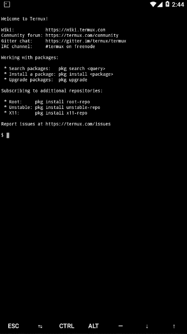

它只是一个已经启动并欢迎我们的终端。

现在我们将更新我们的终端，我们将安装安装 wordpress 所需的工具

我们要做的第一件事是执行以下命令，这将帮助我们更新我们的终端:

`pkg update && pkg upgrade`

我们的终端更新后，我们将安装必要的工具:

`apt install mariadb php vim wget -y`

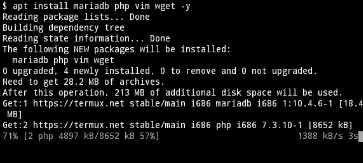

现在，我们将部分了解我们正在做的事情:

使用 apt install，我们告诉我们的终端，我们希望安装一些指定的工具，我们有 mariadb，这是我们将要使用的数据库，我们有 php，我们将使用它来创建服务器，vim 作为文本编辑器，用于从互联网下载文件。

一旦工具安装完毕，我们将下载 wordpress

我们使用下面的命令来下载 wordpress 的最新版本:

`wget [https://wordpress.org/latest.tar.gz](https://wordpress.org/latest.tar.gz)`

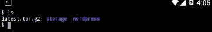

我们必须做的一件非常重要的事情是创建我们的“wordpress”数据库，为了创建它，我们将使用以下内容:

我们将执行以下命令来启动 mariadb 服务:

`mysqld`

一旦执行，就会出现类似这样的内容:

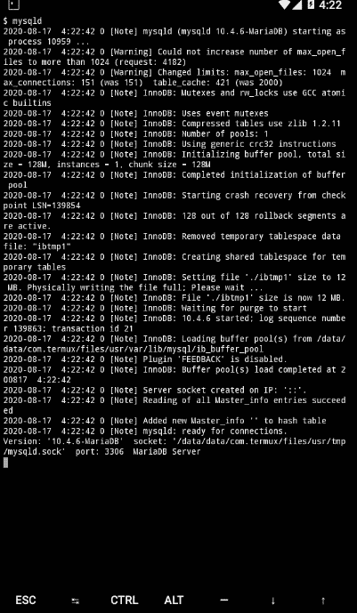

这意味着 mariadb 服务已经在运行。接下来是在我们的 termux 中创建一个新会话，这是通过向右拖动屏幕来完成的，将出现一个菜单，允许我们创建更多会话:

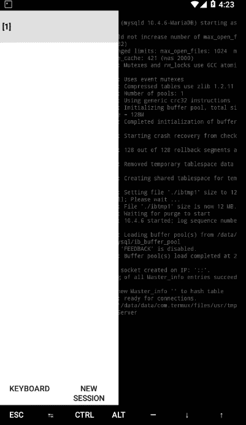

在新的会话中，我们执行命令:`mysql`进入 mariadb 环境并继续该过程。

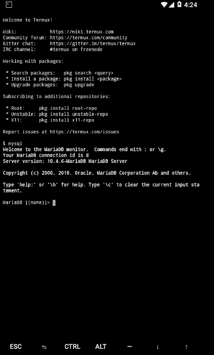

我们可以看到默认情况下使用该命令的数据库:

`show databases;`

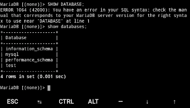

现在，我们使用下面的命令来创建我们的数据库，并授予它工作的权限。

记得更改用户和密码

```
MariaDB> CREATE DATABASE wordpress;
MariaDB> GRANT ALL PRIVILEGES ON wordpress.* TO "wp-user"@"localhost" IDENTIFIED BY "contraseña";
MariaDB> FLUSH PRIVILEGES;
MariaDB> EXIT
```

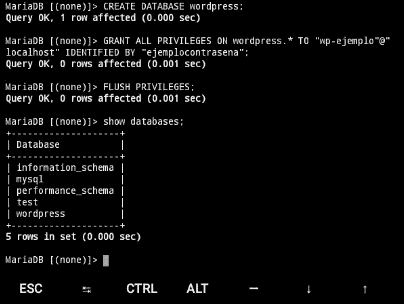

准备好了，我们的数据库配置好了。

我们一切都准备好了

现在我们只需要创建服务器来托管我们的 wordpress 并继续配置。为了在这个例子中挂载服务器，我们将使用 phpp。
PHP 允许我们将终端作为简单的服务器使用:

`php -S 0.0.0.0:8081`

我们将呆在 wordpress 文件夹中，执行上面的命令，使用端口 8081 在本地主机上托管我们的 wordpress

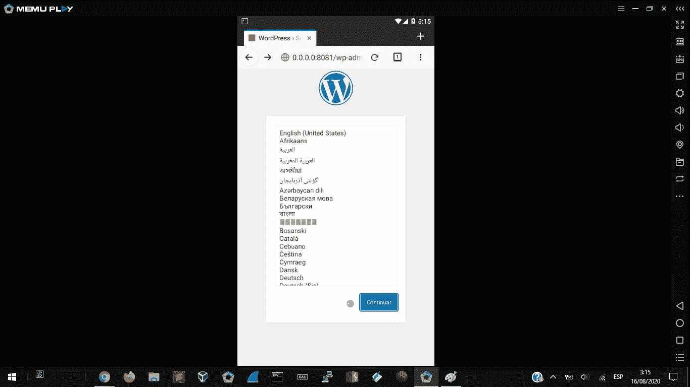

如你所见，我们的本地主机中已经有了我们的 wordpress，为了继续配置，我们选择我们的语言:

现在，我们只需要填写我们之前在填充数据库时选择的信息:

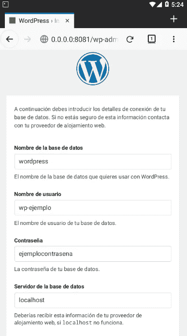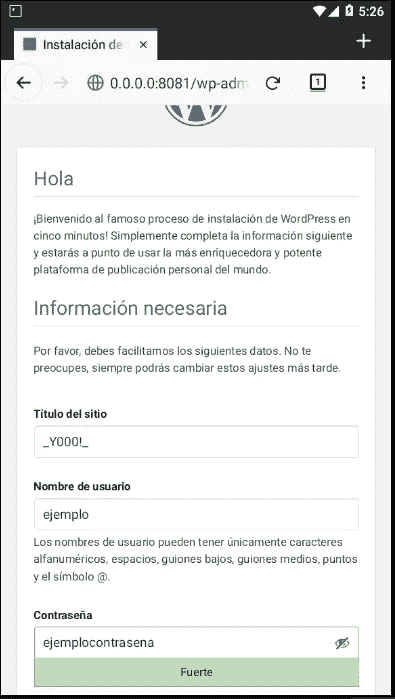

我们按照步骤操作，然后用我们的数据登录，就这样！我们的 android 上已经有了 WORDPRESS

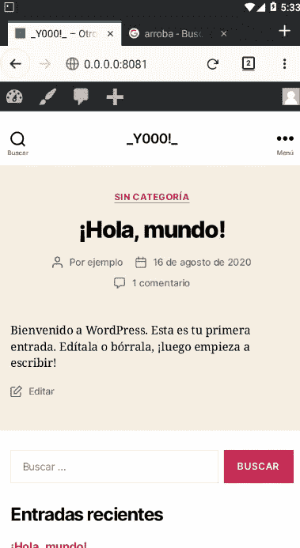