# 即时推进器充电器-游戏开发系列 38

> 原文：<https://medium.com/nerd-for-tech/instant-thruster-recharger-game-dev-series-38-93c5e52ea837?source=collection_archive---------17----------------------->

目的:轻松创建一个可视化充电推进器。

为了创建一个可视化推进器充电器，我将使用 UI 的滑块作为命令来控制播放器的速度。

在本文中，创建这个函数有两个部分。

1.  在 UI 中创建一个推进器滑块，并使其随时间充电和放电。
2.  根据滑块的不同状态控制播放器速度。

## 创建推进器滑块

右击画布，然后选择 **UI** > **滑块**。

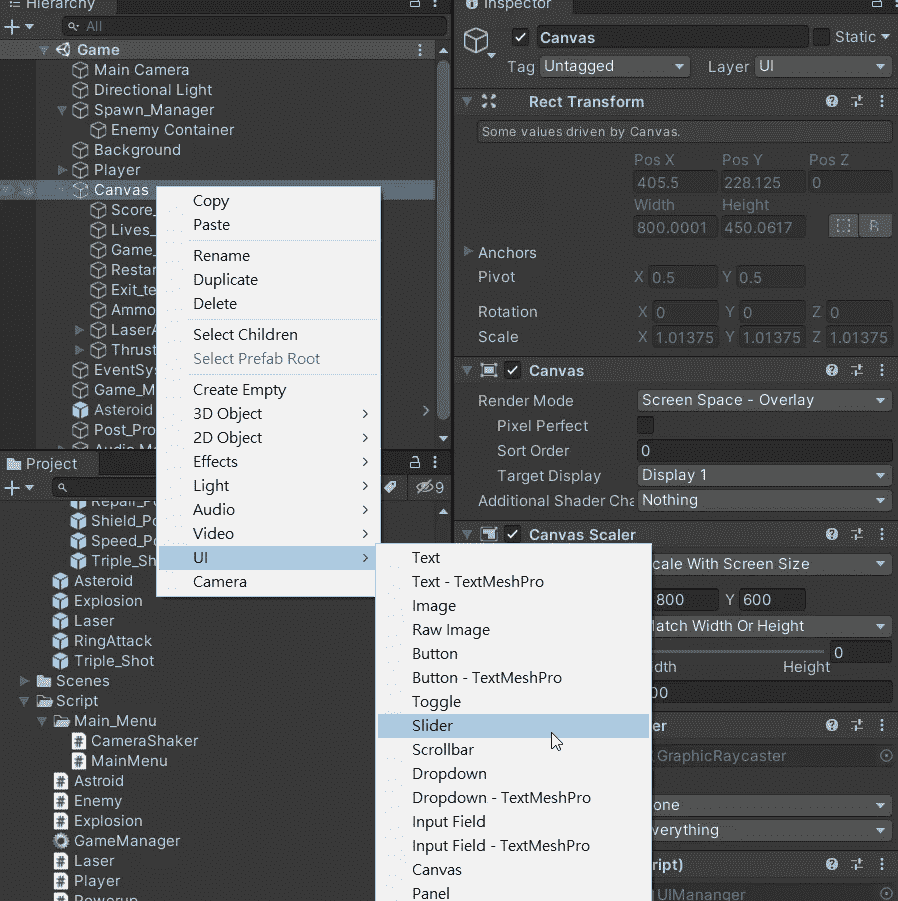

调整位置和比例。您可以禁用滑块游戏对象下的手柄游戏对象。我们不需要这个把手。
设置最小&最大值，我们稍后会用到。

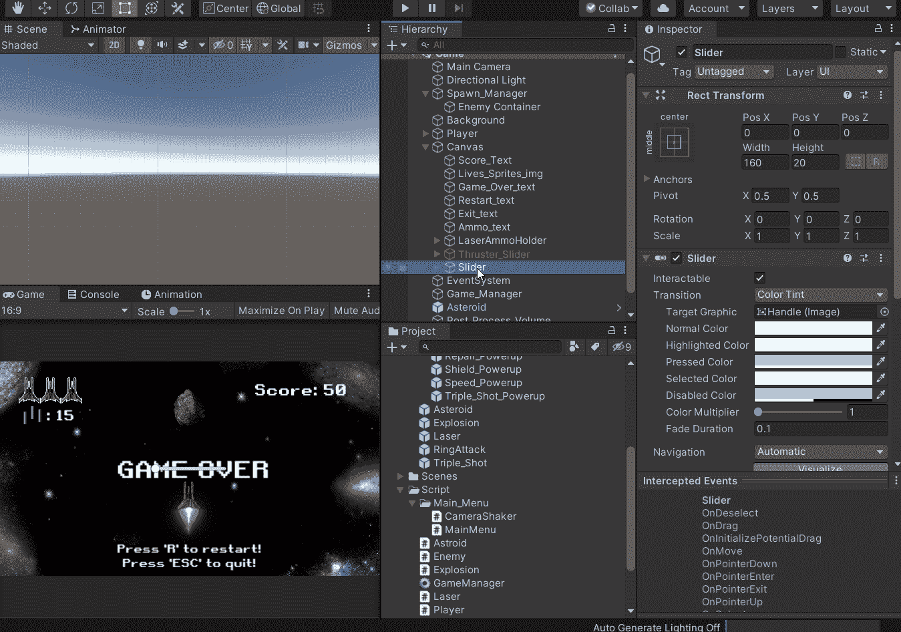

当您移除手柄时，您可能会注意到滑块上有一个微小的缝隙。要擦除这个，点击滑块游戏对象下的**填充区域**，并将左边的&设置为相同的数量，你的滑块应该看起来很棒。

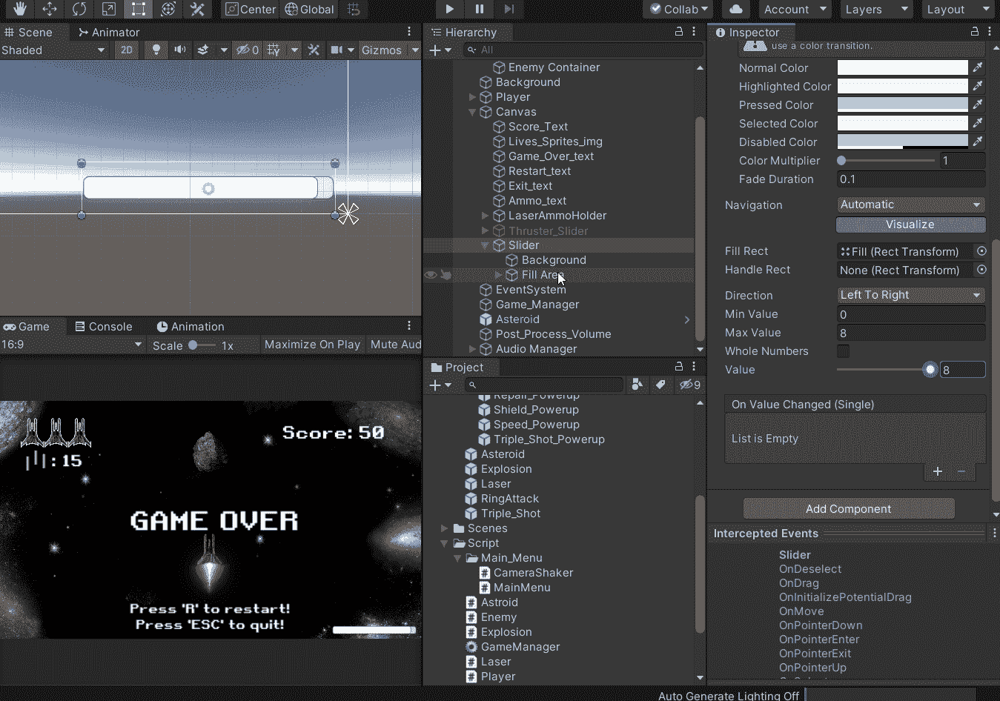

然后我们可以让它按时间充电。

打开 **UIManager** 脚本，创建 slider 的变量，在 **Start()** 将 slider 的值设置为 0。

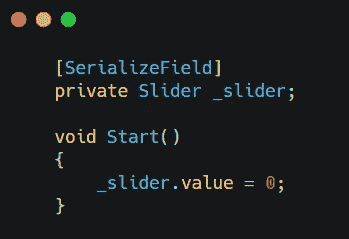

在 **Update()** 中，通过下面的代码使其自动充值。我们还需要另一个布尔变量。

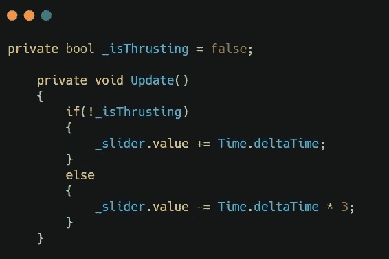

回到编辑器，拖动滑块到变量。玩游戏，你应该看到滑块正在充电。

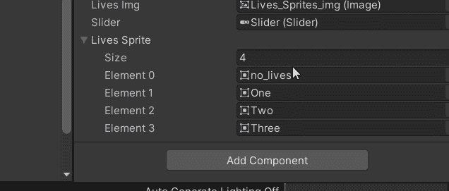

在 Update()中，我们已经增加了一行来减少滑块。然而，我们还没有任何减少它的触发因素。
这是我们需要让玩家控制滑块的地方。

创建另一个玩家可以调用的公共方法。

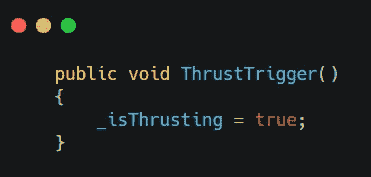

用这种方法，当玩家调用它时，bool 将变成 true，我们的滑块值将减少，如 **Update()** 所示。

现在在**播放器**脚本中，在 **Update()** 中添加一个 if 语句。

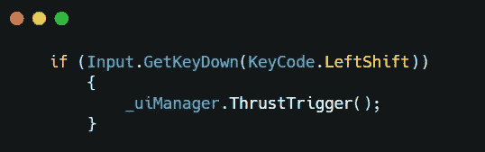

有了这个语句，如果我们按下左移，滑块将减少。让我们检查一下这个是否有效。

你可能会注意到这个问题。每次我按下 shift 键，这个值都会减少，这不是我们想要的。

我们想在推进器满载时才启动它。在这种情况下，我们可以简单地给 **ThrustTrigger()** 添加一个 if 语句。

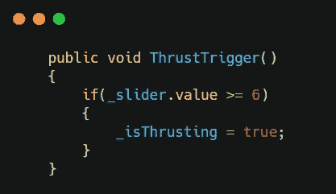

现在我们可以呼叫玩家来启动推进器。

## 控制速度

为了控制速度，我们需要在播放器中设置两个变量。

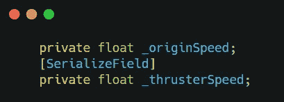

*   **_originSpeed** :这个会存储我们玩家在 **Start()** 中的原点速度。
*   **_thrusterSpeed** :这就是我们要设置一个新的浮点作为推进器的速度。

有了这些变量，我们可以创建另一个公共方法来切换速度。

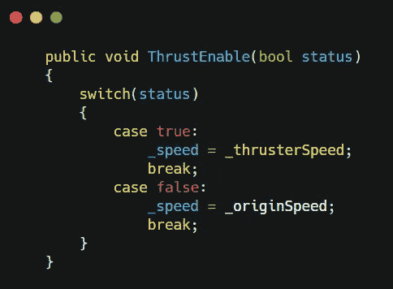

这是启动推进器的开关。该语句需要一个布尔值。我们可以把它叫做 in out **UIManager()** 。

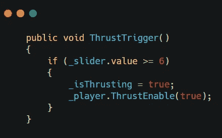

_player 是定位播放器脚本的另一个变量。

当滑块的值为 0 时，不要忘记禁用推进器。

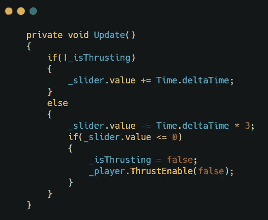

一切就绪。现在可以试驾了！

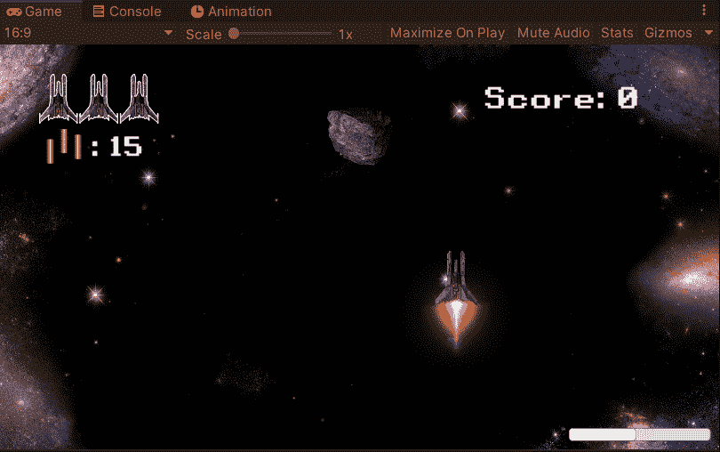

接下来:[不同角度的敌人](https://sj-jason-liu.medium.com/enemy-from-different-angles-game-dev-series-39-972f0c367185)