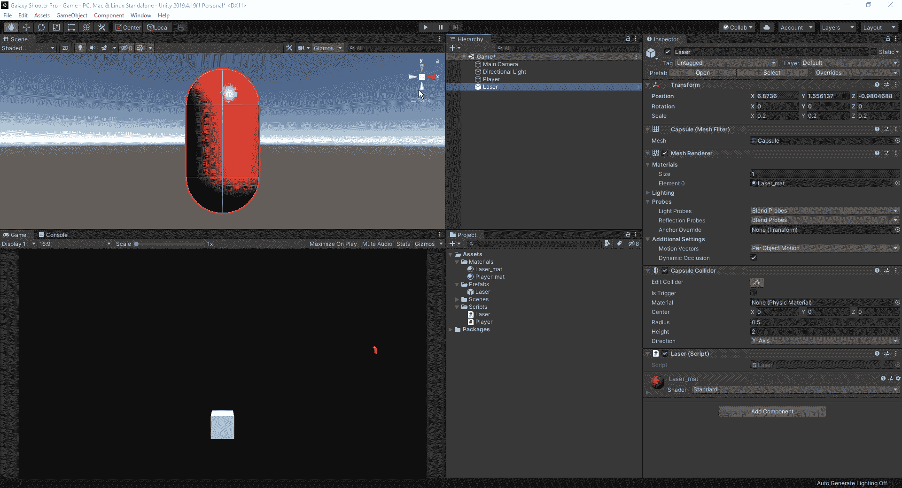
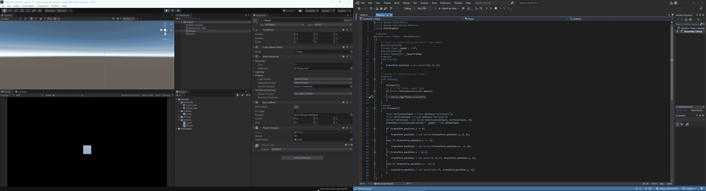
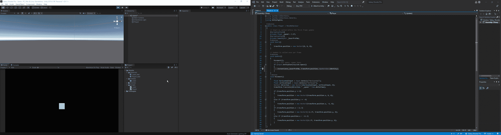
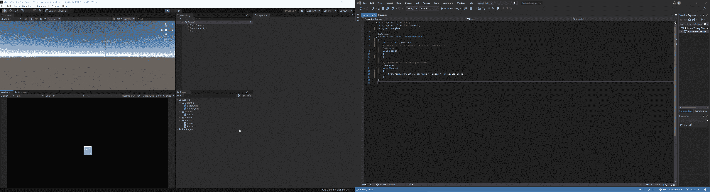
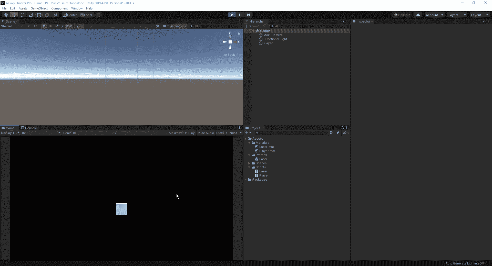
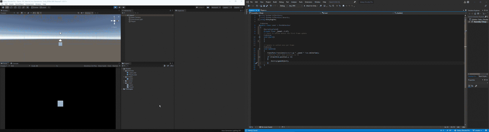
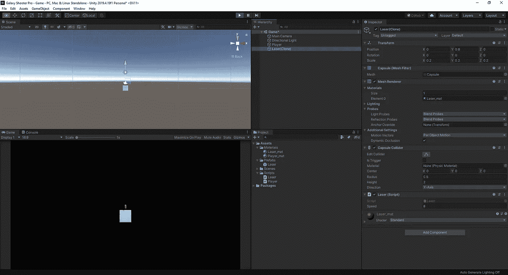
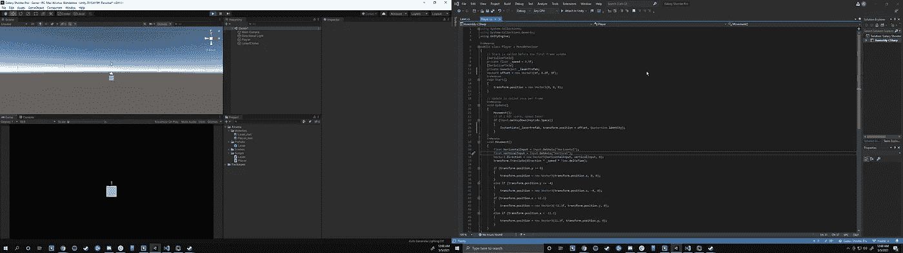

# 实例化和销毁游戏对象

> 原文：<https://medium.com/nerd-for-tech/instantiating-and-destroying-game-objects-88f08cfbf969?source=collection_archive---------15----------------------->

现在我们已经完成了玩家的动作设置，让我们开始一些火力。由于这是一个空间射手，有什么更好的方法来建立一个射击机制比一些激光。然而，由于我们现在只是将基本对象作为占位符，我们将从一个扮演激光角色的 3d 胶囊开始。同样，因为这将是一个预置，这是一个组件，允许我们保存它在项目中重复使用。本质上，你在游戏中看到的任何东西都是重复出现的相同图像，比如子弹、激光、墙壁等等。都是预制的。这使得开发人员可以快速地将他们的对象实现到游戏中，而不必一遍又一遍地编写新的脚本和编辑。

正如你所看到的，我们已经为我们的预设创建了一个新的文件夹，同时将我们的胶囊对象链接到预设，并将其涂成红色。同样，我们继续前进，创造了一个激光脚本。

现在我们要做的是测试，以确保我们的空格键设置正确，这样我们就可以发射激光。为了检查，我们简单地创建我们的代码，该代码用于移动播放器，但是输入空格作为我们的按键。从那里，我们将做一个快速的 debug.log 检查，以确保它工作正常，一旦正常，我们可以将其改为我们的激光。对于 Unity，我们将为创建一个游戏对象而编写的代码行被实例化。对于编程来说，实例化意味着创建一个对象的实例。

对于代码行，我们看到有四元数。身份。这意味着对象在一个向量中的旋转。当我们把同一性加到它的末尾时，我们在告诉统一性，我们根本不希望物体旋转。

现在我们已经有了每次挤压空间时产生的激光，我们现在有一些事情需要解决。

1.  我们如何让我们的激光向上移动
2.  一旦激光离开我们的游戏屏幕，我们如何摧毁它们，这样我们就不会让它们永远都在旅行，让我们的游戏充满各种物品。

首先，让我们为激光轨迹编一个代码。因为我们已经知道如何为一个物体创造运动，这是一个很容易解决的问题。

正如我们所看到的，我们需要做的就是创建我们的 transform.translate 代码，并告诉 Unity 我们想要向上移动激光。从这里，我们可以添加一个速度变量，我们发现这是一个很好的速率，瞧，我们有一个移动的激光。

现在，我们必须找出如何清理我们的等级制度，这样激光就不会永远聚集在那里。我们要做的第一件事是找出激光从屏幕上消失的地方。

我们要做的是启动游戏并发射一束激光。我们只是暂停游戏，让它停留在游戏视图中，然后移动它，直到我们在视图中看到它的边缘。当它在 6.9 左右开始消失时，我们会在 y 轴上移动到 8 来删除它，这只是为了安全起见，以防一旦我们将实际图像添加到对象上，我们的激光会有更长的视觉。

现在我们有了摧毁点，我们必须为要摧毁的激光写代码。

现在我们已经弄清楚如何让我们的激光向上移动，以及一旦到达某一点如何摧毁它。最后，我们要做的是为激光的发射点创建一个偏移量，这样它就不会在玩家的中间发射，而是稍微在玩家的前面。这将使激光看起来更干净，当我们实例化的激光。
首先，我们要计算出玩家前方开始发射激光的距离。

当我们的玩家设置为(0，0，0)时，我们将需要放出一束激光并移动它，使它稍微高于我们的玩家。从这里，我们将去我们的球员代码，并找出一种方法来添加 0.8 到 y 轴产卵点。我们能做的，是用(0，0.8，0)设置创建一个新的向量 3。

今天就这些了。我们已经学会了如何制作激光，调整它的速度，一旦它离开屏幕就摧毁它，并偏移它的产卵点，这样它产卵时看起来更干净。下一次，我们将着眼于为激光创建一个冷却类型的系统，这样它就能在所有玩家之间建立一个公平的竞争环境，并对我们的编码进行一点清理。