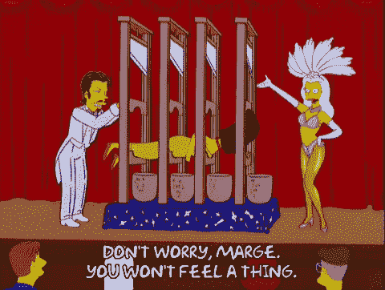
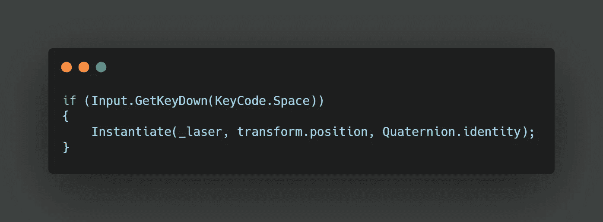
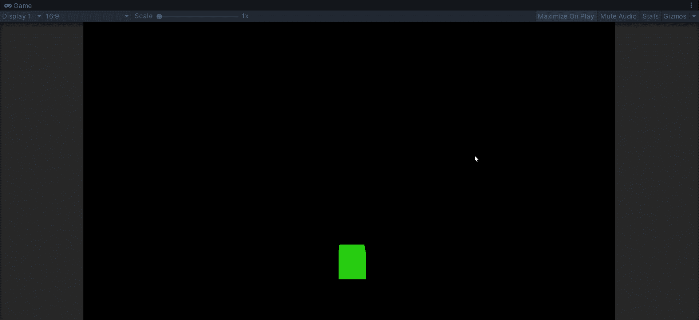

# 在 Unity 中实例化和销毁游戏对象

> 原文：<https://medium.com/nerd-for-tech/instantiating-and-destroying-game-objects-in-unity-5bd9dde9d23d?source=collection_archive---------24----------------------->

我们并不总是希望所有的东西都马上出现在我们的游戏中。有时我们也想中途移除一些东西。为此，Unity 有两个特性，**实例化**，和**销毁**。

比方说我每次打空格键都要造一个激光弹丸。首先，我们需要将激光存储为游戏对象变量。由于激光应该是可重复使用的，它可以作为一个**预制件**存放。这允许我们在游戏中创建激光的多个实例。在我们的玩家行为脚本中，我们可以在我们的 **Update** 方法中添加另一个检查。

这段代码现在将在每次按下空格键时创建我们的激光预置。 **transform.position** 在我们玩家的当前位置创建预设，**四元数. identity** 在当前旋转位置创建预设。

让我们的激光产卵在我们的球员的中心位置并不完全是视觉上的吸引力，所以我们可以创建一个偏移。这可以创建为一个新的 **Vector3** ,后跟我们想要偏移的 spawn 位置的浮点值。然后，我们可以简单地将我们的偏移变量添加到我们的**转换中。**

假设我们发射了 100 发激光弹药。我们现在有 100 个游戏物体在我们游戏的某个地方，离屏幕很远很远。实际上，一旦它们退出我们的视野，就可以被删除。我们可以再次使用一个简单的 if 语句，这一次在我们的激光行为脚本中检查我们的 Y 值是否大于我们的屏幕限制。很像创建我们的球员边界，除了我们想删除激光。为此，我们可以使用**Destroy(this . game object)；**

我们也可以使用我们的激光摧毁其他游戏对象，如敌人。但要做到这一点，我们需要看看 Unity 的物理系统。在接下来的几天里，继续关注更多的文章，扩展我们的基本射击行为。