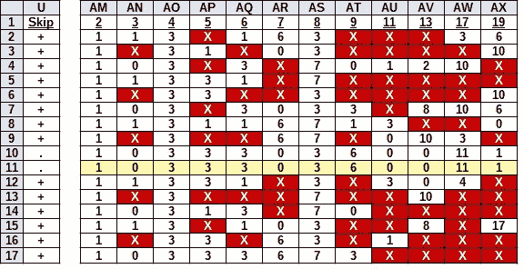
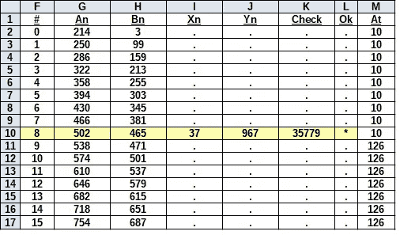
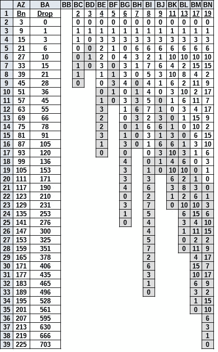
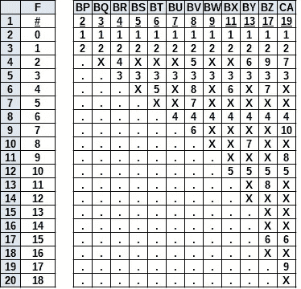
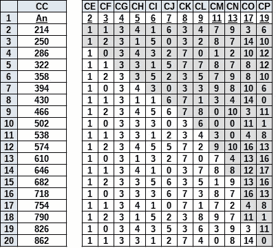
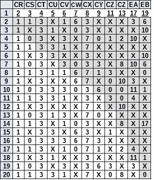
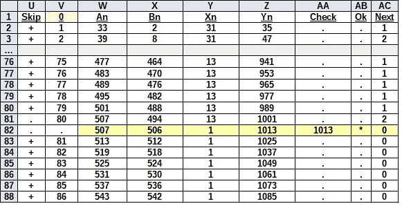

# 整数家族的下一代

> 原文：<https://medium.com/nerd-for-tech/integer-number-families-the-next-generation-3f298d347b5c?source=collection_archive---------10----------------------->

## **第四部分:整数因式分解的基础知识**

```
*Sometimes it is not what you see that is important,
It is what you do not see.*
```



禁区和有效的保理行

**前言**

**整数因式分解族**还有别的层次吗？答案是肯定的，但这可能不是你所期望的。有些音程可以去掉；然而，开销计算将成比例增长。(表现出惊讶。)请坐好，享受另一次进入数学疯狂王国的旅程！(顺便说一句，请原谅标题中的双关语，我就是忍不住。)

本文是“整数分解基础”系列文章的一部分。如果您查看我的[关于](https://jbjo1956.medium.com/about)的数据，可以看到所有其他文章的列表。

**第 1 章—背景**

**整数因子分解族**的基础知识在以下网址讨论:

[https://jbjo 1956 . medium . com/introduction-to-integer-factoring-families-DCE 2152 FBA 81？source = friends _ link&sk = 382 a4 fef 0 EAC 9 c 47673 c 550 db 9560761](https://jbjo1956.medium.com/introduction-to-integer-factoring-families-dce2152fba81?source=friends_link&sk=382a4fef0eac9c47673c550db9560761)

这里是对材料的回顾。(周二小考……)

迭代整数分解的主要引擎是**费马因式分解方法**。

[https://en.wikipedia.org/wiki/Fermat's_factorization_method](https://en.wikipedia.org/wiki/Fermat's_factorization_method)

这种方法不使用筛子，并根据以下方程计算:*N = An Bn*=*(An+Bn)(An Bn)，*其中 *(N)* 是被调查的数字。(数学定义见**附录 1** )的初始值 *(An)* 为 *√N* 上舍入。反向计算:*Bn =√【An N】*；如果 *(Bn)* 不是整数，则需要下一次迭代。每次迭代将通过将 *(An)* 加 1 来执行。这种情况会持续下去，直到找到一个整数，或者*(An Bn)*的值降至 3(最小的可能奇素数)以下。

一个典型的家庭，其中 *An = 25* 看起来是这样的:

```
An/Bn: N=Xn×Yn=An^2–Bn^2: Si+6Sn=(Sa+6Sx)(Sb+6Sy): Drop=625–N
--------------------------------------------------------------------
25/0:  625=25×25=625–0:   7+6×103=(7+6×3)(7+6×3):  Drop=0
25/6:  589=19×31=625–36:  7+6×97=(7+6×2)(7+6×4):   Drop=36
25/12: 481=13×37=625–144: 7+6×79=(7+6×1)(7+6×5):   Drop=144
25/18: 301=7×43=625–324:  7+6×49=(7+6×0)(7+6×6):   Drop=324
25/24:  49=1×49=625–576:  7+6×7=(7+6×(-1))(7+6×7): Drop=576
```

**下降**是家族的 *(N)* 和**顶值**之差，在本例中为 *625* 。下降的重要方面是这个家族中的所有因子都有可被 *36* 整除的下降，例如**下降**在 *576* 模 *36* 是 *0* 。因此，如果任何一个数和 *625* 的差能被 *36* 整除，那么这个数**可能属于*族=25* 。尽管有很多例外，但是**下降**也必须遵循**下降顺序**。对于*族=25，*顺序为 *1×36，4×36，9×36，*和 *16×36* 。由于 *72* 为 *2×36* ，故排除。**

每个**家族**只支持一个**系列**。在观察中发现**因子系列**的来源，除了质数 2 和 3，所有其他质数都在可被 6 整除的数字附近，例如质数 5 和 7 在数字 6 旁边。 *(N)* 可以属于两个系列。在*系列= 5，Si = 5，N = 5+6×Sn* 和 *Sn =* { *0，1，2，3，…* } 中*系列= 5* 的例子有 *N = 5，11，*和 *17* 。在*级数= 7，Si = 7，N = 7+6×Sn* 和 *Sn =* { *-1，0，1，2，3，…* } 中*级数= 7* 的例子有 *N = 1、* *7、13、*和 *19。* ( *系列= 2* 和*系列= 3* 是存在的，但是会被排除在这篇短文之外，因为他们有自己的家谱。)

这两个系列可能会产生三种产品。

```
(1) First, a *Series = 5* times a *Series = 7* yields a *Series = 5.* There are two subsets:
  (a) *Series = 5* times a *Series = 7* yields *Series = 5A,* Example: *35 = 5×7* or 
  (b) *Series = 7* times a *Series = 5* yields *Series = 5B,* Example: 77 *= 7×11.* (2) Second, a *Series = 7* times a *Series = 7* yields a *Series = 7,* Example: *4*9 *= 7×7.* (3) And finally a *Series = 5* times a *Series = 5* yields a *Series = 7,* Example: *25 = 5×5.*
```

根据 *(An)* 的值有三组族，其中*组= An mod 3。*分别是*组=* *0，1，*和 *2。*

```
(1) If *Group =* *0 (An mod 3 = 0),* then the entire family is
    *Series = 5* from the product of *Series = 5* times *Series = 7* or
    *Series = 7* times *Series = 5\.* (2) If *Group =* *1 (An mod 3 = 1),* then the entire family is
    *Series = 7* from the product of *Series = 7* times *Series = 7.* (3) If *Group =* *2 (An mod 3 = 2),* then the entire family is 
    *Series = 7* from the product of *Series = 5* times *Series = 5.*
```

回到 *Family=25，*我们发现 *25 mod 3 = 1，*所以是 *Group=1* ，将只支持 *Series = 7，*例如 *7+6×103=(7+6×3)(7+6×3)。*下一个支持*系列= 7* 的家族是*组= 2*at*An = An+1 = 25+1；* *家族=26。*

```
An/Bn: N=Xn×Yn=An^2–Bn^2: Si+6Sn=(Sa+6Sx)(Sb+6Sy): Drop=625–N
--------------------------------------------------------------------26/3:  667=23×29=676–9:   7+6×110=(5+6×3)(5+6×4):  Drop=0
26/9:  595=17×35=676–81:  7+6×98=(5+6×2)(5+6×5):   Drop=72
26/15: 451=11×41=676–225: 7+6×74=(5+6×1)(5+6×6):   Drop=216
26/21: 235=5×47=676–441:  7+6×38=(5+6×0)(5+6×7):   Drop=432
```

*系列=7* 不变，但**公因数**变为 *72* 。新家庭的准入现在由 N mod 72 = 0 决定。这里的教训是，如果您正在评估一个*系列=7* 号*，*，您必须检查*组=1* 中的每个家族和*组=2 中的每个家族。*我们可以跳过*An = An+1 = 26+1；* *族=27，*因为是*组=* *0 (An mod 3 = 0)。*下一个支持*系列= 7* 的家族是*组= 1*at*An = An+1 = 27+1；* *家族=28。*

```
An/Bn: N=Xn×Yn=An^2–Bn^2: Si+6Sn=(Sa+6Sx)(Sb+6Sy): Drop=625–N
--------------------------------------------------------------------
28/3:  775=25×31=784–9:   7+6×128=(7+6×3)(7+6×4):  Drop=0
28/9:  703=19×37=784–81:  7+6×116=(7+6×2)(7+6×5):  Drop=72
28/15: 559=13×43=784–225: 7+6×92=(7+6×1)(7+6×6):   Drop=216
28/21: 343=7×49=784–441:  7+6×56=(7+6×0)(7+6×7):   Drop=432
28/27:  55=1×55=784–729:  7+6×8=(7+6×(-1))(7+6×8): Drop=720
```

现在我们有了一个*组=1* 和一个**公因数**的 *72。*看来*(安)*是*奇数*，*(安)*是*偶数*之间出现了反转。这就要求我们现在根据 *(An)* 的值是奇数还是偶数，每组有两种口味。这里的教训是，你必须检查每个*组=1(偶数)，每个*组=1(奇数)，每个组=2(偶数)，每个组=2(奇数)。如果在这一点上，这一程序的好处还不明显，深呼吸，当你盯着食谱时，你不能吃蛋糕。最好的解决方案是采取不同的路径，分别通过所有的*偶数*和所有的*奇数*组。从统计上来说，你会在不追第二组的情况下，找到 50% 的解。

**第 2 章——基本因子分解迭代**

是时候实际评估一个数了: *N = 37×967 = 35779* 其中 *35779 mod 6 = 1，*所以*系列=7。**An 的初始值= √[N] = √[35779] = 189.153(上舍入)= 190。*由于 *190 mod 3 = 1* 支持*系列=7* ，无需调整。

我们在*组= 1* 和*组= 2* 之间有一个选择。当我们对*组= 1，*的 *(An)* 的值进行同步时，我们会发现 *An = 214* 是最合适的。在这个过程中，我们消除了路径中的 *An = Odd。*(既然我已经算出了问题，我知道我们会在 *Group = 1，*中找到解决方案，所以这次我们可以忽略 *Group = 2* 解决方案。)

我们现在运行 *(An)* 的增量，增量等于**公因数**除以 *2* 。在这种情况下，即 *72/2=36* 。执行迭代，我们直到第 9 次尝试才会找到解决方案，结果是 *An = 502。*



**页面费马迭代块**

跳过一些这样的迭代不是很好吗？嗯，实际上，我刚做了。你只是不能从你的角度看到整个表格，但我会尝试解释。看到*列【U】中的*“+”*符号了吗？*他们告诉我们可以完全跳过 *(An)* 的这些值。

也许你已经注意到这个**费马迭代块**与以前的版本不同。这个版本基于**全费马矩阵**。在这个版本中，矩阵主干是包含 *(Bn)* 的值的*列【X】*。事实上，在长格式的*列中【X】*包含了 *(Bn)* 的每个值，我们可以在包含 *(N)* 的最后一个家族中找到这些值。最后一家有 *Xn=1* 和 *Yn=N，*所以 *An=(Yn+Xn)/2* 和 *Bn=(Yn-Xn)/2。*在我们的例子中 *N=35779，*所以*Xn = 1；Yn = 35779An = 17890*和 *Bn=17889。***全费马矩阵**从 *An=214* 开始，有 *17889* 行，每一行对应*(Bn)*的一个值，一直持续到达到值 *An=17890* 为止。当 *Xn×Yn < =N 时， *(An)* 的值递增；*但是， *(Bn)* 的值会不间断地持续到最后。(我知道……这本身就是一篇论文，但我就是没有时间。)

如果我们选择不显示每一行，下一个列的**显示了对 *(Bn)* 的调整。方程为:*Z =(X N-Y N)/12√[(Y N-X N)/4+X nY N]/6。*随后的 *Bn=Bn + 6×Z.* 如果您更喜欢看到所有近 18K 行，这可以省略， *Bn=Bn + 6* 。**

**第 3 章——基本保理对准**

原来有一个对齐段会显示 *(An)* 的哪些值可以跳过。


**页面纸张对齐块**

解释起来很容易。如果校准块中的线有一个“X”，那么与之相关的 *(An)* 的值可以跳过，并且不需要执行平方根的验证。如果没有找到“X ”,则必须进行验证。如您所见，可以跳过相当多的行。

"数学恶魔在做什么？"你可能会问。这需要更多的解释。

**第 4 章——下落对准**

还记得上面**家族图**中的那些点滴吗？从 *(Bn)* 的值可以容易地计算出压降。适当的*Drop = Bn Top Bn*其中 *(Bn)* 的值取决于 *(An)* 是奇数还是偶数。

取这些液滴，并通过除以公因数**将其归一化，公因数**在本例中为 *72* 。归一化的序列将是{0，1，3，6，10，…}然后对这些执行各种除法，例如 *Cell[BA6]=10，*所以*Cell[BH6]= Cell[BA6]mod Cell[BH1]= 10 mod 7 = 3。整个事情看起来是这样的:*



**页面纸张下降正常化块**

最有趣的一点是，所有的序列都是重复的，并且重复块的深度与除数相同。请注意，这些约数只是我为了测试目的而收集起来的一些，除了你的电子表格可以处理的以外，没有上限。第二个最有趣的方面是序列中有缺失的数字，例如在除数 *"3"* 下，我们得到序列 *"0:1:0。"*没有编号*“2。”**【5】*缺少*【2】**【4】。*

我们如何识别缺失的数字？



**页纸缺失值块**

这个插图有点混乱。为了找到一个丢失的数字，电子表格查看列*“F”*中的期望值，并在**下降标准化块**中搜索该值。如果找到该数字，它会显示为指针，例如*【0】*位于*【1】*处，而*【1】*位于*【2】处*如果没有找到号码，则在列中输入一个*“X”*，例如*单元格[BV4]= If(＄F4<BV $ 1)，IFNA(MATCH(＄F4，BI$2:BI$33，0)，“X”)，“”)= 5* 。

现在，我们使用 *(An)* 和 *(N)* 产生的实际液滴来重复这一过程。



**页面纸张实际下降标准化块**

该模块类似于上面的**页面下降标准化模块**。同样，所有序列重复，重复块的深度与除数相同，我们使用上面的除数。序列中有缺失的数字，但这次我们对它们不感兴趣。我们想知道的是**页面缺失值块**中是否有任何数字缺失。如果它们是，那么我们不能对齐块中的数据。我们可以跳过 *(An)* 的这些值。

最后，最后一个数据块。我们交换出不匹配的值，并用*“X”*替换它们。



**页面纸张复合对齐块**

眼熟吗？没有红色突出显示的是原来的**定位块**。事实上，我们最初看到的只是这个块的循环表查找，例如 *Cell[AP11] =INDEX(CU$2:CU$6，IF(MOD($AE11，AP$1)=0，AP$1，MOD($AE11，AP $ 1))= 3。*对了，*单元格【AE11】= 9。* *列【AE】*(未显示)是一个修改过的计数器，允许移位，但那是另一天的事了。

对于那些真正理解这一切的人来说，你可能会想，“找到每个 *(An)* 处的压降，并对照 *(Bn)* 处的压降值进行验证，不是更容易吗？”这将是一个有效的程序，除非我的国际象棋拼图网站不断提醒我，“有一个更好的移动。”

[https://chesspuzzle.net/](https://chesspuzzle.net/)

**第 5 章—质数中断**

糟糕，我差点忘了包括一个关于质数的片段。让我们将一个已知的质数 *1013* 放入电子表格。



**带质数的费马迭代**

尽管为了显示的目的，输出被截断，但是电子表格确实将 *(An)* 的每个值标记为 *"+"* ，以表明它们都可以被跳过。高亮显示的值表示找到了一个因子，即 *1013 = 1×1013* ，这正是我们所期望的。

说实话，并不是所有的质数都会这么干净。大多数人会打一两个嗝。这是因为**校准块**的初始化仅运行到*“19”我现在的假设是，如果我们再增加一些范围，几乎所有的(小)质数都会被“涂黑”*

**第六章——未完待续……**

为了避免陷入费马大弟子的最后定理，让我澄清一下我的想法。使用**因子分解校准模块**，我们可以在一个大循环中重复数字串。当它们正确对齐时，你就有很大的机会找到一个因子。这有点像老虎机，但有一个很大的不同。我们知道不倒翁序列！现在，我的经验告诉我，“即使这看起来很容易，也要为一场伟大的斗争做好准备。”我已经看到了很多分歧，因为有很多方式可以将序列连接在一起。它很可能会变成一个浴缸，上面有太多的洞，装不下水。

运气好的话，我会带些真正好的东西回来。

**更新:**

有关**快速费马整数族因子分解**的讨论，请访问:

[https://jbjo 1956 . medium . com/fast-Fermat-integer-family-factoring-e2c 277943727？source = friends _ link&sk = a 685 a 442 c 14 a5 fc 7d 8715 a 4d 449 a 94 cf](https://jbjo1956.medium.com/fast-fermat-integer-family-factoring-e2c277943727?source=friends_link&sk=a685a442c14a5fc7d8715a4d449a94cf)

演示**快速费马整数族因式分解**如何工作的 JavaScript 程序现已推出。

[https://jbjo 1956 . medium . com/JavaScript-code-for-fast-Fermat-integer-family-factoring-74b 738 B1 db7d？source = friends _ link&sk = 0 E3 f 81 ad 1 ddcbbaa 9 daf 4 ed 7 b 564 EAC 3](https://jbjo1956.medium.com/javascript-code-for-fast-fermat-integer-family-factoring-74b738b1db7d?source=friends_link&sk=0e3f81ad1ddcbbaa9daf4ed7b564eac3)

**附录 1 —标准定义和等式**

```
…*^…*  — Raise to the Power of
√*[…]* — Square Root Function
*An*   — Factor of Base Root Value:         *An = (Yn + Xn)/2* where *An ≥ √[N]
Bn*   — Factor of Small Root Value:        *Bn = (Yn — Xn)/2
Ia*   — Unity Factor for *Na:*               *Ia = ± 1
Ib*   — Unity Factor for *Nb:*               *Ib = ± 1
N’*   — Integer Prime Number:              *N’ = N’×1 ≠ N
N*    — Composite Integer Factorization:   *N = Xn×Yn ≠ N’
N*    — Fermat’s Factorization:            *N = An² — Bn²
                                            = (An — Bn)(An + Bn)
N*    — Series Factorization:              *N = Si+6Sn
                                            = (Sa + 6Sx)(Sb + 6Sy)
Ri   —* Fermat Remainder:                  *Ri = An² — N* (Iterate until *Ri=Bn²*)
*Si* — Series Identifier for Composite *N:* *Si = 5* or *7 = 6 + In
Sa* — Series Identifier for *Xn:*          *Sa = 5* or *7 = 6 + Ia
Sb* — Series Identifier for *Yn:*          *Sb = 5* or *7 = 6 + Ib
Sn* — Series Expansion for Composite *N:  Sn = (N — Si)/6
Sx* — Series Expansion for *Xn:*           *Sx = (Xn — Sa)/6
Sy* — Series Expansion for *Yn:*           *Sy = (Yn — Sb)/6
Xn*   — Smaller Integer Factor of *N:       Xn = An — Bn* where *1 < Xn ≤ Yn
Xn   —* Smaller Integer Factor of *N:       Xn = Sa+ 6Sx* where *1<Xn≤Yn;* *Sa = 5* or *7
Yn*   — Larger Integer Factor of *N:*        *Yn = An + Bn* where *Yn ≥ Xn > 1
Yn   —* Larger Integer Factor of *N:        Yn = Sb + 6Sy* where *Yn≥Xn>1;* *Sb = 5* or *7*
```