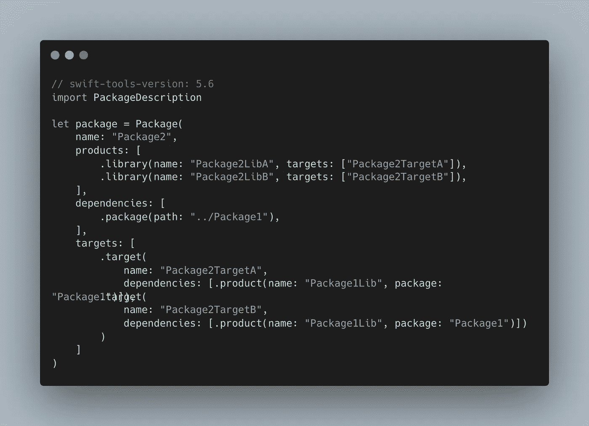
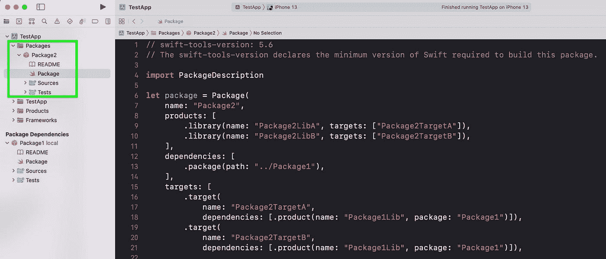
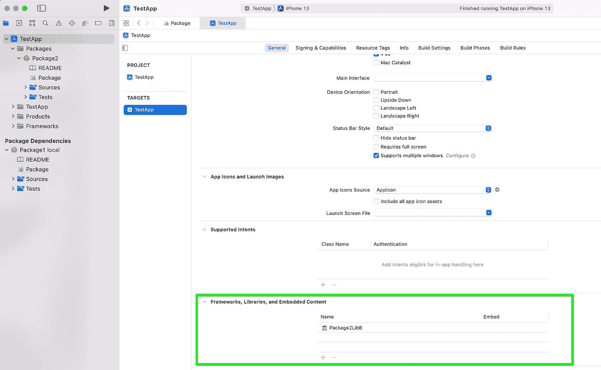
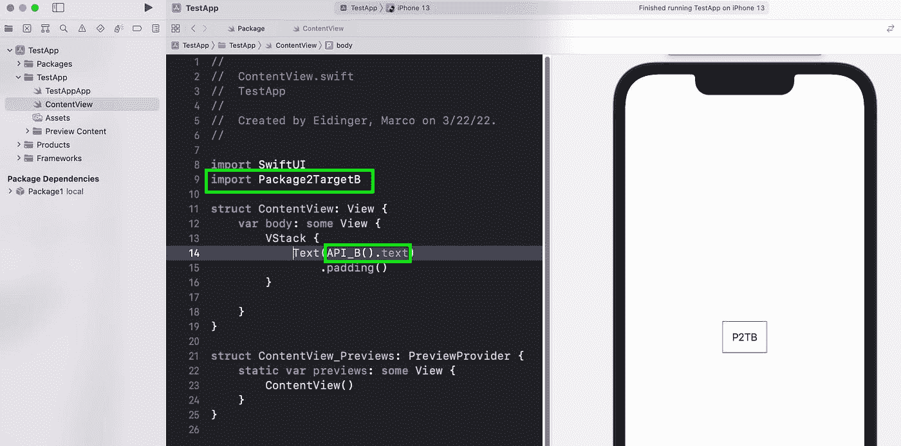

# 将复杂的 Swift 软件包集成到您的 iOS 应用程序中

> 原文：<https://medium.com/nerd-for-tech/integrate-a-complex-swift-package-into-your-ios-app-6690d77958c1?source=collection_archive---------1----------------------->

在这篇博文中，我帮助应用程序开发人员理解 Swift 包的术语，以及如何在 iOS 应用程序中集成更复杂的结构化 Swift 包。

由`swift package init`命令创建的最简单的包结构包括

*   一个包裹
*   使用单一产品(类型:库)
*   使用单一目标(+测试目标)

所有这些包/产品/目标的名称都是相同的。

让我们看一个更复杂的例子:

这个包(这里命名为`Package2`)提供了两个*库*产品。每个产品都有自己的目标。每个目标都利用包依赖项提供的库。

让我从一个*应用开发者*的角度开始解释不同的构建模块。

*   您想要使用包中的功能= >您将*包*添加到 Xcode 项目中。

*   你想使用一个库=> **你在 Xcode** 中添加一个库*产品*到你的应用目标。

*   最后，当从库=> you **中导入相关代码时，你正在使用** `**import <target/module>**` **语句**。

在这个例子中，模块`Package2TargetB`提供了一个公共结构`API_B`。

> Swift 目标相当于 Swift 模块，所以它们经常互换使用。一个模块指定一个命名空间，并对可以在模块外部使用的代码部分实施访问控制。

我强烈推荐阅读 Jeremy David Giesbrecht 在 [Swift 论坛](https://forums.swift.org/t/module-vs-product-vs-target/27640/2)中给出的定义。它更多的是对包开发者说的。

*原发布于*[*https://blog . ei dinger . info*](https://blog.eidinger.info/integrate-a-complex-swift-package-into-your-ios-app)*。*