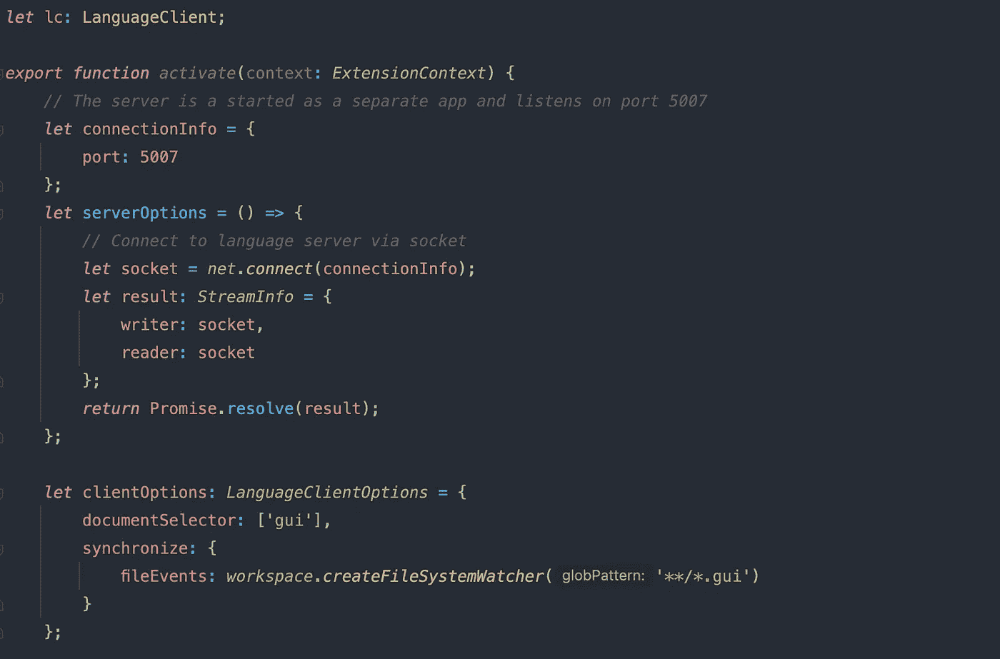
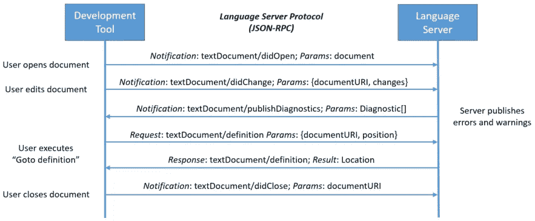

# 集成语言服务器和 VS 代码扩展

> 原文：<https://medium.com/nerd-for-tech/integrate-language-server-with-vs-code-extension-ffe8f33a79cf?source=collection_archive---------1----------------------->

本周，我和我的团队想为公司内部语言创建一个新的语言服务器。已经有人在努力创建一个基于 XText 的 Eclipse 语言插件。为了能够在 Eclipse 之外的其他 ide 上使用语言服务器，我们基于微软[语言服务器协议](https://microsoft.github.io/language-server-protocol/) (LSP)创建了一个新的语言服务器。

我的任务是将新创建的语言服务器与 VS-Code 集成起来。我选择这个编辑器而不是 IntelliJ IDEA，因为众所周知，它比 IntelliJ 更容易和更好地集成语言服务器。

# 客户端和语言服务器之间的通信

首先，当用户打开一个文档时，客户端向语言服务器发送一个包含文档内容的通知。

服务器将带有当前文档诊断信息的通知发送回客户端。

如果用户编辑一个文档，客户端会发送一个新的通知，通知中包含该文档的当前 url 以及与旧版本的不同之处。这样就不必在每次修改后都上传整个文档。

如果用户执行“Go to definition ”,他会向服务器发送一个带有当前 documentURI 和光标位置的请求。

服务器发回一个响应，其中包含链接的类、方法或变量的位置。

当用户最终关闭文档时，它会向服务器发送一个带有 documentURI 的通知，以便服务器可以从当前上下文中删除文档。

图自[https://Microsoft . github . io](https://microsoft.github.io)

语言服务器的默认端口是端口 5007。在这个例子中，我们也将在这个端口上启动我们的语言服务器。

你可以在[https://code . visual studio . com/API/language-extensions/language-server-extension-guide](https://code.visualstudio.com/api/language-extensions/language-server-extension-guide)上了解更多关于服务器和客户端之间的通信

# 创建扩展

要创建语言扩展，您需要创建具有以下项目结构的项目:

> /package.json
> / <扩展>. configuration . JSON
> /src/extension . ts
> /src/ts config . JSON

其中<extension>应该是你想要支持的新语言的扩展。</extension>

在本教程的以下部分中，我将继续使用“ **gui** 作为语言文件的扩展名。

package.json 文件的内容如下所示:

请注意从第 22 行到第 35 行的零件，因为这是与扩展相关的零件。在第 33 行的扩展名前添加点非常重要。

gui.configuration.json 文件将用于该语言的本地支持，如自动结束括号和注释。

需要所有这些配置来改进最终用户的工作流程，并提供自动完成的基本功能。

基本的/src/tsconfig.json 文件如下所示:

现在真正有趣的部分位于 extension.ts 文件中。

创建一个 LanguageClient，并连接到本地主机上的端口 5007。

第 27 行需要 gui 扩展，以便服务器知道应该跟踪哪些文件。

应该通知服务器的文件事件在第 29 行定义。使用这种配置，客户端仅在出现“**”时通知服务器。gui"** 文件已更改。

在第 37 行，客户端被启动。

deactivate()函数是必需的，这样，如果扩展被禁用，服务器就可以关闭连接。

# 运行扩展

要运行扩展，您需要在 VS-Code 中打开这个项目，如果您还没有使用它，然后按“Debug/Run”。这将打开一个新的 VS-Code 窗口，其中已经安装并启用了您的自定义扩展。现在，您可以使用定义的扩展名创建一个新文件。您现在应该能够使用 LSP 服务器的自动完成功能和语义检查了。

更多信息可在以下网站找到:

*   [https://code . visual studio . com/API/language-extensions/language-server-extension-guide](https://code.visualstudio.com/api/language-extensions/language-server-extension-guide)
*   [https://learn . Microsoft . com/en-us/visual studio/extensibility/adding-an-LSP-extension？view=vs-2022](https://learn.microsoft.com/en-us/visualstudio/extensibility/adding-an-lsp-extension?view=vs-2022)
*   [https://idiomatic soft . com/post/2022-04-29-create-vs code-client/](https://idiomaticsoft.com/post/2022-04-29-create-vscode-client/)

# 反射

## 什么进展顺利

我认为扩展的实际实现并不困难，我在很短的时间内就让它工作了。

## 什么需要改进

这个小项目中最难的部分是理解语言服务器协议到底是什么以及它是如何工作的。开始的时候，我并没有在官方文件中读到太多，而是试图找到当时我在 StackOverflow 上遇到的具体问题的答案。这种方法的问题是，我从来没有完全理解这个主题本身，因此遇到了一些问题，如果我事先对这个主题有更好的了解，我就不会遇到这些问题。