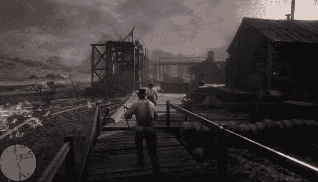
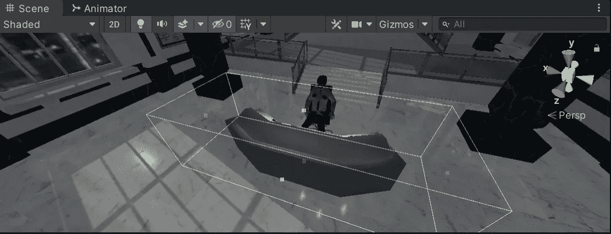
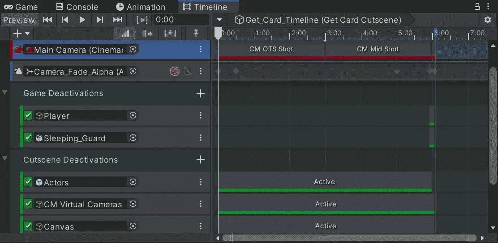
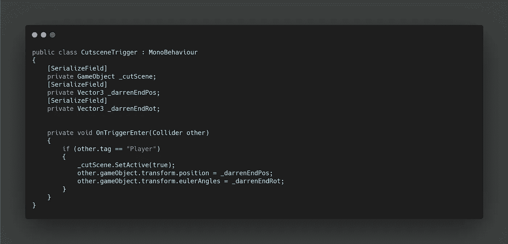

# 整合游戏之间的过场动画

> 原文：<https://medium.com/nerd-for-tech/integrating-a-cutscene-between-gameplay-f89fc274217b?source=collection_archive---------9----------------------->

目前，我们唯一激活的过场动画处于被抓的失败状态。为了从睡着的守卫那里拿到钥匙卡，我们需要从游戏中进入过场动画，然后再回到游戏中。

为了触发过场动画，我们可以用一个空的游戏对象作为触发器。在此基础上，我们可以创建一个脚本来保存模块化系统中的所有过场动画触发器。

**CutsceneTrigger 脚本**包含对我们想要启用的过场动画游戏对象的引用。然后**进入**如果检测到玩家，我们启用过场动画，这允许**时间线**和**影院**接管。

我们的过场动画已经包含了达伦和沉睡的守卫，所以我们需要禁用场景中的现有过场动画。我们可以在**时间线**中使用**激活轨迹来做到这一点。**这也允许我们在过场动画的最后一帧中重新启用这两个实例，这很好，因为我们已经渐变为黑色。

过场动画结束后，我们需要关闭过场动画组件，并重置摄像机以继续游戏。同样，这可以通过激活轨迹来实现。至于摄像机，我们可以创建一个最终的 **Cinemachine shot** 来复制游戏中合适的摄像机角度。

此外，我们的玩家在箱子碰撞器的边缘触发过场动画，但是在过场动画中，我们希望他出现在守卫的右边。为了解决这个问题，我们可以创建 **Vector3 的**来存储玩家可以设置的位置和旋转。现在，当他被重新激活，游戏继续，玩家将出现在他应该出现的过场动画的结尾。

