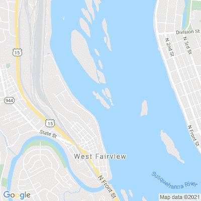
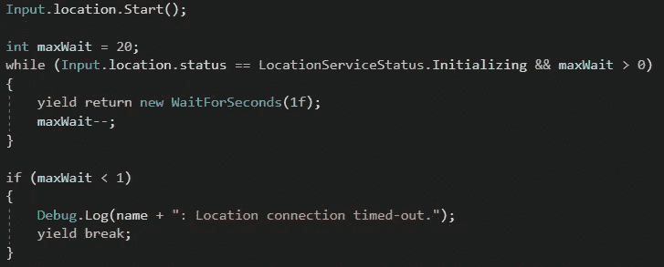
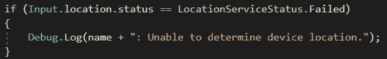
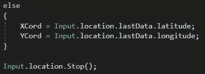
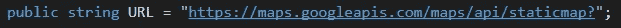
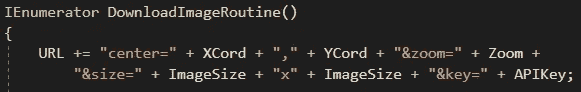
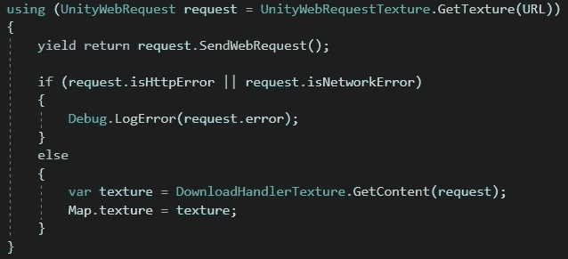

# 将谷歌地图 API 与 Unity 集成

> 原文：<https://medium.com/nerd-for-tech/integrating-google-maps-api-with-unity-bcb1b95d7fcc?source=collection_archive---------12----------------------->

**目的:**获取用户所在位置的地图图片。

宾夕法尼亚州哈里斯堡“浩荡”的萨斯奎汉纳河

为了显示地图，我们首先必须从用户的设备上获取用户的位置。我们需要使用一个 *IEnumerator* 方法来做到这一点；在这种情况下，我将使用*启动*方法。

首先，我们将确保用户允许我们的应用程序访问他们的位置。

如果我们有权限，我们会告诉系统开始这个过程。在我们放弃之前，我们会给系统 20 秒的时间来获得响应。

如果系统找不到位置，我们会报告。

如果我们得到了位置，我们将保存纬度和经度。

不管结果如何，我们都必须停止我们已经开始的进程。

现在我们有了位置，我们将调用另一个 *IEnumerator* 。我们将首先用我们需要的所有数据组装一个 URL 字符串:坐标(位置点将在地图的中心)、缩放(我们对位置的聚焦程度)、我们想要的图像大小以及我们的 Google 分配的地图 APIKey。

然后我们将使用一个 *using* 语句来生成一个 *UnityWebRequest* ，它将 URL 的结果存储为一个*纹理*。(使用语句的*将在完成后自行清理。)然后我们会发送请求。如果我们发现错误，我们会报告它。否则，一切工作，我们将应用我们的纹理到我们的图像，为我们的用户显示地图！*

