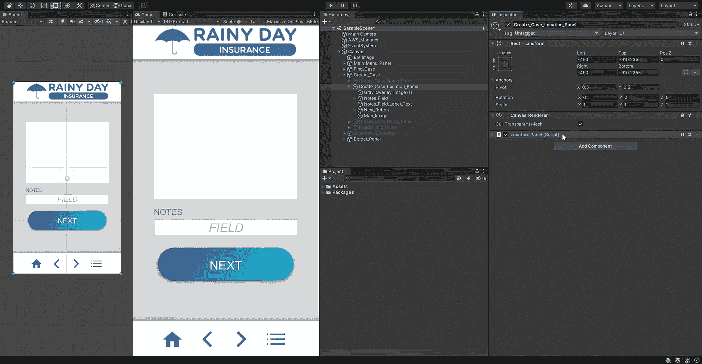
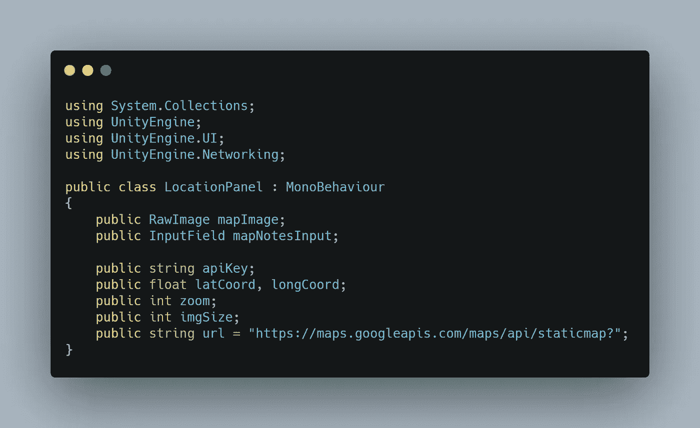
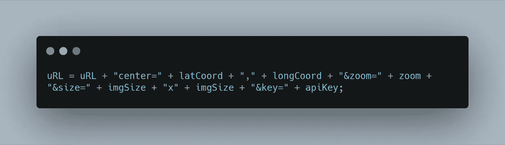
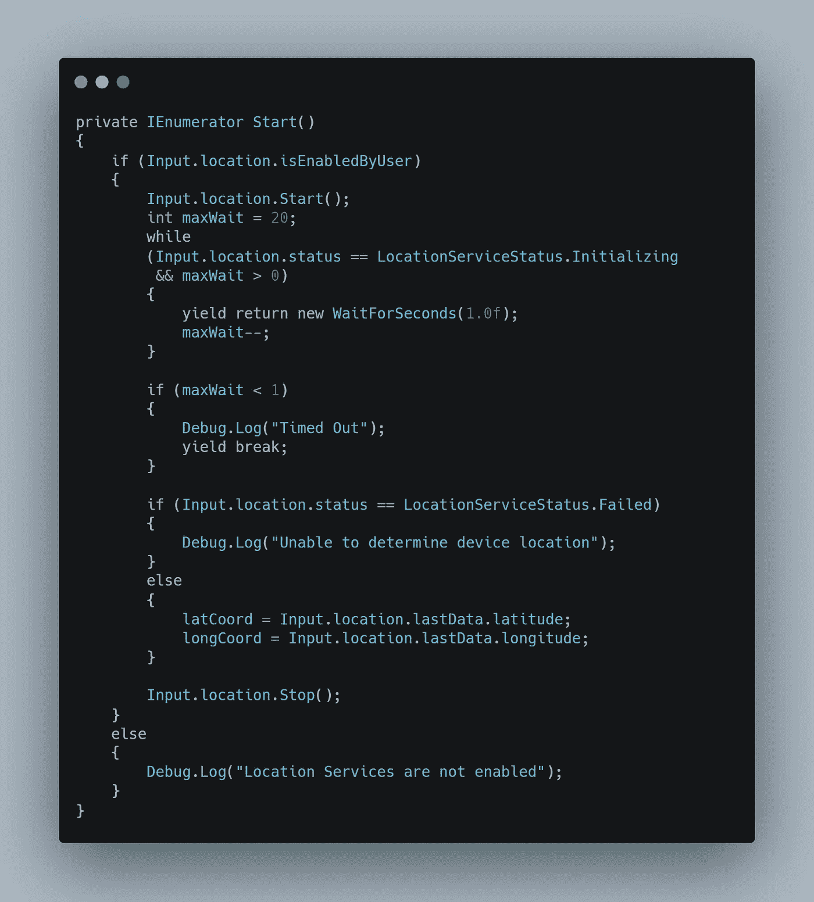
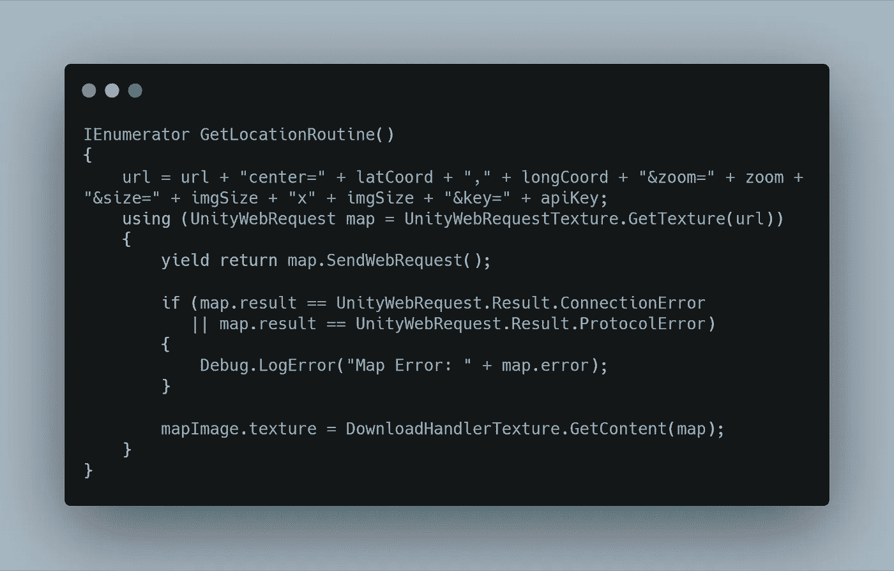

# 将谷歌地图 API 与 Unity 集成

> 原文：<https://medium.com/nerd-for-tech/integrating-google-maps-api-with-unity-dcef5e461e20?source=collection_archive---------6----------------------->

## 接触天空之眼

他们至少可以说“请”

嘿，我从我的后树林间隙回来了:如果你正在读这篇文章，支持和保护你当地的荒野保护区！

好了，够了。今天，我们将为我们的保险应用程序用户添加从谷歌地图获取他们当前位置的静态地图的功能，并将其添加到他们的新索赔中。让我们开始吧。

如果你正在跟进，对于这个过程，你将需要一个[谷歌地图 API 键](https://developers.google.com/maps/gmp-get-started)。

脚本细节被隐藏，因为 SHHHH API 密钥是秘密的！

首先，我将转到我的位置面板的 C#脚本，并创建必要的变量来创建请求我们的地图和处理表单信息的 URL。

这些变量是公共的，因为这是一个演示，比序列化每个字段在编辑器中查看要简单。

网址是根据谷歌提供的[指令格式化的。要构建它，我们只需使用这些指令中提供的参数关键字从变量中构建一个新的字符串。](https://developers.google.com/maps/documentation/maps-static/start)

但是为了得到 latCoord 和 longCoord 的值，我们需要首先确保我们是在使用 UnityEngine 的*。联网*。

Unity 为定位服务提供了 Start()和 Stop()方法，因此您可以精确控制您的应用程序何时主动尝试了解设备的位置。我们只在这一小段代码中需要它，所以这是这个过程的第一部分也是最后一部分。一旦定位服务打开，我们循环等待 20 秒，每秒检查是否有来自谷歌的结果。根据发生的情况，我们要么记录一个错误，要么请求变量所需的数据。

下面是伪代码:

> 如果位置服务已启用
> …启动()位置服务
> …设置最大等待时间
> …同时状态==正在初始化，最大等待时间> 0
> …等待第二秒
> …最大等待时间-1
> …如果等待时间为 0，则记录“超时”
> …如果状态==失败，则记录“无法确定位置”
> …否则，获取 lat 和 long
> …停止()位置服务
> 否则记录“位置服务未启用”

因为我们在等待秒，所以我们需要将它放在 IEnumerator 类型的方法中，并使用 yield 语句。我们希望地图立即加载，所以我们将把 *void Start()* 变成 *IEnumerator Start():*

最后，我们将构建另一个协程，使用从用户设备获得的位置数据从 Google 获取地图数据。我们构建 URL(如上)，然后启用 Unity Web 请求。我们可以在 Unity 的 SendWebRequest()方法上产生 return，而不是 while 循环。如果该方法返回一个错误，我们将记录它。否则，我们将我们的图像纹理分配给我们下载的图像。

在伪代码中:

> 构造 url 和参数
> 打开 unity web 请求以从 url 获取地图纹理
> …等待结果
> …如果结果是错误的，记录错误
> 将地图 UI 图像纹理设置为下载的地图图像

在 C#中:

整个过程就是这样。为了不向您展示我的地下巢穴在哪里，我不会显示代码的结果——但它是有效的！

明天我将介绍一个非常简洁的 Unity 免费插件，它可以从任何设备上的任何相机抓取图像。我们将使用该插件允许我们的用户拍摄索赔现场的照片。