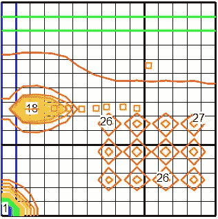
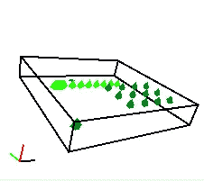
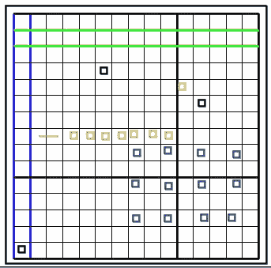
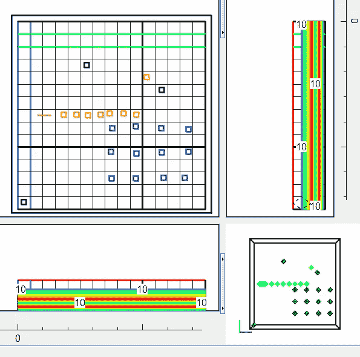

# 集成 MODFLOW、ModelMuse 和 Fortran

> 原文：<https://medium.com/nerd-for-tech/integrating-modflow-modelmuse-and-fortran-81c961975b5d?source=collection_archive---------2----------------------->

[](https://github.com/aswinvk28/modflow_fortran) [## aswinvk28/modflow_fortran

### docker-compose up-d-build docker exec-it modflow _ fortran/bin/bash nonprivuser @ d6ba ECA 63141:/home/project $ gfortran…

github.com](https://github.com/aswinvk28/modflow_fortran) 

## 目标:

使用[**Model muse**](https://www.usgs.gov/software/modelmuse-a-graphical-user-interface-groundwater-models)**创建[](https://www.usgs.gov/software/modflow-6-usgs-modular-hydrologic-model)****模型，并使用 Fortran 获取仿真数据表。******

************************************

## ********背景:********

******[***解释各层差异***](https://www.quora.com/What-are-the-differences-between-aquifer-aquiclude-aquitard-aquifuge)******

****定义了 5 层:****

*   ****上层 _ [含水层](https://en.wikipedia.org/wiki/Aquifer)****
*   ****上层 _ 弱透水层****
*   ****中层含水层****
*   ****下 _ 弱透水层****
*   ****下层含水层****

*****泵送率= -5 的一系列井已经在这些层中定义，这些层将保持水。从 200 处的上层含水层到-400 处的最底层含水层，这些层被放置在特定的间隙中。*****

*****排水管已从外部模型导入，等高线反映了其布局。*****

*   *****显示为蓝色的是油井*****
*   *****显示为浅橙色或粉红色的是排水管*****

## *******编程:*******

********

******ModelMuse 屏幕******

****上面给出的是井、[](https://www.hatarilabs.com/s/ExampleProblemModflowModelMuse.rar)****和层的剖面图。 [**ModelMuse**](https://www.usgs.gov/software/modelmuse-a-graphical-user-interface-groundwater-models) 后，用水流从左到右、从上到下模拟等高线。所有 [**型号 Muse**](https://www.usgs.gov/software/modelmuse-a-graphical-user-interface-groundwater-models) 型号都有。gpt 扩展。他们最终被模拟成。nam 扩展 Fortran 模型流模型。********

> ****ModFlow mf6 可执行文件执行 mfsim.nam 扩展以生成一系列模拟值。****

## ******编译** [**MODFLOW**](https://www.usgs.gov/software/modflow-6-usgs-modular-hydrologic-model) **从** [**USGS**](https://www.usgs.gov/software/modelmuse-a-graphical-user-interface-groundwater-models)****

> ******git 克隆**[**https://github.com/aswinvk28/modflow_fortran**](https://github.com/aswinvk28/modflow_fortran)****

```
****docker-compose up -d --build**

**docker exec -it modflow_fortran /bin/bash****
```

## ****在 Fortran 中执行 MODFLOW****

```
****docker exec -it modflow_fortran /home/nonprivuser/mf6.2.0/mf6 {}.nam****
```

## ****从 Docker Box 编译 Fortran****

```
****nonprivuser@d6baeca63141:/home/project$ gfortran -o hello_world hello_world.f90**
**nonprivuser@d6baeca63141:/home/project$ ./hello_world**
**output:
 hello from GCC version 7.5.0****
```

## ****使用共数组编译 Fortran****

```
****gfortran -fcoarray=lib coarray_hello.f90 -lcaf_mpi
./coarray_hello**
**output: 
 number of Fortran coarray images:           1
 Process            1
 Elapsed wall clock time   4.1199999999999999E-005  seconds.****
```