# 将 PayPal 沙盒与 React JS 项目集成

> 原文：<https://medium.com/nerd-for-tech/integrating-paypal-sandbox-with-react-js-project-191caf0a7b53?source=collection_archive---------5----------------------->

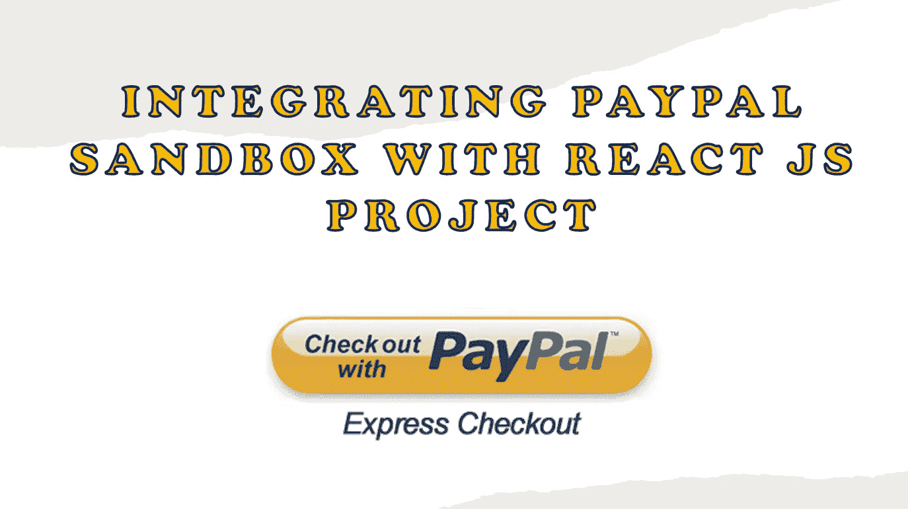

PayPal 沙箱是一个独立的虚拟测试环境，**模拟真实的 PayPal 生产环境**。这提供了一个屏蔽空间，您可以在其中启动处理 PayPal API 请求，而无需使用任何实时 PayPal 帐户。

在本文中，我将向您展示如何将 PayPal sandbox 与您的 ReactJS 项目集成。

## 第一步:

安装 npm 依赖项。你可以在这里 看到更多关于这个依赖 [*的细节。*](https://www.npmjs.com/package/react-paypal-express-checkout)

> npm 安装-保存反应-贝宝-快速-结帐

## 第二步:

为项目中的 PayPal 按钮创建一个新文件作为组件，并将下面的代码复制到其中。

文件名:PaypalButton.js
这里 可以获取代码 [*。*](https://codepen.io/jeema-riyana/project/editor/DVQwdd)

## 步骤 03:

接下来，您必须将沙盒应用程序 ID 添加到上面的代码中。为此，你必须访问 PayPal 开发者**并点击***登录仪表板*** 。(如果您没有帐户，需要先注册)。**

**然后，您将重定向到如下图所示的页面。**

**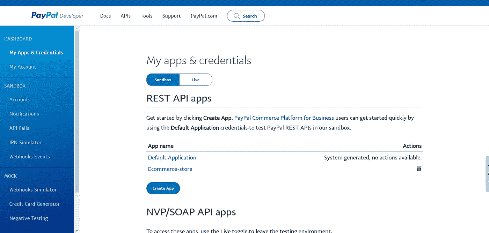**

**PayPal 开发者账户**

****按照以下步骤创建应用 ID。****

1.  **点击 ***在 ***REST API apps*** 下创建 App*** 。然后，您将进入下图所示的页面。**

*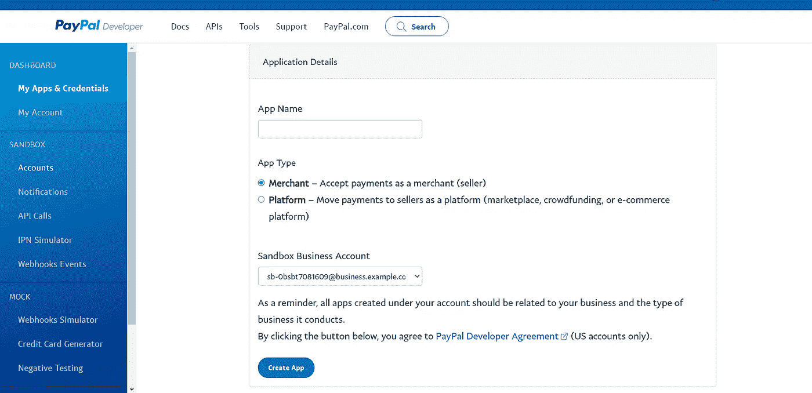*

*创建应用程序*

*2.输入唯一的 ***App 名称*** ，点击 ***创建 App。****

*现在你可以看到你的沙盒账户和客户端 ID，如下图所示。*

*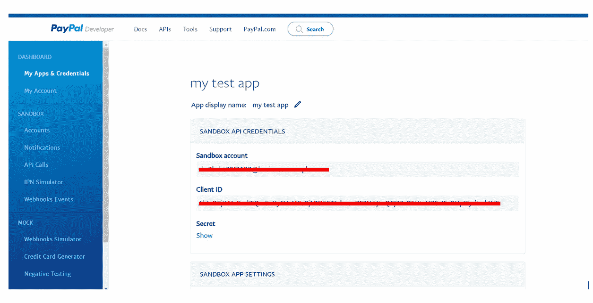*

*3.复制**客户端 ID** 并粘贴到您的 PaypalButton.js 的 const client = {…}下。*

*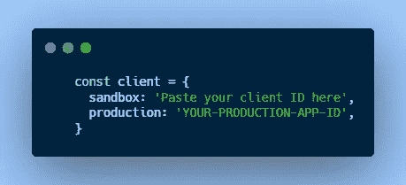*

## *步骤 04:*

*将 PaypalButton.js 导入到需要显示 PayPal 按钮的组件中。此外，你必须通过总金额和历史，你可以得到如下图所示的道具。*(这里我添加了 clearCart，因为我需要在付款后清空购物车。您可以根据需要添加)**

*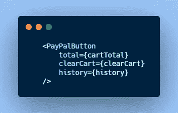*

*当您运行您的项目时，您可以看到 PayPal 按钮，如下图所示。*

*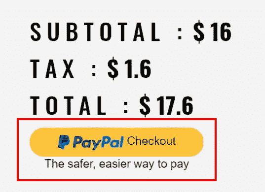*

*PayPal 按钮*

## *第五步:*

*现在，您可以点击此按钮进行测试付款。它会将你重定向到贝宝登录页面。*

*要登录并进行测试付款，您可以使用我们在步骤 03 中创建的帐户的凭据。*

*为此，前往 ***沙盒*** 下的 ***账号*** 。然后，您可以看到为您创建的两个默认帐户。如果需要自己的账号，可以点击 ***创建账号*** 创建一个。或者您可以使用任何默认凭证来进行测试支付。*

*在这里，您可以看到两个默认帐户，即企业帐户和个人帐户。你可以用个人账户作为买家账户，用企业账户作为卖家账户。要获取凭证，点击 ***管理账户*** 中的三个点，点击 ***查看/编辑账户*** 。在那里，您可以看到该帐户的电子邮件 ID 和密码。*

*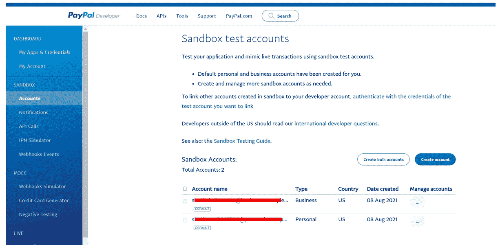*

*沙盒测试帐户*

## *步骤 06:*

*使用您的个人帐户凭证登录后，您可以看到下面的弹出窗口，其中显示了您的付款详情。点击 ***立即支付*** 进行支付。*

*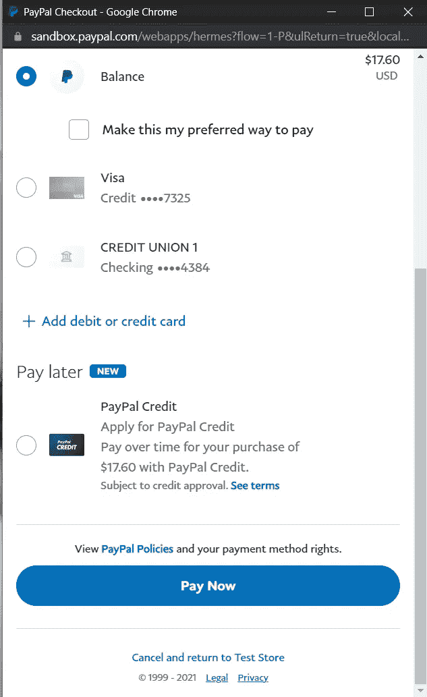*

## *步骤 07:*

*要检查支付情况，请访问 [*PayPal 沙盒账户*](https://www.sandbox.paypal.com/) ，并使用买家账户凭证登录，该凭证用于登录以在步骤 06 中进行支付。在这里，您可以看到您所做的所有交易，如下图所示。*

*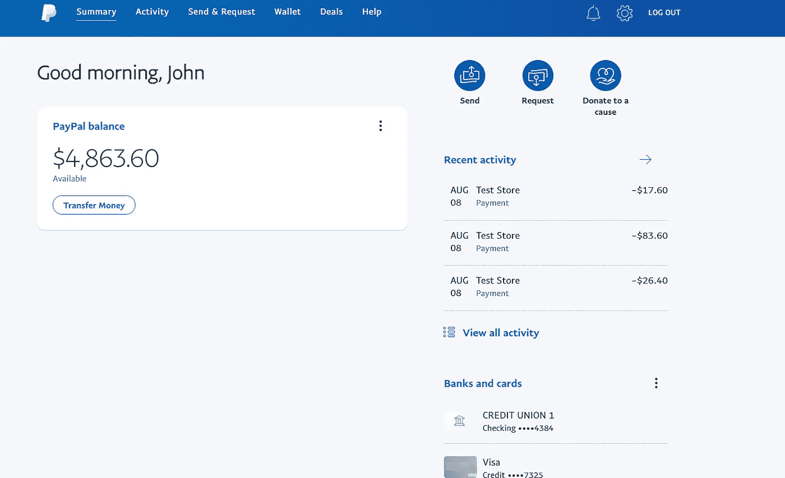*

*如果您使用商业帐户凭据登录，您可以看到您收到的付款，如下图所示。*

*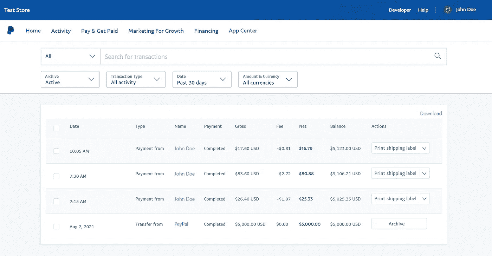*

*所以现在我们已经完成了所有的步骤，我希望你已经成功地将你的 React JS 应用程序与 PayPal 沙盒集成。*

***♥️♥️感谢您的阅读。敬请关注即将发布的文章。♥️♥️***