# 将 Visual Studio 与 Unity 集成用于游戏开发。

> 原文：<https://medium.com/nerd-for-tech/integrating-visual-studio-with-unity-for-game-development-282bb2f5b365?source=collection_archive---------1----------------------->

由 [Unsplash](https://unsplash.com?utm_source=medium&utm_medium=referral) 上的[网帖](https://unsplash.com/@screenpost?utm_source=medium&utm_medium=referral)拍摄

你刚刚开始用 Unity 学习游戏开发，现在你需要写一个脚本(假设你想给你的角色提供基本的运动能力)。因此，您发现您需要安装 Visual Studio，于是您下载并将其安装在您的系统中。

现在，您已经安装了 Unity 和 Visual Studio，您决定继续下一步，所以您点击您已经创建的 C#脚本，然后快照！你意识到你没有从 [IDE](https://en.wikipedia.org/wiki/Integrated_development_environment) 得到任何关于 Unity 组件的建议或代码补全。

IDE 中没有建议和代码完成

但是这不正是 IDE 应该做的吗？通过为您完成代码并使一个类中的所有方法随时可供您使用，让您的生活变得简单一点？那么是哪里出了问题呢？

嗯，别担心！您已经错过了一个非常简单的步骤，由于它没有按预期工作，这就是这篇文章打算帮助您修复。

在这篇文章中，我将指导你完成以下内容:

1.  下载正确的 Visual studio。
2.  在 Unity 中创建新的 C#脚本。
3.  集成 Visual Studio 和 Unity。

让我们开始吧！

# 下载正确的 Visual studio。

[这里](https://visualstudio.microsoft.com)，可以找到下载 Visual Studio 社区版的链接。

**注:**专业版和企业版付费。

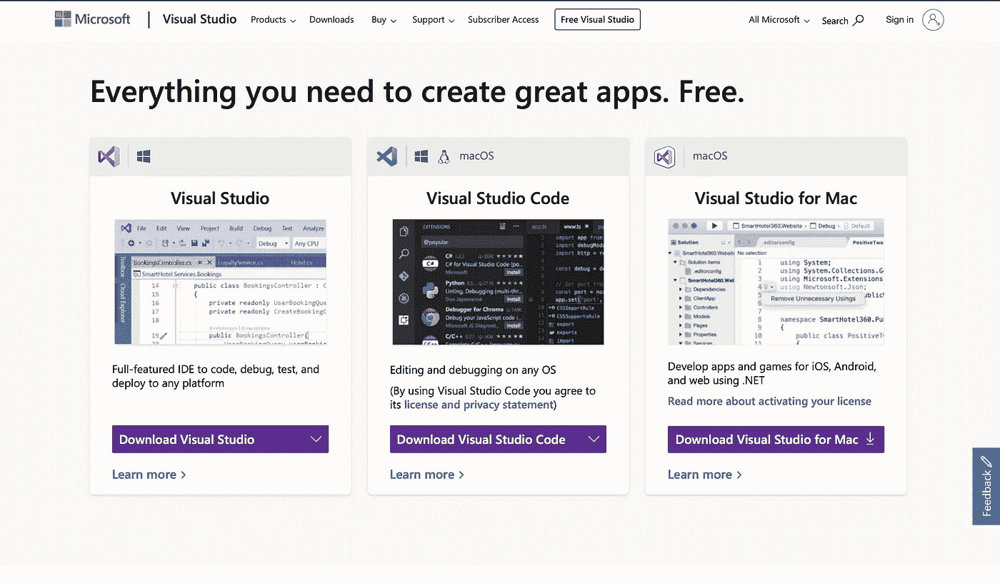

根据您的平台，下载正确的 Visual Studio。此外，我不建议下载“Visual Studio 代码”,因为它只是一个代码编辑器，而不是一个完全集成的 IDE，不像 Visual Studio。我将在这里演示 MacOS 版本。

让下载和安装在后台进行。同时，我们将看到如何在 Unity 中创建 C#脚本。

# 用 Unity 创建一个新的 C#脚本。

打开 Unity 并寻找“项目层级”面板。您将能够在此处看到*“资产”*文件夹。(在我的例子中，我有“资产”和“包”)

## **步骤 1:选择根“资产”目录**

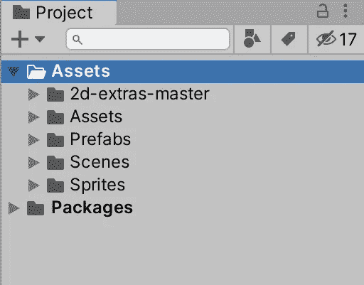

## 步骤 2:创建新的脚本目录

右键单击上图所示的资产文件夹，创建一个新的“文件夹”，如下图所示，并将其命名为**“脚本”**

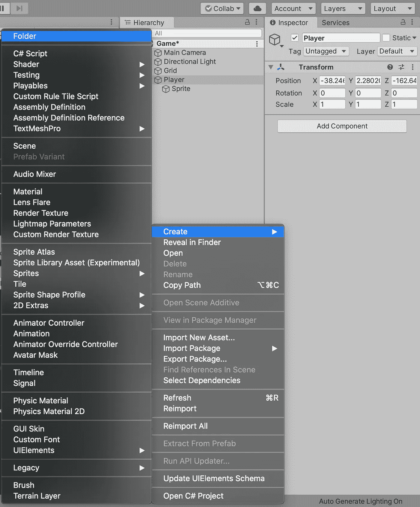

一旦你完成了，你会得到这样的东西:

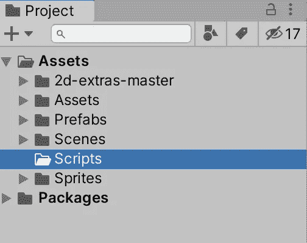

## 步骤 3:创建一个新的 C#脚本

右键单击脚本目录，创建一个新的 C#脚本，如下图所示，并为其提供一个合适的名称。因为我们试图让主角活起来，所以我们将它命名为**‘player’**，没有指定任何格式。

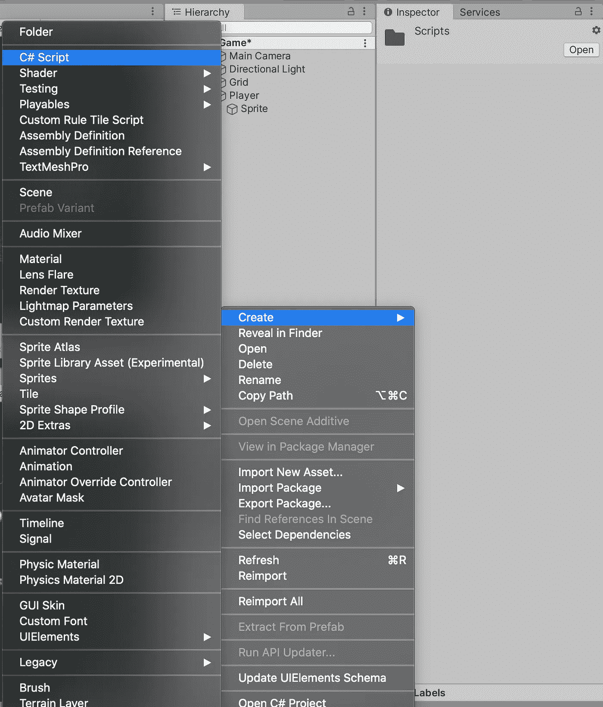

现在，您将拥有一个用基本代码生成的 C#脚本，它可以在“Inspector”面板中看到。

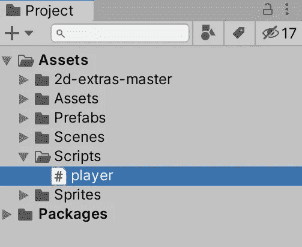

**暂时不要**点击 C#脚本。现在，我们将返回并检查 Visual studio 安装是否已经完成。如果没有，请等待它完成，因为您还没有任何能够运行 C#脚本的应用程序。

一旦安装成功，我们准备继续前进！

# 集成 Visual Studio 和 Unity。

这是最重要的部分，所以请确保您遵循本节中的所有步骤。

## 步骤 1:打开偏好设置

单击 Unity 选项卡并选择“首选项”,如下图所示。

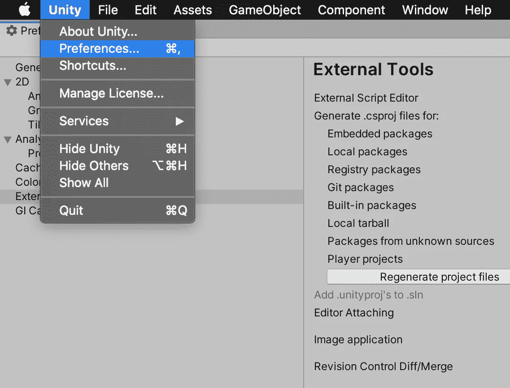

## 步骤 2:选择外部工具

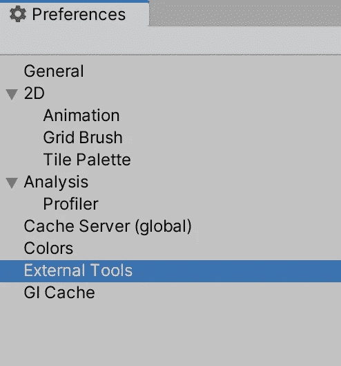

## **第三步:从下拉列表中选择 Visual Studio**

单击外部工具部分的下拉菜单，然后选择“Visual Studio”。

**注意:**如果 Visual Studio 安装尚未完成，则不会反映出来。

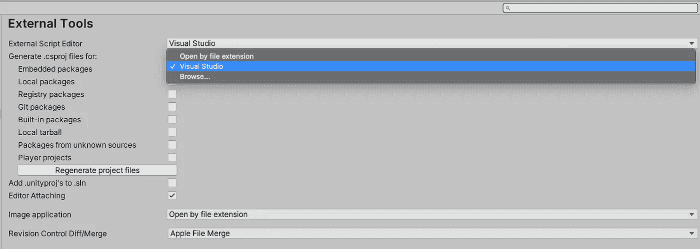

如果 Visual Studio 已完成安装，但您仍然无法在下拉列表中看到它，请单击“浏览”，导航到 Mac 上的应用程序，单击 Visual Studio 并选择“打开”，如下图所示。

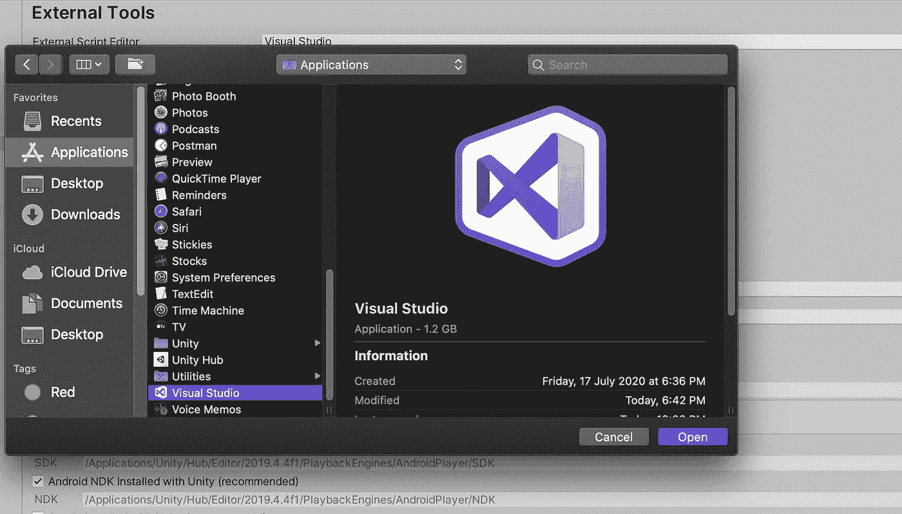

既然 Visual Studio 已经与 Unity 集成，选择我们在上一节中创建的“player”C #脚本，等待它启动。

让我们尝试一下我们以前尝试过的东西，看看我们是否能充分利用 IDE 的潜力:

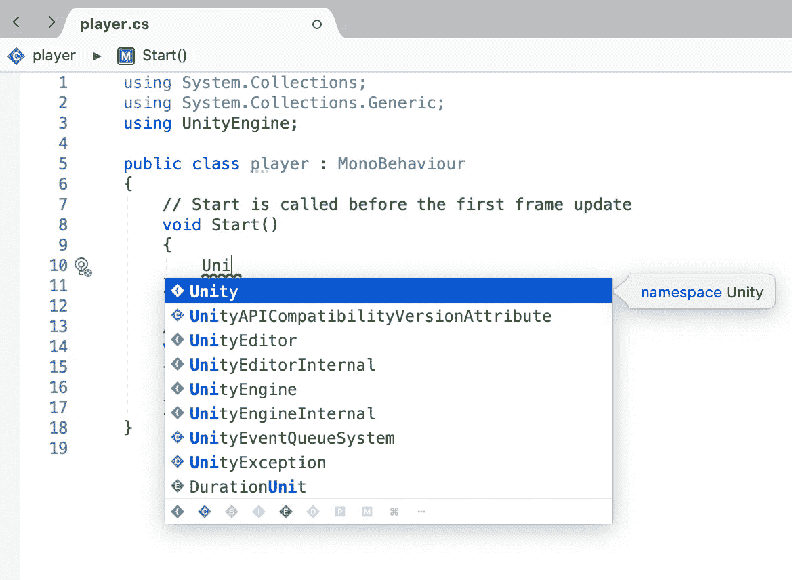

就是这样！我们现在已经成功地将 Visual studio 与 Unity 集成在一起，离赋予我们的角色生命又近了一步。