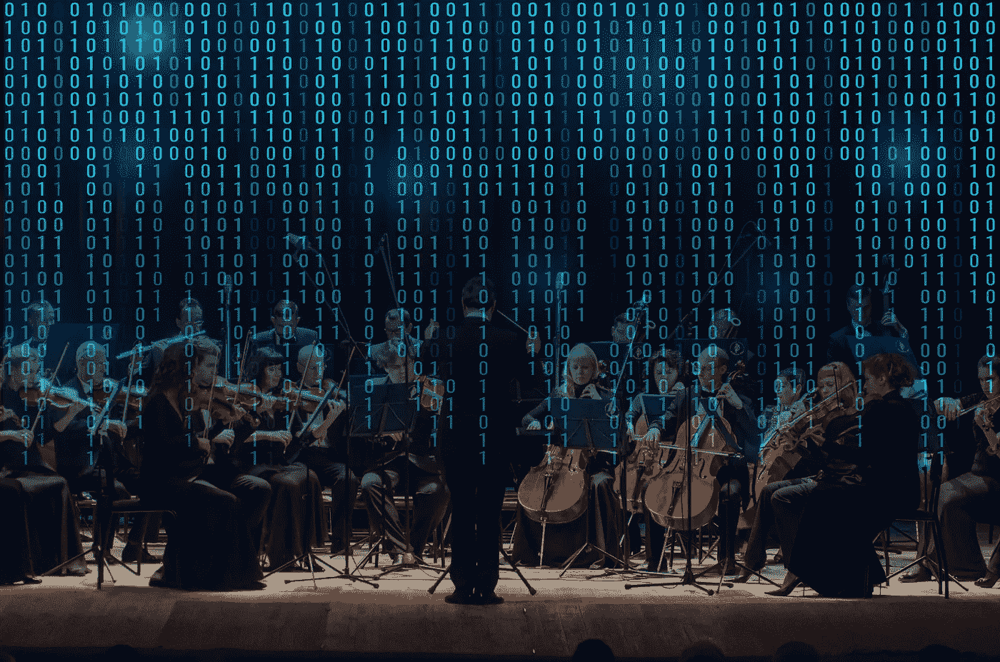

# 智能编排:发展速度中的软件安全

> 原文：<https://medium.com/nerd-for-tech/intelligent-orchestration-software-security-at-the-speed-of-development-ebf27080f2f6?source=collection_archive---------22----------------------->

对一般人来说，“智能配器”听起来可能就像是纽约爱乐乐团指挥为了确保单簧管不会在小提琴独奏中乱踩而做的事情。如果音乐听起来很好，有意义，并产生情感反应，所有的乐器必须和谐地一起工作。音乐家必须在正确的时间演奏正确的音符。

这不仅仅适用于音乐。在软件开发中也是如此，即使情感反应直到一个应用程序完成并在被它所做的弄得眼花缭乱的用户手中才会出现。

智能编排的数字版本是平衡更快开发软件产品的贪得无厌的需求与这些产品安全的同等重要的需求所需要的。如果它们不安全，当这些产品的用户成为黑客唾手可得的果实时，他们的情绪反应很可能是沮丧和愤怒。

犯罪黑客的目标现在已经很熟悉了。对于个人受害者，他们试图窃取身份，用偷来的信用卡进行欺诈性购物，并抢劫银行账户。如果一家公司是目标，他们会试图窃取知识产权，暴露客户的个人和财务数据，并掠夺公司的财务。

而且，正如最近的头条新闻所显示的，一系列的攻击旨在从运营关键基础设施的组织那里收取数百万的赎金，从[燃料](https://armerding.medium.com/colonial-pipeline-yet-another-cybersecurity-wake-up-call-e9d03498e34d)到[食品供应](https://arstechnica.com/gadgets/2021/06/attack-on-meat-supplier-came-from-revil-ransomwares-most-cut-throat-gang/)到[运输](https://thehill.com/policy/cybersecurity/556489-massachusetts-ferry-operator-hit-by-ransomware-attack)。

对于安全性薄弱的产品的制造商来说，结果也是熟悉而痛苦的:品牌受损、可能的诉讼、失去市场份额、合规制裁等等。足以摧毁任何已经在挣扎的组织。

虽然黑客确实会利用窃取的密码，无知的员工可能会受到网络钓鱼攻击并点击恶意链接，但大多数成功的黑客攻击都是通过未打补丁的不安全软件实现的。这意味着它一开始就不安全，很可能是因为开发人员面临着将产品投入生产的压力，并且无法管理来自安全工具的大量通知，这些通知拖了他们的后腿。

**金发女孩测试**

因此需要智能编排。如果做得好，它可以帮助解决这个难题。开发人员不必为了安全而牺牲速度，因为正如 Goldilocks 所说，软件测试是恰到好处的。

智能编排是一种在正确的时间使用正确的工具调用正确的测试的自动化方式，并且只标记关键的漏洞，而不是用如此多的不相关或琐碎的安全通知来淹没开发人员，以至于他们开始将它们视为不受欢迎的背景“噪音”并简单地忽略它们。

智能编排并不是一个新概念，它的元素已经存在了几十年。但是一种更全面的形式正在成为主流。

在上个月的 [RSA 会议](https://www.rsaconference.com/en/usa)上，Synopsys 软件完整性小组发布了 it 的产品[版本。(披露:我为 Synopsys 撰稿)。](https://www.synopsys.com/software-integrity/polaris/intelligent-orchestration.html?cmp=pr-sig&utm_medium=referral?cmp=pr-sig&utm_medium=referral)

这听起来像是软件开发人员的梦想。它的工作方式符合[牛津语言](https://languages.oup.com/google-dictionary-en/)词典中对编排的第二个定义:“计划或协调一种情况的各种因素以产生预期的效果，尤其是秘密地。”

在这种情况下，隐秘的部分是有选择性的和受欢迎的，这就是它对开发者如此有吸引力的原因——除非绝对必要，否则它不会打扰你。

那么它怎么知道什么时候打扰你，什么时候让你一个人待着呢？米拉·劳很高兴你这么问。Rao 是 Synopsys Software Integrity Group 的产品管理高级总监，负责领导该公司智能编排解决方案的开发。

她将其描述为“心脏和大脑”,它知道测试什么、何时测试以及使用什么工具，因为用户——开发人员、团队、组织——可以按照他们想要的方式对其进行编程。这与你的医生办公室给你发短信或电子邮件提醒你预约或让你知道验血结果并没有太大区别——其余时间让你一个人呆着。

在软件开发的世界中，构建/组装过程被称为管道，它是开发人员用来编译、构建他们的代码并将其部署到生产环境中的一组自动化过程。

**并行管道**

智能编排也是一个管道，它与构建和发布管道并行运行。它可以被编程来确定和启动最合适的安全测试，包括[静态](https://www.synopsys.com/software-integrity/security-testing/static-analysis-sast.html?cmp=pr-sig&utm_medium=referral)、[动态](https://www.synopsys.com/software-integrity/application-security-testing-services/dynamic-analysis-dast.html?cmp=pr-sig&utm_medium=referral)和交互式应用安全测试以及[软件组合分析](https://www.synopsys.com/software-integrity/security-testing/software-composition-analysis.html?cmp=pr-sig&utm_medium=referral)，后者在开发代码库中找到开源组件，以及这些组件中任何已知的漏洞。

Rao 说:“在智能编排管道中，您可以为您拥有的应用程序类型、技术和框架配置规则，以确保您执行正确的分析。

“我举的一个简单例子是:你在 JavaScript 文件中对一种字体做了一些修改。我需要运行所有的活动吗——静态分析、动态分析和软件组合分析？一个大大的不！”

“但如果你对加密 API(应用程序编程接口)或你的认证和授权 API 进行了重大更改，那么你需要运行静态分析并执行手动代码审查，以查看这些更改是否得到了正确实施，”她说。

简而言之，智能编排可以配置为只做您希望它做的事情，这就是所谓的“策略即代码”可以对其进行编程，以查看代码更改的重要性、应用程序的风险概况以及要考虑的策略，然后“知道”开发团队是否可以跳过某些安全活动并将其推向生产。

Rao 说，这可以消除她经常从软件开发人员那里听到的抱怨:“我的管道本身需要 10 分钟，但如果我集成了安全工具，则需要 40 分钟或更长时间。”

当然，任何软件开发人员都知道事情可以比这更复杂。许多较大的组织有数百甚至数千个正在开发的项目，从内部的、从不面向公众的应用程序或服务，到为互联网上潜在的数百万用户设计的应用程序或服务。

他们似乎不太可能都只使用智能编排管道的一种配置。这是否意味着要花费时间和金钱来创造数以千计的独立的、特定的配置呢？

不完全是。“这里的关键是看一个组织使用的不同语言和技术。我们建立一个管道，然后你可以从这个管道迭代，”饶说。“例如，如果您有 Java 和 Maven，并且有一个为该技术构建的管道，那么如果您有 10 个使用这些语言的应用程序，您可以从该管道继承。

底线:现实是开发者不会放慢速度来适应安全工具。安全工具必须加快速度。“软件开发人员必须快速行动——他们每天都要签入代码变更，甚至每小时都要签入，”Rao 说。“不管我们软件安全行业喜不喜欢，快速发货是一种新的常态。”

或者，正如新思公司的财富 500 强金融服务客户所说，“你不运行的测试可能与你运行的测试同等重要。”

这就是智能流程编排知道如何做的事情，因为您提前告诉了它。