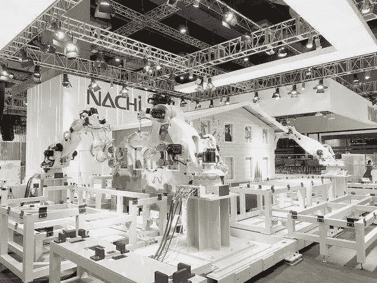

# 智能机器人集体亮相 CIIE 将建房子和干农活

> 原文：<https://medium.com/nerd-for-tech/intelligent-robots-collectively-appear-at-the-ciie-will-build-houses-and-do-farm-work-2fb7cf1acb9d?source=collection_archive---------2----------------------->

[https://www.163.com/dy/article/GOD50G1L05373BXP.html](https://www.163.com/dy/article/GOD50G1L05373BXP.html)

## CIIE 的智能机器人

2021 年 11 月 5 日，琳琅满目的高科技产品第四届国际进口博览会正式接待参观者。展览中最引人注目的部分是技术设备展区。许多参展商带来了他们最高端的产品——智能机器人，可以在各个领域展示他们的才华:建造房屋，移动重物，拧螺丝，挑选幼苗。

在富士越的机器人展区，两个巨型机器人正在合力抬起一块预制屋板。据现场工作人员介绍，这些机械臂单机可以举起 350 公斤的重量。四个或五个机器人可以根据预先设定的指令一起工作来完成房屋框架的建造。

在建筑展区旁边，有一个大力神机器人在做焊接工作。它的动作像刺绣一样轻柔。工作人员说，这个机器人既能做粗活，也能做细活。它能举起 600 公斤的重物，并能进行摩擦、搅拌和焊接。不可思议的是，它可以在没有火花的情况下将两块钢板焊接在一起。据报道，藤越曾带了十几个机器人来参展。他们将能够建造房屋、搬运、焊接、拧紧和组装。

在爱普生数字智能农业展区，一台数字智能机器人向大家展示了“干农活”的技能。它看起来也像一个机械臂，幼苗可以被选择并放置在水培区。机器人一次性“处理”了左手边的六棵绿色幼苗，并将其放入右手边的水培区，动作精准，循环往复，不知疲倦。据说机器人识别秧苗质量的能力比人工更准确。“我们可以向机器人输入合格的数据，”专家说，“比如合格的叶面积大小，机器人就会据此来取苗。然后，被选中的幼苗会被传送机器人送到水培柜进行培育。”

另外，爱普生的数值训练机器人也很神奇。看起来像柜机，但却是“培训老师”，可以进行一条龙服务。学生可以现场学习组装技能。而且无法到达现场的同学可以使用 VR 眼镜远程学习。当他们需要帮助时，他们也可以与真正的老师在线交流。

## 定制机器人

人工智能和机器人的 R&D 应该真正贴近客户的需求。目前，商用机器人在中国市场有很大的潜力。人工智能和机器人的结合应该考虑成本、技术和用户体验。

移动互联网和电子商务系统的蓬勃发展，推动了消费需求的爆发。另一方面，传统工业机器人带来的红利已经消失。因此，目前整个行业的需求是朝着智能化和数字化发展。以人为本是机器人行业最重要的驱动力，用户体验必须放在第一位。

# 结束

将你的数据标注任务外包给 [ByteBridge](https://tinyurl.com/24bkemnp) ，你可以更便宜更快的获得高质量的 ML 训练数据集！

*   无需信用卡的免费试用:您可以快速获得样品结果，检查输出，并直接向我们的项目经理反馈。
*   100%人工验证
*   透明标准定价:[有明确的定价](https://www.bytebridge.io/#/?module=price)(含人工成本)

**为什么不试一试？**

来源:

1 https://t.ynet.cn/baijia/31688480.html

2 https://www.robot-china.com/news/202111/04/68114.html