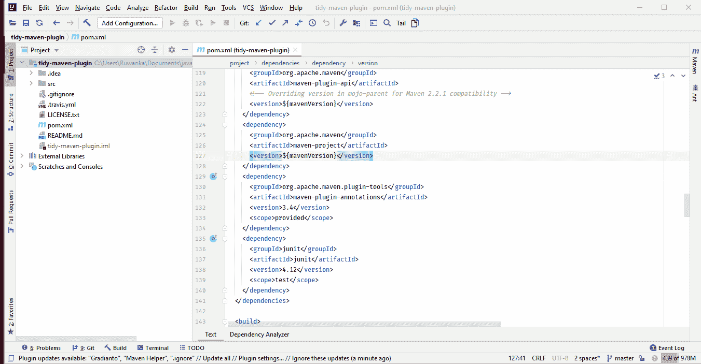
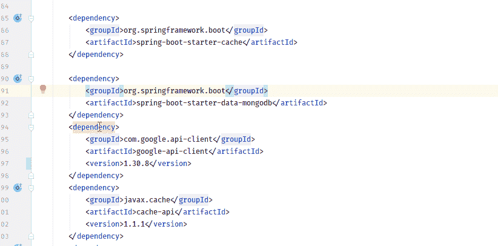
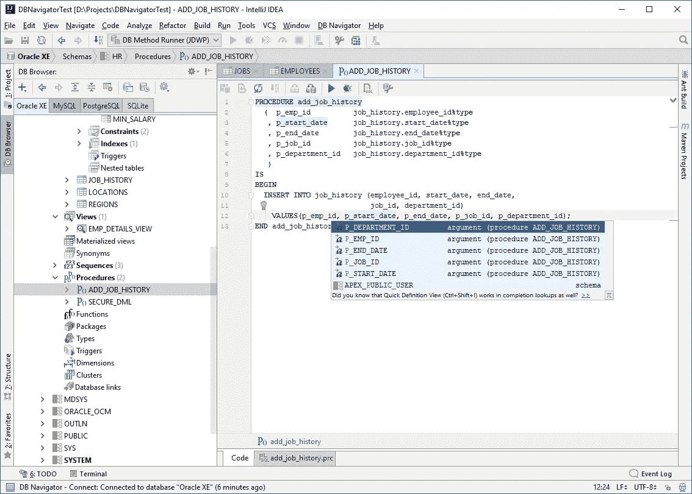
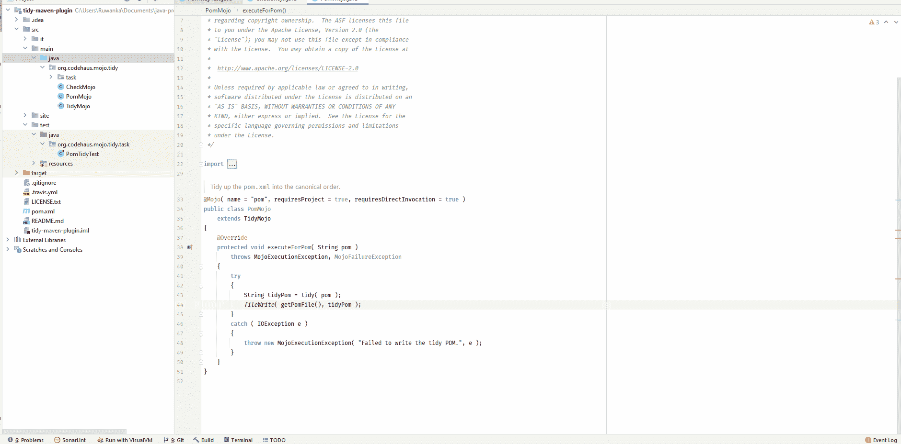
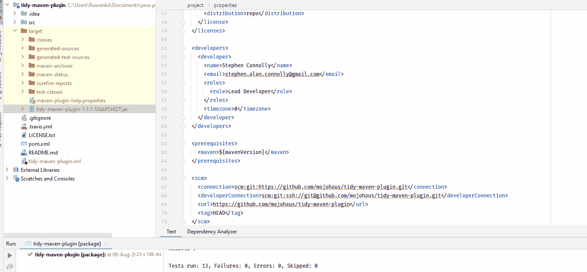
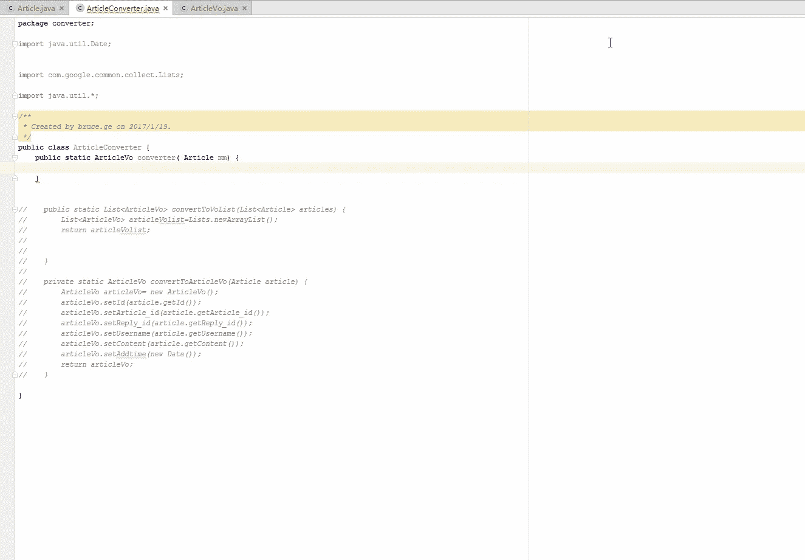
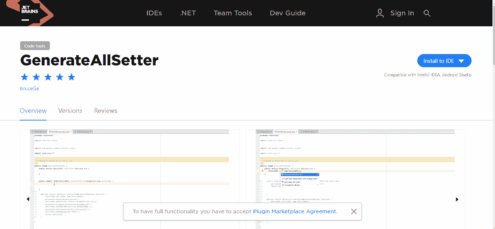

# 为 Java 开发者策划的 IntelliJ IDEA 插件

> 原文：<https://medium.com/nerd-for-tech/intellij-idea-plugins-curated-for-java-developers-8472c03c6cd3?source=collection_archive---------0----------------------->

我是基于想法的 IDEs 的忠实粉丝。如今，我主要从事 IntelliJ IDEA 工作。所以拥有一套好的插件可以提高你的生产力。现在有一个插件市场，在那里你可以得到大量的免费插件和付费插件。这里是我最喜欢的插件列表，我每天都在使用。

## 1.Maven 助手

如果你使用 maven 作为你的构建工具，这个插件是一个必须拥有的插件。在处理大型项目时，您可能会注意到有多少次您使用 maven dependency analyze 命令并从上到下滚动来查找依赖性或依赖性冲突。这个插件给了你一个很好的视图，你可以立即搜索并通过点击排除冲突。您会发现还有许多其他有用的选项。

 [## Maven 助手-插件| JetBrains

### 必须有一个插件与 Maven 一起工作。

plugins.jetbrains.com](https://plugins.jetbrains.com/plugin/7179-maven-helper) 

maven 助手在运行

## 2.Maven 依赖搜索器

这个插件让你在 IDE 中搜索 maven central。它还为您提供下载二进制 jar、源 jar 和复制您最喜欢的构建工具的依赖项的选项。因此，这简化了依赖项搜索，并且对于使用第三方库的项目非常有用。

 [## Maven 依赖搜索器-插件| JetBrains

### Maven 依赖搜索器。

plugins.jetbrains.com](https://plugins.jetbrains.com/plugin/12574-maven-dependencies-searcher) 

maven 依赖搜索器在运行

## 3.Maven 依赖更新程序

你有没有注意到 Android Studio 有一个很好的小功能，你可以在 build Gradle 文件中将一个依赖项更新到它的最新版本？所以这个插件是我开发的，目的和 maven 一样。所以试一试，让我知道你的想法。这需要最新的 maven 索引。您可以通过访问设置➡构建、执行、部署➡构建工具➡ Maven ➡知识库来更新 maven 知识库。接下来，选择您想要更新的存储库并点击 update 按钮。

 [## Maven 依赖更新程序-插件| JetBrains

### 检查 maven 依赖版本更新并提供。

plugins.jetbrains.com](https://plugins.jetbrains.com/plugin/13018-maven-dependency-updater) 

maven 依赖项更新程序正在运行

## 4.数据库导航器

许多应用程序需要 SQL 数据库集成。所以 IntelliJ IDEA Ultimate edition 附带了 SQL 数据库集成。那么社区版呢？在 IntelliJ IDEA community edition 中使用 SQL 数据库时，Database Navigator 为您提供了一整套工具。它支持 Oracle、MySQL、SQLite 和 PostgreSQL。这是我最喜欢的插件之一。

 [## 数据库导航器-插件| JetBrains

### 数据库开发，脚本和导航工具。

plugins.jetbrains.com](https://plugins.jetbrains.com/plugin/1800-database-navigator) 

数据库浏览器-信用:插件页面

## 5.重复类查找器

我想你知道罐子地狱这个概念。Jar Hell 的意思是，当您的类路径中有多个依赖项时，可能会有具有相同名称空间和名称的类。因此，在运行时，它们可能会相互冲突，产生意想不到的行为。因此，这个插件可以帮助您识别项目类路径中的问题类型。

 [## 插件| JetBrains

### 在依赖关系中查找重复的类。

plugins.jetbrains.com](https://plugins.jetbrains.com/plugin/9845-duplicateclassfinder) 

运行中的重复类查找器

## 6.可视化虚拟机启动器

分析性能影响对于任何 Java 应用程序都是至关重要的。可视化虚拟机是一个很好的工具。但是从可视虚拟机中附加它有点麻烦。那么为什么不在 IntelliJ IDEA 本身内部做呢？

 [## VisualVM 启动器-插件| JetBrains

### 从 IDEA 中启动 VisualVM。

plugins.jetbrains.com](https://plugins.jetbrains.com/plugin/7115-visualvm-launcher) 

使用 visualVM 选项运行

## 7.声纳线头

我希望你总是努力交付高质量的代码。因此，只需点击几下鼠标就能使用静态代码分析器是一个优势。这个插件可以作为流行的 Sonarqube 的独立插件。此外，它可以与您的 Sonarqube 服务器集成，从中获取分析规则。

 [## SonarLint 插件| JetBrains

### SonarLint 是一个免费的 IDE 扩展，可以让你在编写代码时修复错误和漏洞！就像拼写检查一样…

plugins.jetbrains.com](https://plugins.jetbrains.com/plugin/7973-sonarlint) 

声纳线头在工作

## 8.存档浏览器

有时你需要查看你的 war 文件或任何存档文件。存档浏览器提供您的目录，就像在项目工具窗口中导航存档文件一样。是不是很牛逼？

 [## 存档浏览器-插件| JetBrains

### 这个插件允许你浏览像 IDEA 中的文件夹一样的大多数档案。

plugins.jetbrains.com](https://plugins.jetbrains.com/plugin/9491-archive-browser) 

运行中的存档浏览器

## 9.生成器生成器

顾名思义，它只需一次点击就能为 POJO 生成构建器模式。你可以使用这个插件生成内部构建器或者单独的构建器类。

 [## 生成器-插件| JetBrains

### 增加了为一个类生成生成器并在它们之间切换的能力。

plugins.jetbrains.com](https://plugins.jetbrains.com/plugin/6585-builder-generator) 

运行中的生成器

## 10.生成复制构造函数

这个插件生成复制构造函数。相信我，这在某些情况下很有帮助。所以在你的插件集合中有这个是一个优势。

 [## generatecopy constructor-Plugins | JetBrains

### 将生成复制构造函数的选项添加到“生成”菜单中(alt + ins)。

plugins.jetbrains.com](https://plugins.jetbrains.com/plugin/7225-generatecopyconstructor) 

实际生成复制构造函数

## 11.GenerateSerialVersionUID

当您处理依赖于 java 序列化的项目时，这个插件会很方便。它很容易为一个类添加 serialVersionUID。

 [## GenerateSerialVersionUID-Plugins | JetBrains

### 在生成菜单中添加新操作“SerialVersionUID”(alt+ins)。

plugins.jetbrains.com](https://plugins.jetbrains.com/plugin/185-generateserialversionuid) 

SerialVersionUID 正在运行

## 12.GenerateAllSetter

这个插件允许你用默认值生成所有的设置器。你只需要更新你想要的值，这无疑为你节省了大量的击键次数。

 [## GenerateAllSetter-Plugins | JetBrains

### GitHub | Issues 一键调用一个对象的所有的 set 方法 generate call to class all setter method by alt+enter on the variable class generate…

plugins.jetbrains.com](https://plugins.jetbrains.com/plugin/9360-generateallsetter) 

在行动中生成所有设置者-积分:插件页面

## 最后的话

当我发现一些自己重复的东西时，我倾向于在市场上搜索一个插件。大部分时候都是有一个的，那就试试吧。现在，在浏览市场时安装插件很容易。也评论我错过了你喜欢的插件。如果你觉得这有帮助，请鼓掌。感谢阅读。

从市场安装插件