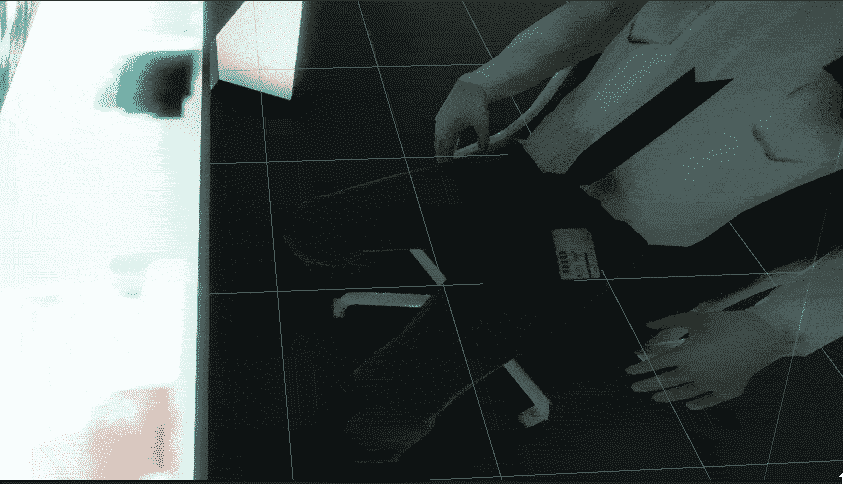

# 在 Unity 中与过场动画互动

> 原文：<https://medium.com/nerd-for-tech/interacting-with-a-cutscene-in-unity-b1aef1f27bbc?source=collection_archive---------22----------------------->

它去哪里了？

在我的一个过场动画中，我们的英雄从睡着的守卫那里偷了卡，但是当我们从过场动画回到游戏时，守卫又拿回了钥匙卡。我们实际上可以很快解决这个问题，因为钥匙卡只是一个可以打开和关闭的游戏对象。但是我们怎么能让过场动画告诉游戏关掉某些东西呢？