# 与 Cypress 中的元素交互

> 原文：<https://medium.com/nerd-for-tech/interacting-with-elements-in-cypress-dcea47847248?source=collection_archive---------21----------------------->

但是首先，为了确保我们的测试只在我们要求的时候运行，我想关闭 Watch 特性。将打开“cypress.json”文件。cypress.json 文件是一个设置文件，可以用来进行 cypress 配置。添加关闭手表的功能。

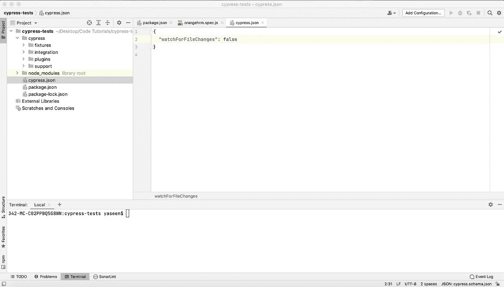

非值班功能

好了，我们添加了关闭手表功能的设置，现在让我们回到测试。

我们将看到如何使用 Cypress 的交互功能来更快地编写测试。我们需要访问“username”元素，因此我们需要为该元素选择一个选择器。虽然我们可以手动解决，但我们可以使用 Cypres 的帮助。我们去赛普拉斯吧。现在我们将运行测试直到完成，然后添加我们需要的内容。[运行测试，点击“选择器定位器[狙击手图标]”，然后点击“用户名”。如果我们点击这个小文本框，我们可以指向屏幕上的元素，我们希望获得选择器。

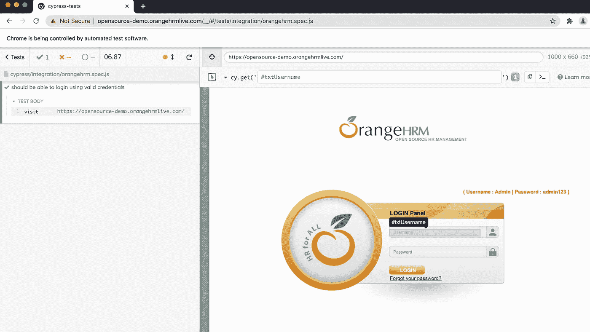

元素选择

当我们点击它时，我们得到选择器和 Cypress 中用于“获取”元素的命令。[点击"复制到剪贴板"，然后将其粘贴到测试中。].我们粘贴复制的命令并运行测试。

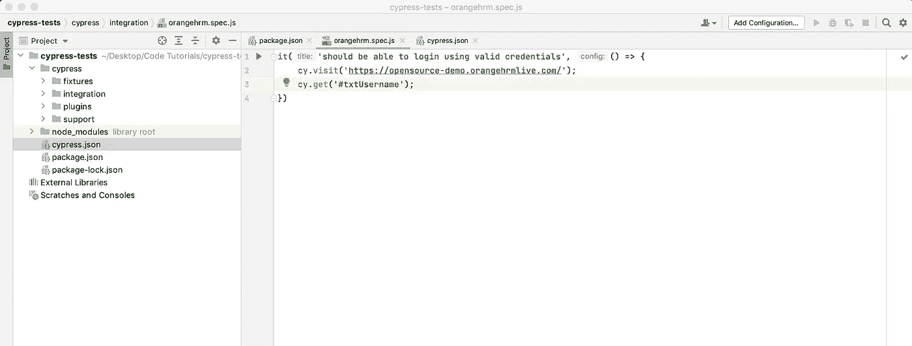

复制粘贴代码块

测试通过了。注意，我们现在在屏幕的左边有两个命令，更有趣的是:将鼠标悬停在“GET”命令上会准确显示哪个元素 GET [。获得]定位。

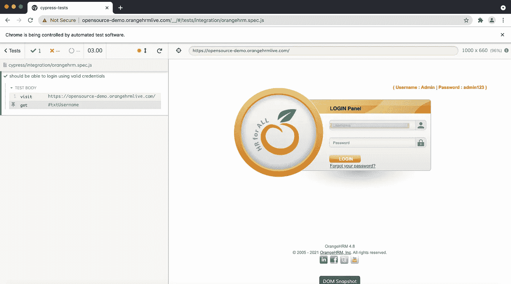

现在，让我们通过在“username”元素中键入“admin”文本来添加 todo。因此，我在{ { }之后立即添加了一个. type()命令。get}}。这被称为“命令链”。

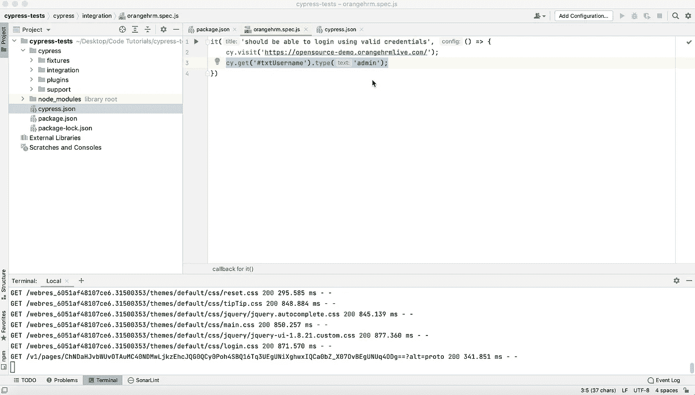

它将 type 命令链接到 get 命令，因此 type 会将我们想要的任何内容输入到 get 的元素中。让我们进行测试。

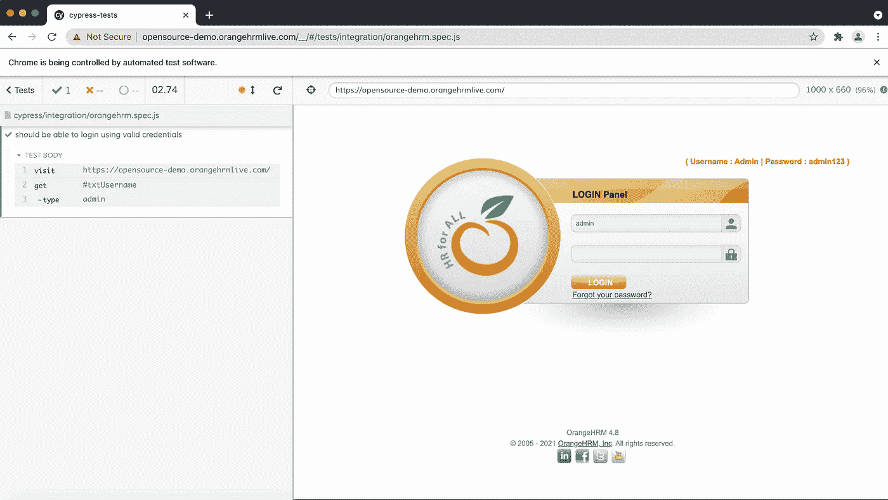

但是让我们稍微改变一下选择器——让它看不到更多的柏树魔法。添加错误的密码选择器，并运行测试以查看它是否失败。我们将选择器更改为不存在的选择器，并运行测试。正如我们所料，它失败了。

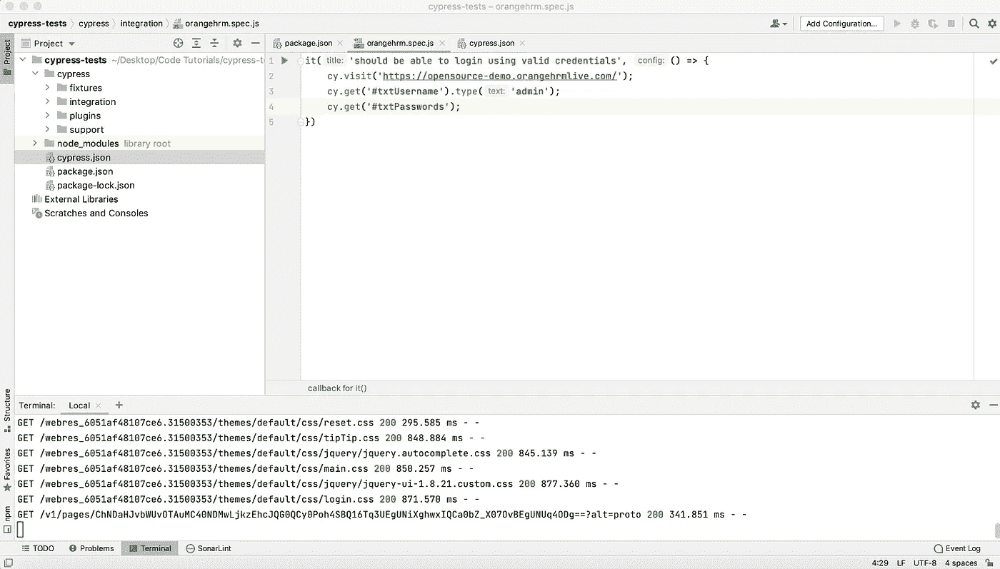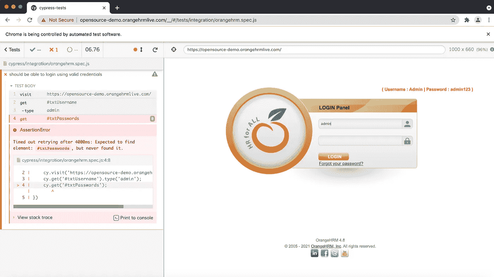

不过，请注意，Cypress 等待了一会儿，直到测试失败。什么时候？为什么呢？因为 Cypress 会在功能出现之前等待一段时间。这就是为什么 Cypress 被贴上了“非片状测试工具”的标签。

我们可以改变超时时间。让我们去。get}}并添加一个选项 timeout —您可以看到有相关的文档— cy.get 有第二个带选项的参数。这是 JavaScript 世界中的一种常规模式。有些 API 有最后一个参数，这是一个“选项”参数，在这里您可以将各种选项作为 JavaScript 对象传递。在这种情况下，我们传递 10 秒的超时。

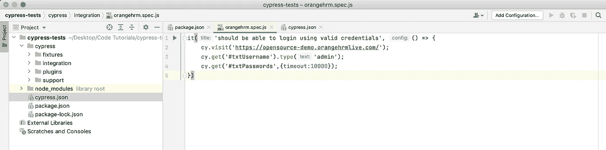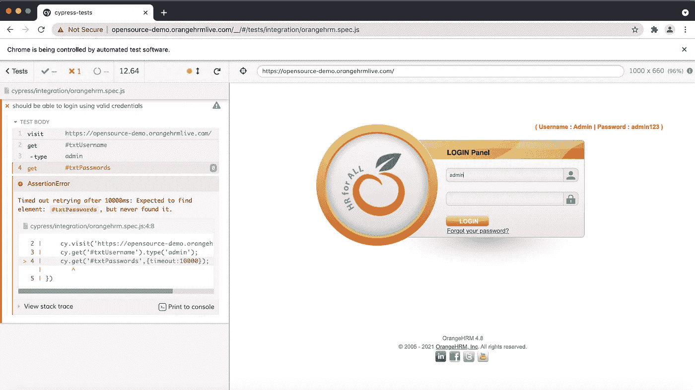

我们将完成登录测试脚本并运行测试。

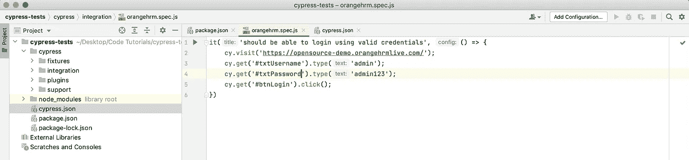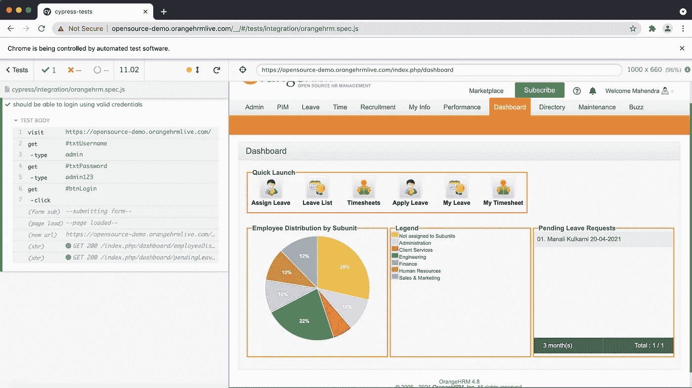

了解用户界面的特别之处。当我们单击每个按钮时，我们将看到命令发出时的状态。页面上的所有活动及其影响都是历史记录。非常适合故障排除。因此，我们已经学习了如何在元素上执行命令，大多数时候，您将使用 click、get 和 type。

**Cypress Documentation**
点击 Cypress.io 顶部导航右侧的“Docs”。你的入口是 Cypress IO 网站上的“Docs”选项卡。让我们看看组件是如何工作的。我们将转到“核心原则”来强调元素间的相互作用。我们既能看到命令，也能看到交流的东西的可操作性。如你所见。

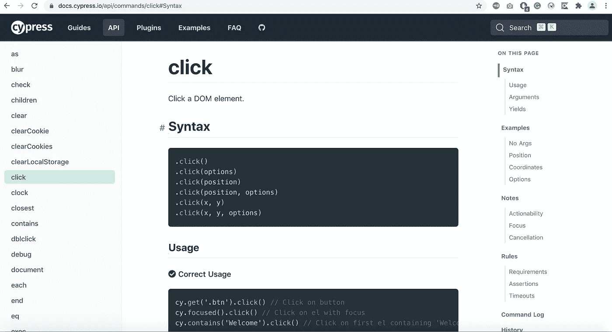

让我们点击。单击()。如果你能看到，我们学到的技能。点击只是冰山一角。稍后了解更多关于你的技能。不幸的是，在 cypress 中，并不是所有可以用来访问项目的控件都有手册，但是我们可以查看完整的命令列表，然后点击 API。