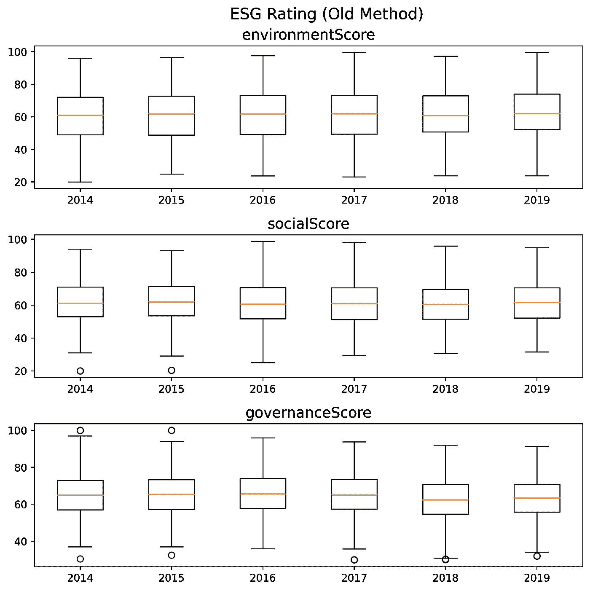
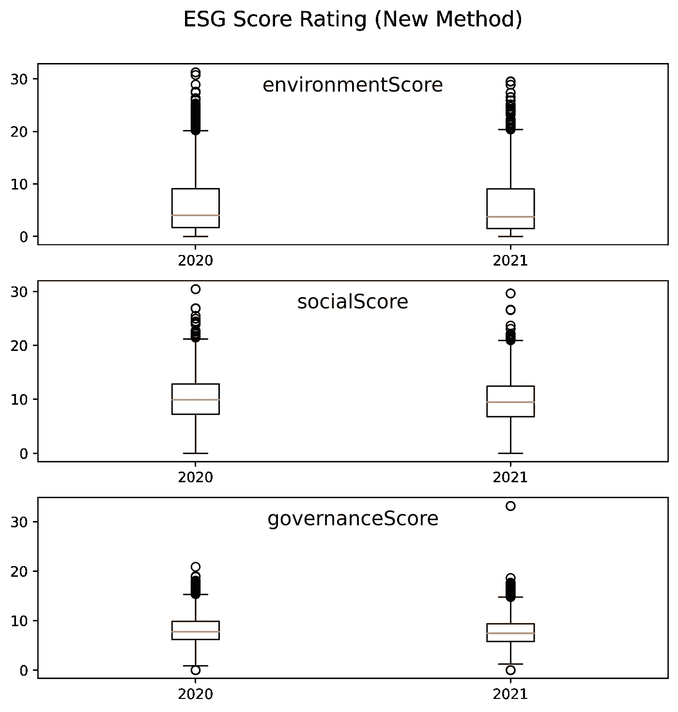

# 对评估企业可持续发展感兴趣？访问大量 ESG 和财务报告

> 原文：<https://medium.com/nerd-for-tech/interested-in-assessing-corporate-sustainability-access-tons-of-esg-and-financial-reports-9de53f7b6257?source=collection_archive---------5----------------------->

## 使用 Yahoo Finance API，您只需几行代码就可以下载许多公司的 ESG 和财务报告，包括股票数据。

**风能和太阳能是未来—** [**卡斯滕·沃思在 Unsplash**T5 上的照片](https://unsplash.com/photos/0w-uTa0Xz7w)

在大流行后的世界，政府正在可持续发展项目上投资数万亿美元——这广义上意味着投资我们未来喜欢的一切——包括可再生能源、循环经济、资源效率、人权、透明度、一般权利等。这些投资中的很大一部分[增加了全球 ESG 资产的规模](https://www.bloomberg.com/professional/blog/esg-assets-may-hit-53-trillion-by-2025-a-third-of-global-aum/)。

环境、社会和治理(ESG)是一个[投资概念](https://www.cfainstitute.org/en/research/esg-investing)，通常归因于[千禧一代更喜欢](https://www.spglobal.com/en/research-insights/articles/move-over-millennials-esg-investing-is-a-multigenerational-conversation)透明、对社会负责和环境可持续的公司。本博客介绍了如何获得您感兴趣的公司的 ESG 和其他财务数据，以了解这些公司在整体企业可持续发展方面的情况。

# **数据来源**

许多数据平台，如彭博、雅虎财经、谷歌财经，提供了所有上市公司的全部信息。然而，据我所知，只有 Yahoo Finance 提供对最新 ESG 数据的免费访问，所以我将使用它来展示如何下载公司信息。

Yahoo Finance platform 需要“ticker”详细信息来访问财务和公司数据。每个公司在任何数据平台上都有一个唯一的显示代码(代码)，没有它就不可能使用 API。幸运的是，我找到了一个[网站](https://investexcel.net/all-yahoo-finance-stock-tickers/)，它有一个 excel 文件，里面有许多国家近 10 万家上市公司的报价清单。虽然这份名单已经过时(截止到 2017 年)，但对于我们的培训来说已经足够了。

**谨慎声明**:根据我下载 ESG 数据的经验，似乎只有大约(15–20%)的上市公司会报告 ESG 数据。因此，我们的许多 ESG 数据请求将是空的。

# **工具和技术**

虽然 yfinance 库是一个很棒的用户友好的工具，可以让 T2 以一种有组织的格式(dataframes)获得这样的数据，但我发现直接的雅虎 API 对我们来说更方便、更快捷。此外，direct API 还有一个额外的特性。大多数开源数据库很少提供(出于某种显而易见的原因——免费)关于 ESG 参数的历史数据，除了股票价格，而其他专有的昂贵来源(例如[彭博终端](https://data.bloomberglp.com/professional/sites/10/ESG-Brochure1.pdf))却提供了这些数据。但是，由于 Stackoverflow 上的一篇[帖子](https://stackoverflow.com/questions/67378377/how-to-fetch-historical-esg-data-from-yahoo)，我开始知道如何使用雅虎 API 来获取过去的信息 ESG。

# **Python 脚本**

我们需要访问两个数据集。一个包含所有报告的数据库，包括最新的 ESG 信息和财务参数。另一个具有有限数量的 ESG 参数的历史细节(即，只有三个维度中的每个维度的合计分数)。因为两个数据集需要相似的 API 查询，所以我们可以用一个通用的脚本获得两个数据集，只需稍作修改。下面的块是我们查询的初始设置。

下一个代码块下载所有数据，具体取决于选择—仅下载最新报告或历史 ESG 分数。当公司的 ESG 分数也可用时，该脚本仅保存公司的其他报告。

就是这样，现在你有了你选择的任何上市公司的充足数据。在做一些分析之前，让我们理解 ESG 分数的真正含义。

# **ESG 分数描述**

雅虎财经[使用由 Sustainalytics 收集的](https://www.barrons.com/articles/yahoo-adds-sustainability-company-data-1517599809) ESG 数据。早些时候，ESG 分数反映了公司在不同环境、社会和治理指标上的综合表现。综合 ESG 评级范围在 0–100 之间，100 是 ESG 评级最高的公司。

然而，在 2019 年 10 月，方法从 ESG 评级(越高越好)更改为 ESG 风险评级(越低越好)..修正后的 ESG 分数[代表公司资产面临的](https://connect.sustainalytics.com/hubfs/INV/Methodology/Sustainalytics_ESG%20Ratings_Methodology%20Abstract.pdf)风险，因此较低的值意味着风险较小。

# 快速洞察

鉴于方法上的变化，我们将分别研究这两个数据集。据报道，产生了 ESG 性能的基本趋势。请注意，该脚本下载了许多关于不同参数的数据，但是为了便于说明，我们将只关注历史 ESG 分数。

下图显示了全球 8000 多家公司的旧方法 ESG 得分中值的趋势。由于 5 年是一段很短的时间，我们看不到分数有明显的变化。除了一些年度间的波动之外，总的业绩模式是稳定的。

8000 多家上市公司不同年份的 ESG 得分分布

根据新方法，风险评级的分布如下所示。虽然数字得分与上图相反(越低越好)，但许多公司表现不佳，从异常值的数量可以明显看出。

8000 多家上市公司的新 ESG 风险分布

# **最后的想法**

博客的主要目的是展示如何免费下载 ESG 和其他数据用于不同的分析。研究人员一直在使用这些数据来产生关于公司的 ESG 表现是否有任何财务影响的有趣见解。

我已经下载了数千家公司的报告，我接下来的几篇博客将描述两件事。首先，公司的一些财务参数如何与其 ESG 得分相关联。第二，与公司所属国家的环境、社会和治理记录相比，公司的环境、社会和治理表现如何。