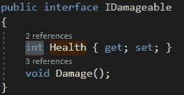
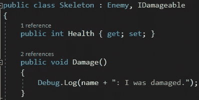
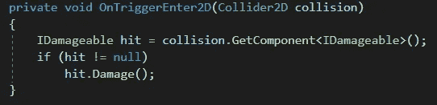
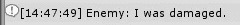

# Unity 中的接口

> 原文：<https://medium.com/nerd-for-tech/interfaces-in-unity-a939ea3aef01?source=collection_archive---------11----------------------->

**目标:**使用*界面*伤害生物或物体。

在我们的游戏中，我们希望玩家不仅能够攻击敌人，还能够攻击无生命的物体，如板条箱、桶和可破坏的墙壁。现在，我们的剑不在乎*能伤害什么*，只在乎*能伤害什么*。我们可以使用一个*接口*来确定哪些对象是易损坏的。

标准的做法是用大写的 *I* 作为前缀，用大写的 *able* 作为后缀来命名接口。在我们的例子中，我们将调用我们的接口*idamagable*。我们的接口没有自己的方法或变量——相反，它告诉将要使用该接口的对象它需要实现什么。在我们的例子中，我们想要一个没有任何参数的健康属性和损害方法。

现在我们将把我们的*id 可成像*接口添加到我们的框架中。我们还没有到担心损坏点的地步，所以我们还不会对*健康*属性做任何事情——我们只需要实现它来满足*I 可损坏*的要求。但是我们会实现*伤害*功能；骨架会告诉我们它何时被损坏(当它的*损坏*方法被调用时)。

现在我们来看玩家剑的*攻击*脚本。在它的 *OnTriggerEnter* 方法中，如果它碰撞的另一个对象有一个 *IDamageable* 组件，它将调用那个对象的 *Damage* 方法。这样做是安全的，因为我们知道任何使用*I 可损坏*接口的东西都必须有一个*损坏*方法！

我们可以从输出中看到骨架已经损坏了！

