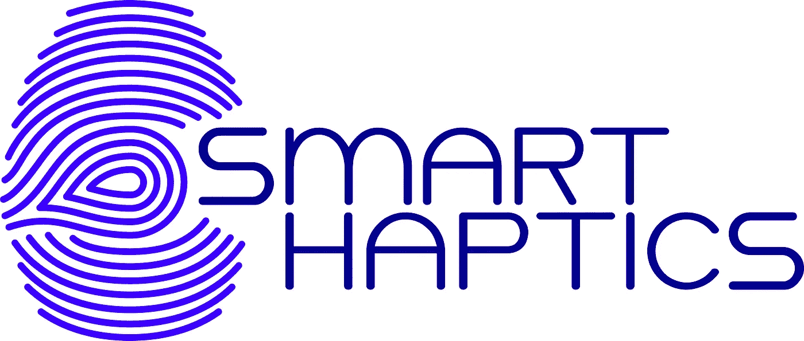
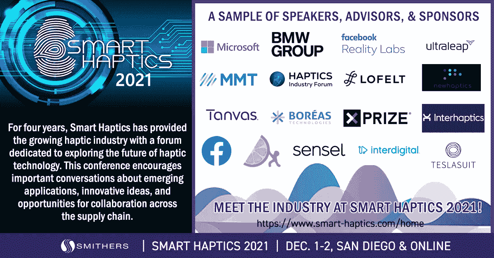
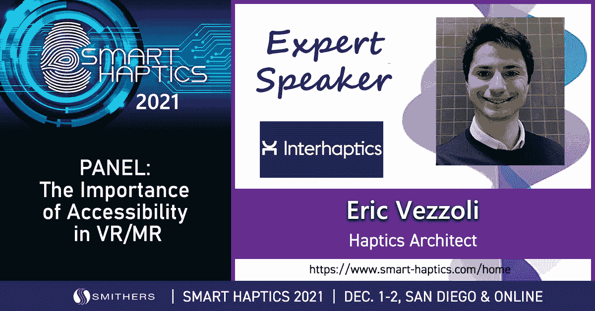

# 12 月 1 日和 2 日在圣地亚哥举行的 2021 智能触觉展上的 Interhaptics

> 原文：<https://medium.com/nerd-for-tech/interhaptics-at-the-smart-haptics-2021-in-san-diego-on-the-1st-2nd-december-a827dd59ea87?source=collection_archive---------7----------------------->

**智能触觉 2021 事件**

为期两天的 Smart Haptics 2021 活动是一场专注于[触觉](https://www.interhaptics.com/explore/what-is-haptics)技术商业化的技术会议。2021 年的主题是:明天的技术在今天嗡嗡作响——触觉的扩展世界。

[Interhaptics](https://www.interhaptics.com) 和来自整个供应链的专家齐聚一堂，共同打造一个平衡、丰富且令人兴奋的项目。主讲人分别是:[微软](https://www.microsoft.com)、[福特](https://www.ford.com)、[丰田研究所](https://www.tri.global)、[洛费尔特](https://lofelt.com)、[博雷阿斯科技有限公司](https://www.boreas.ca/?lang=fr#)、 [XPRIZE](https://www.xprize.org) 、[Sensel](https://sensel.com)Inc .、 [Ultraleap](https://www.ultraleap.com) 、 [Interhaptics](https://www.interhaptics.com) 、 [NewHaptics](https://www.newhaptics.com) 、[haptic、](https://hapticsif.org) [CuteCurcuit](https://cutecircuit.com) 、 [Tanvas](https://tanvas.co) 等等。

作为首个行业驱动的触觉会议， [Smart Haptics](https://www.smart-haptics.com/home) 是一个领先的行业盛会，致力于探索创新解决方案和新兴技术，这些技术正在重新定义触觉感知、触摸反馈技术的未来，以及触觉技术如何改变我们解释世界和与他人互动的方式。

由于 Interhaptics 是 [haptics Club](https://anchor.fm/haptics-club) 的重要成员，Interhaptics 在圣地亚哥举办的智能 Haptics 活动上为您提供-15%的折扣，代码为:HAPTICSCLUB2021

**深入触觉景观**

触觉技术的不断发展和生产使得无障碍的解决方案和创新的方式与我们的世界互动和理解。通过提供一个专门针对该行业的论坛，该活动鼓励行业合作，并提供一个平台来促进关于新兴触觉应用和 iphone 和 android 触觉的重要而有见地的对话，即将到来的发展和趋势，将产品推向市场的挑战，以及触觉在我们快速发展的技术世界中的未来。

该会议汇集了史密瑟斯多年来在商业智能方面的专业知识、丰富的活动经验和中立性，将有助于扩展您在以下方面的知识:

*   触觉产业的未来
*   汽车触觉学的进展
*   AR/VR/XR 的最新触觉发展
*   移动设备触觉技术的最新创新，特别是 android 和 iphone 触觉技术
*   触觉在健康和保健技术中的应用

该计划提供了关于关键市场驱动因素和新兴机会的第一手信息。主题包括当前趋势、多模态触觉、致动器技术的进步、健康和保健、游戏和触觉 android 和 iphone、XR 的扩展、汽车触觉、行业的未来等等。

展示的面板鼓励小组讨论和解决问题。小组讨论包括:VR / MR 中可访问性的重要性，与 Interhaptics、XR 协会和平等进入，汽车技术的未来，与 Grewus、Ford、Toyota、Ultraleap 和移动磁体技术，以及行业和 SDO——我们两者都需要，与 haptics 行业论坛和 Nanoport 技术公司。

汽车小组将讨论触觉汽车技术的未来——新产品、技术和创新。

**智能触觉 2021 活动上的 inter Haptics—12 月 1 日**

12 月 1 日上午 11 点，Interhaptics 的创始人兼首席执行官 Eric Vezzoli 将主持小组讨论:Haptics Standard Ascendant。该小组将包括:

*   Robert Desautels 首席技术官， [D-Box Technologies](https://www.d-box.com/en)
*   Philippe Guillotel —杰出的科学家，[交叉指型研究&创新](https://www.interdigital.com/research-and-innovation)
*   克里斯·乌烈芝——首席技术官，[沉浸式](https://www.immersion.com)
*   Tim Szeto 首席执行官，[纳米技术公司](https://nanoport.io)

该小组将围绕触觉标准化展开讨论。现在，许多组织致力于定义触觉标准，包括 Khronos、IEEE、MPEG、HIF 等等。

在过去的一年里，这些举措中有许多取得了重大进展。该小组将由直接参与这些项目的成员组成，他们将提供各种计划的概述。

观众将了解到:

*   这些计划所针对的技术和市场，以及它们的关键目标
*   为什么是现在，最近的成就，当前的挑战，以及即将到来的里程碑
*   如何参与

在这里找到完整的节目。

**智能触觉 2021 活动上的 Interhaptics 合作伙伴—12 月 1 日**

下午 12 :15，您将能够跟随我们的合作伙伴 Margot Racat 博士，IDRAC 商学院的市场营销教授。

Margot Racat 博士将讨论触觉技术:实现混合零售的电子人接触。

今天的购物环境包括从物理到虚拟场所的混合交互。在这种情况下，承认感官对于营销的重要性，品牌需要了解如何在网上购买产品时触及消费者的感官——当使用移动设备购物时，尤其是对于体验性商品，以及当购买前对实物产品的访问受到高度限制时，品牌如何满足感官刺激的需求？

本演示将深入探讨这个问题，以及这样一个事实，即如果有一种触觉再现技术能够在实时交互过程中实现与产品触觉提示相关的类似纹理的感觉，这会使消费者更好地处理产品信息吗？Margot Racat 博士将探索这一点以及更多，让您思考技术可能会引领我们走向我们尚未发现的新的触摸体验。

点击查看完整程序[。](https://www.smart-haptics.com/smart-haptics/agenda?EventId=4042)

**智能触觉 2021 活动上的 inter Haptics—12 月 1 日**

Eric Vezzoli 也将在 12 月 2 日下午 1:30 就虚拟现实中可访问性的重要性发表演讲/何先生将由以下人员陪同:

*   Laura Chadwick——XR 协会行业关系高级总监
*   Thomas Logan——创始人兼首席执行官， [Equal Entry](https://equalentry.com/haptics-for-xr-how-designing-great-haptics-can-support-use-case-accessibility-accessibility-vr-meetup-recap/)

该小组将与触觉界内外的专家探讨虚拟现实/混合现实中更多可访问性的需求。此面板将使用隐藏字幕。

在这里找到完整的节目[。](https://www.smart-haptics.com/smart-haptics/agenda?EventId=4042)

**关于触觉？**

[Interhaptics](https://www.interhaptics.com) 是一家专门从事触觉的软件公司。Interhaptics 为虚拟现实(VR)、混合现实(MR)、移动 as haptics android 和 iphone、增强现实(AR)和控制台应用程序提供手部交互和触觉反馈开发和部署工具。Interhaptics 的使命是促进可扩展的 haptics 生态系统的发展。Interhaptics 致力于为 VR/MR/AR、移动设备(如 haptics android 和 iphone)和控制台开发人员社区提供一流的开发工具，以及支持 haptics 的内容在任何支持 haptics 的平台上的互操作性。

