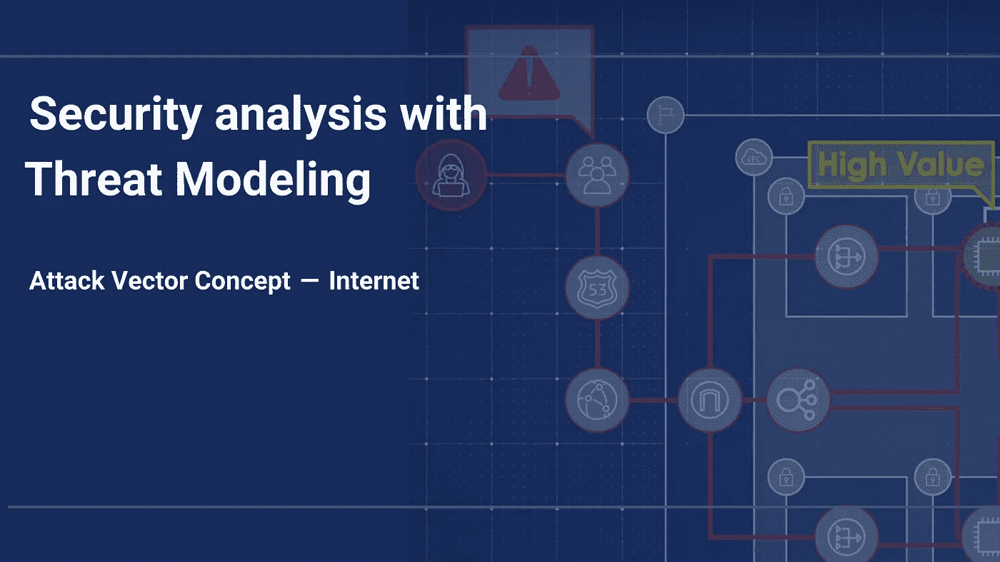
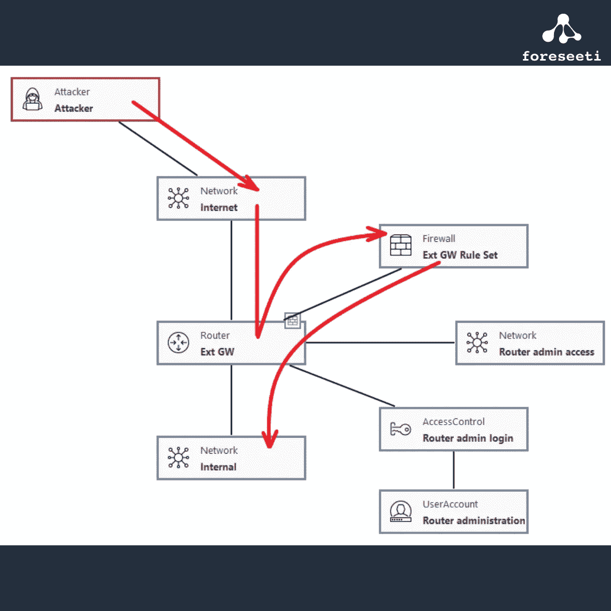

# 攻击媒介概念—互联网—通过威胁建模进行安全分析

> 原文：<https://medium.com/nerd-for-tech/internet-security-analysis-with-threat-modeling-8b3dddd57e1b?source=collection_archive---------15----------------------->

# 互联网—描述

“互联网”攻击媒介始终是需要考虑的相关因素，除非该体系结构与外部世界没有任何联系，而外部世界在本质上受到所谓“空气间隙”的保护。(空气间隙也可以被攻击者克服，但是我们将单独看那种情况。)

实质上，我们正在考虑这样一种情况:假设攻击者位于某个网络区域，如 Internet 或不同类型的来宾和员工家庭网络区域。

# 模型

首先，对 Internet 网络区域的连接建模的最简单方法如下:

使用 foreseeti 的[威胁建模](https://foreseeti.com/threat-modeling/)工具 [securiCAD](https://foreseeti.com/securicad/) 创建

# 攻击向量衰减

在“互联网”攻击媒介示例中，我们说攻击者从“互联网”网络区域开始，或者实际上是我们的防火墙/路由器/网关的外部接口所连接的网络区域。削弱这一点没有多大意义，因为我们可以预期攻击者会不断出现在互联网上。

# 结论

在上面的模型中，添加了箭头来显示攻击是如何进行的。此攻击的成功率取决于防火墙对象上的参数 KnownRuleSet 是设置为 True 还是概率。如果不完全正确(即，有一定的可能性存在系统管理员未知的防火墙规则)，这些未知的防火墙规则可能会给攻击者提供进入的机会。

(KnownRuleSet 参数的一个简短说明是，有时防火墙管理员会说“甚至连防火墙的管理界面都没有显示所有的防火墙规则”。)

如前所述，这里的攻击向量不仅有助于分析实际来自互联网的攻击，而且更常用于回答诸如“该体系结构对于来自网络环境特定子区域的威胁有多脆弱？”在这种情况下，只需将攻击者连接到该区域，并调查出现的攻击路径。