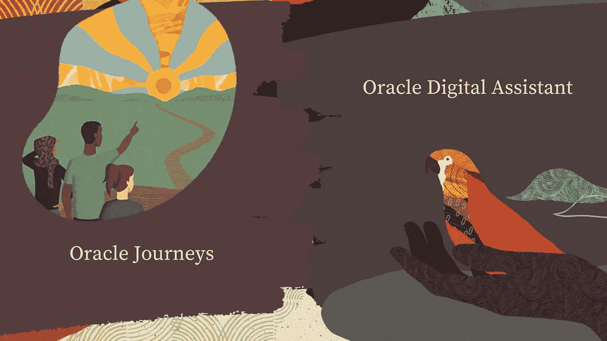

# 实习经历—甲骨文印度公司

> 原文：<https://medium.com/nerd-for-tech/internship-experience-oracle-india-c4e5d115b000?source=collection_archive---------0----------------------->

## 成功是一段旅程。让它每天都很棒。

大三伊始，我收到了甲骨文公司提供的实习机会，非常高兴。自从 Java 成为我学习的第一门编程语言以来，我一直对它有一点点感情上的依恋，在拥有这种语言的公司工作的机会就像是梦想成真。因此，2021 年 5 月 19 日，开始了我一生中迄今为止最不寻常的一个夏天😅。

# 开始

因为疫情的原因，事情和我预想的有点不一样，我们不得不满足于在家工作(T3)。然而，我们所有人在第一天都受到了非常热烈的欢迎。唯一困扰我的是，不像其他人，我穿得有点随便😝。

由于正在进行的疫情，实习模式是**在家工作**

在第一周，我们与经理、导师、入职手续、培训课程、项目介绍、团队分工等等进行了互动。我已经接触了一些行业，与公司、创业公司、开源组织合作过。然而，我的项目工作是基于**数字助理**，这是一个我以前从未工作过的领域，所以我真的很兴奋。

# 我的团队

实习期间发生在我身上最好的事情之一是作为一个伟大团队的一员工作。所以如果不提到他们，这个博客就不完整了——Aasav Badera， [Manas Trivedi](https://www.linkedin.com/in/manas-trivedi/) ， [Ameyanrd](https://medium.com/u/c8ee253d7f52?source=post_page-----c4e5d115b000--------------------------------) ，[Pothugunta chai Tanya Janaki](https://www.linkedin.com/in/pothugunta-chaitanya-janaki-9762b9197/)。他们都充满激情，富有创造力，工作努力。

我们整天主要在 Zoom 上，要么在分组讨论室与 [VS Code LiveShare](https://code.visualstudio.com/blogs/2017/11/15/live-share) 一起工作，要么讨论一些随意的东西。我的团队让实习经历变得真正难忘。例如，即使是在我们做最后陈述和提交项目的那天，Aasav 和我也彻夜未眠，为几个月的辛勤工作做最后的润色。

# 该项目

我的工作包括集成 Oracle Digital Assitant 和 Oracle Journeys。我在人力资本管理团队工作，这是甲骨文云融合应用套件的一部分。

我的项目包括将 Oracle Digital Assitant 与 Oracle Journeys 集成

Oracle Journeys 使人力资源团队能够创建、定制和交付逐步指导，帮助员工完成各种职业或生活事件。集成 Oracle Digital Assistant 意味着员工现在只需与人工智能助理互动，就可以完成所有与旅程相关的工作。对于我的极客读者，我使用 Oracle 云基础设施的 NLP 模型和 Oracle 的 bots-node-SDK 在 NodeJS Express 环境中进行 ODA 集成。

# 学习课程

甲骨文最独特的事情之一是举办许多互动会议，给实习生提供非凡的行业经验。我学到了很多关于软件世界的结构、工作和未来的知识。此外，其中一些会议非常鼓舞人心。例如，我们会见了 Clay Magouyrk，了解了他在 Oracle 和 Oracle 云方面的激动人心的经历。

# 工作经历

在甲骨文工作的经历非常棒。工作时间很灵活，各个阶段都有很大的自由度。管理层也非常支持我们——我记得我的导师和她的经理在一个周五晚上很晚的时候打电话来帮助我们，因为我们在尝试新事物时遇到了困难🤯

我的导师 [Shruthi Banda](https://www.linkedin.com/in/shruthi-banda-ba75951b6/) ，是我见过的最善良的人之一，总是乐于在每个阶段帮助我们。此外，我们每周进行 DSA 测试(以评估实习生)，召开演示会议讨论想法，指出改进之处，并鼓励创新。

# 一些随机的乐趣

就我个人而言，我非常喜欢探索新事物。因此，在我整个实习期间，我谨记两件事——学习和跳出框框思考。我确实在甲骨文探索了许多东西，远远超出了我的工作范围，例如 **Redwood design** 、 **Oracle APEX** 、 **Oracle JET** 和 **Oracle Cloud** 。我也试着在我的作品中加入一些这样的元素，这使得这个项目脱颖而出。

令人惊叹的甲骨文红木设计

# 接收预安置要约

有了一次奇妙的经历后，我真的希望在获得 B.Tech 学位后继续在甲骨文工作。尽管每个人都给了我很好的反馈，但我仍然不确定是否会被录用。

最后，在 7 月 14 日，我收到了甲骨文公司和 IIT·古瓦哈蒂的 CCD 关于报价的电子邮件。我开始收到祝贺的信息，电话，我很高兴🥳

# 最后的话

我要感谢所有让这一切成为可能的人，包括我的父母和朋友们，感谢他们一直以来对我的信任和支持。此外，对于明年将作为实习生加入甲骨文公司的大三学生来说，**准备好享受人生的时光吧**🤩

甲骨文成功地尝试用东西填满我的衣柜😂