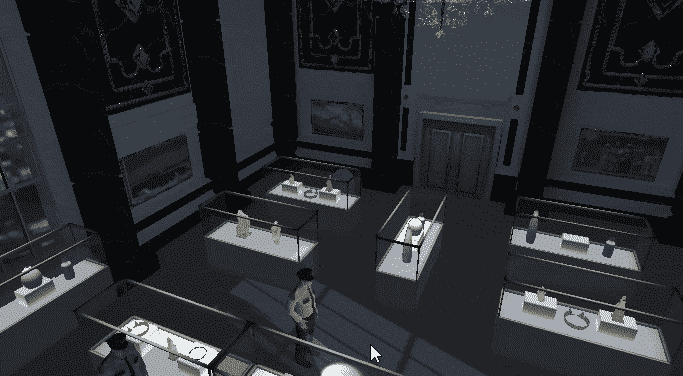

# 游戏机制:相机管理

> 原文：<https://medium.com/nerd-for-tech/into-game-mechanics-camera-management-4a3938feaa11?source=collection_archive---------16----------------------->

**目标**:正确编写摄像机行为脚本

在本教程中，我们将致力于主相机。

我们的第一个目标是利用我们在上一篇文章中发现的相机前进角度。从性能的角度来看，这个问题的简单性将允许我们更好地工作。