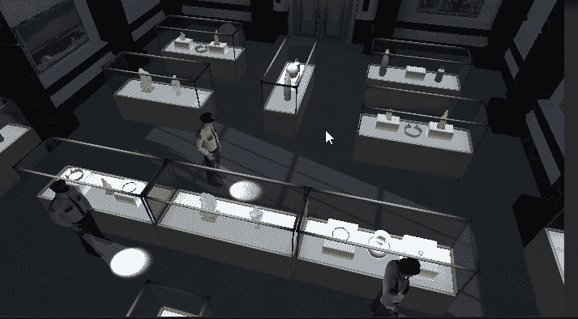

# 进入游戏机制:玩家导航

> 原文：<https://medium.com/nerd-for-tech/into-game-mechanics-player-navigation-b2005cfe39b?source=collection_archive---------4----------------------->

**目标**:了解 navmesh、代理和导航

是啊你没看错:**导航**，不是运动。在这个游戏中想要实现的是一个点击机制，玩家可以接触到地板上的每一个点，但也会有障碍(墙，陈列柜等)。)

…回到本教程中的代码！