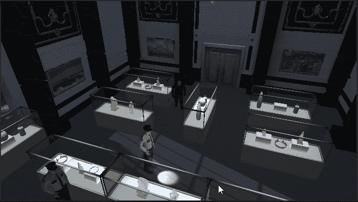

# 进入游戏机制:产品玩家设置

> 原文：<https://medium.com/nerd-for-tech/into-game-mechanics-production-player-setup-2ef3a55c129e?source=collection_archive---------3----------------------->

**目标**:使用 Darren 的 3D 模型，并在空闲和行走状态下添加身临其境的动画

今天我们将向生产阶段迈进一步。首先，我们必须用一个 **3D 达伦模型**(在资产中)替换这个丑陋的胶囊。

要做到这一点，使胶囊回到比例 1，**从玩家对象中删除网格渲染器**组件，并拖动 Darren_3D 预设…