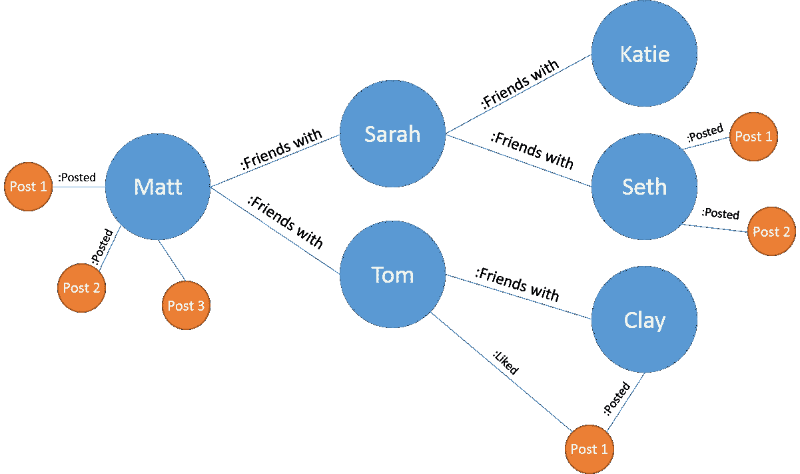
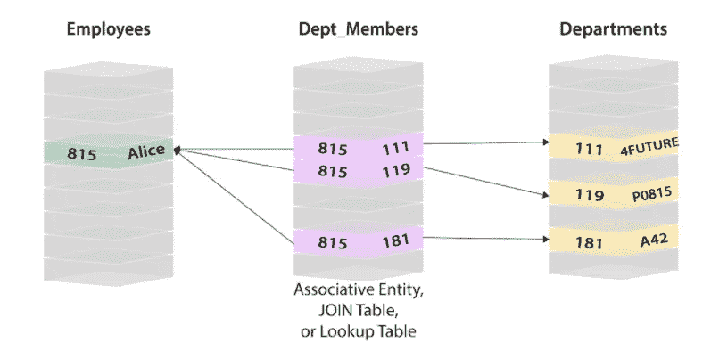
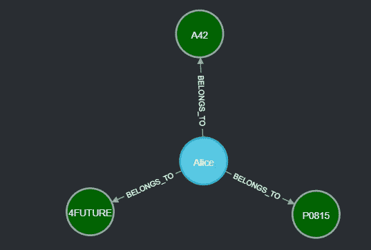

# 使用 Neo4j 深入图表世界

> 原文：<https://medium.com/nerd-for-tech/into-the-depths-of-the-graph-world-using-neo4j-d2f29a637dc9?source=collection_archive---------0----------------------->

**什么是图形？**

图由节点、关系和属性组成。下面是一个简单的例子。

来源:谷歌

马特，莎拉等等。是所有标签为朋友的节点。这些可以描述为一种类型的实体。他们在社交媒体上发布的帖子是另一种类型的实体。类似地，“:Friends with”是一种描述这些实体-朋友如何相互连接/链接的关系类型。图表的第三个组成部分是通常以键值对的形式出现的属性。它们存在于两个节点以及关系中。

假设标记为 Friend 的实体具有键-值对“name:Matt ”,并被视为 Matt-node 的属性之一。

**什么是图形数据库？**

图形数据库是一种使用这些图形结构来存储数据的数据库。它可以比作一个电网网络，其中所有的电气点可以定义为节点，从一个点到另一个点的连线可以定义为关系。

与关系数据库有什么不同？

来源:neo4j.com

关系数据库在这里都是关于表和数据的，是结构化的。为了从一个表连接到另一个表，需要一个叫做连接的操作。连接是在查询时通过匹配连接表中所有行的主键和外键来计算的。这些操作需要大量计算和内存，并且成本呈指数级增长。随着表的数量和关系类型(一对多、多对多等)的增加。)，查询会变得又脏又麻烦。

来源:Neo4j 数据库

正如我们可能看到的，上面提到的同一个示例可以使用 4 个节点(3 个部门节点和 1 个客户节点)和 3 个关系来创建。我们也不需要使用主键或外键的概念。

**Neo4j 是什么？**

Neo4j 是一个高度可扩展的原生图形数据库，不仅可以利用数据，还可以利用数据关系*。*

Neo4j 使用的查询语言叫做 **cypher** 。为了展示一些 cypher 查询，我将上面的图表作为我的参考点。

**查询创建部门节点** :-

`*MERGE (d:Department {name:”4FUTURE”, id:111})
MERGE (d1:Department {name:”P0815", id:119})
MERGE (d2:Department {name:”A42", id:181})*`

**查询创建客户节点** :-

`*MERGE(p:Customer {name:”Alice”, id:815}*`

**建立部门与客户关系的查询** :- `*MATCH (p:Customer {name:”Alice”, id:815})
MATCH (d:Department {id:111})
MATCH (d1:Department {id:181})
MATCH (d2:Department {id:119})
WITH p,d,d1,d2 MERGE (p)-[:BELONGS_TO]->(d)
MERGE (p)-[:BELONGS_TO]->(d1)
MERGE (p)-[:BELONGS_TO]->(d2)*`

Neo4j 有许多使用案例，在世界范围内广泛使用。像[易贝](https://neo4j.com/blog/ebay-shopbot-graph-powered-conversational-commerce/?ref=who-uses)和[沃尔玛](https://neo4j.com/case-studies/walmart/?ref=who-uses)这样的顶级零售商依靠 Neo4j 来推动他们的推荐、促销和简化物流。像 Optum Healthcare 和 Allianz 这样的顶级保险公司依靠 Neo4j 来打击欺诈和管理信息。它在市场上的许多数据库中变得非常流行。

图形数据库各有利弊。

它最适合许多领域实体相互连接的情况，我们希望探索它们之间的关系。图形数据库没有针对数据仓库中典型的大量分析查询进行优化。值得注意的是，图中的查询延迟与我们选择在查询中探索图的多少部分成比例，而不是与存储的数据量成比例。因此，在开始一个项目之前，知道什么时候使用图形数据库成为一项重要的技能。

***参考文献***

1.  [https://neo4j.com/](https://neo4j.com/)
2.  [https://neo4j.com/developer/graph-database/](https://neo4j.com/developer/graph-database/)
3.  [https://SD times . com/databases/guest-view-relational-vs-graph-databases-use/](https://sdtimes.com/databases/guest-view-relational-vs-graph-databases-use/)
4.  [https://neo4j.com/blog/database-model-comparison/](https://neo4j.com/blog/database-model-comparison/)