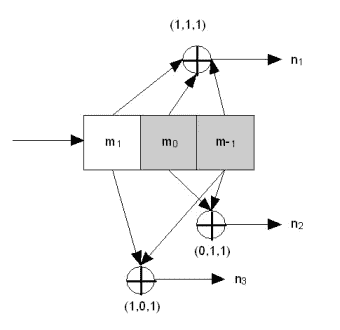
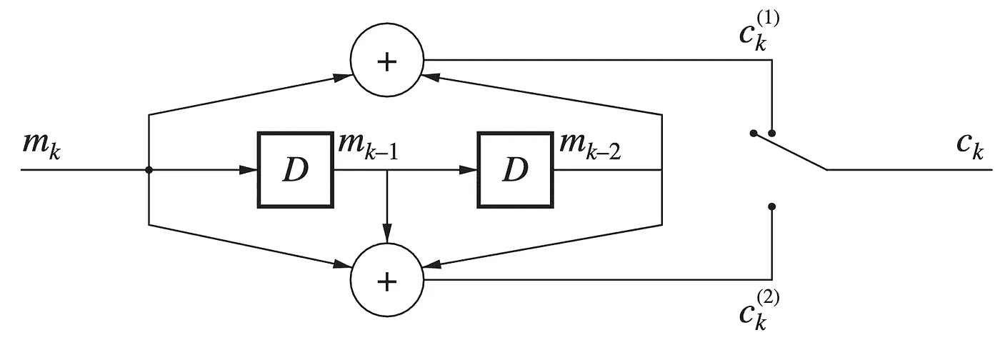
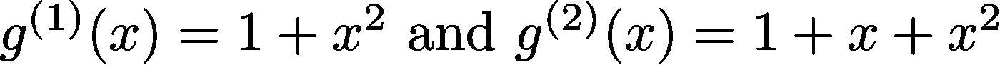
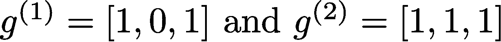
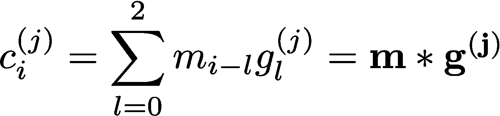
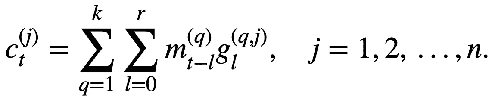
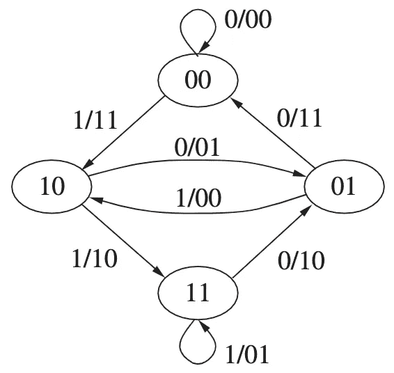
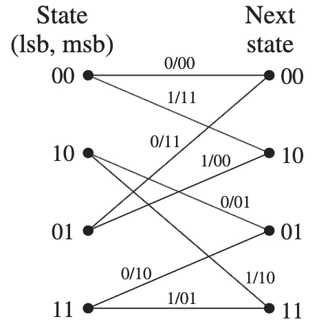
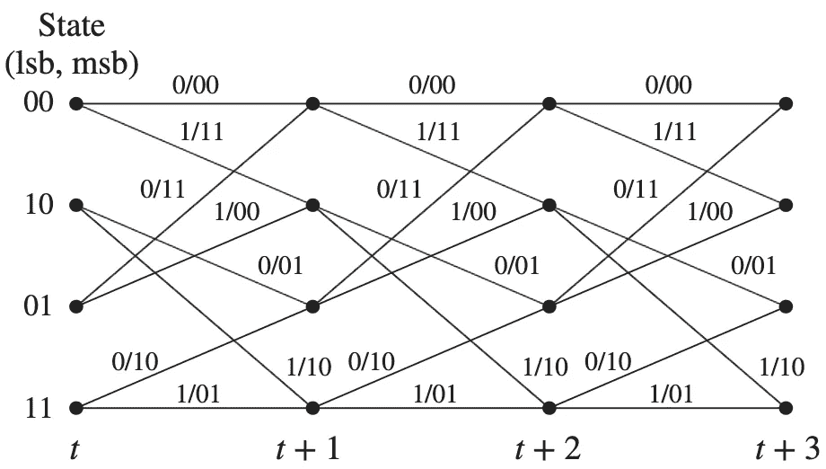
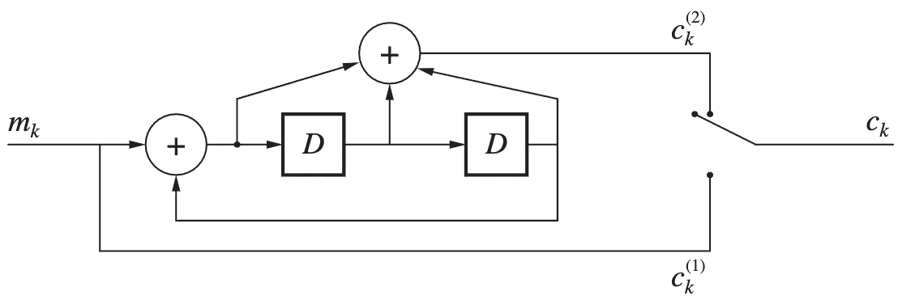

# 卷积编码简介—第一部分

> 原文：<https://medium.com/nerd-for-tech/into-to-convolutional-coding-part-i-d63decab56a0?source=collection_archive---------3----------------------->

卷积编码器，英文维基百科上的 Teridon，公共领域，通过维基共享

这篇文章旨在成为快速介绍卷积编码的两篇文章中的第一篇。如果你对这个主题不熟悉，卷积编码是一种纠错码，用于增强数字通信的可靠性。在这篇文章中，我将介绍基础知识、表示和编码过程。下面的[帖子](https://yair-mz.medium.com/intro-to-convolutional-coding-part-ii-d289c109ff7a)涵盖了使用维特比算法的解码过程。

# 那么它是什么，它是如何工作的？

卷积码已经广泛用于无线通信(WiFi、蜂窝和卫星)中，并且是广泛使用的 Turbo 编码的组成部分。与分组码不同，卷积码没有有限的分组长度，而是可以被视为线性滤波器，IIR 或 FIR。

卷积编码器利用线性移位寄存器(LSR 的)将 *k* 个输入位编码成 *n* 个输出位，从而产生速率为 *R=k/n* 的代码。每个输出位取决于最后一个和最后一个 *L* 输入位，其中 *L* 称为“约束长度”l 描述了编码器拥有的“内存”量(大部分文献使用大写 *K* ，但我发现这很容易混淆，因为 K 很小*K】*。

例如，考虑以下速率 *R=* 编码器:

码率为 *R=，约束长度为 K=2* 的卷积编码器

标有 *D* 的模块代表延迟，因此输出取决于最后一个输入位和前两个输入。输出根据奇偶校验公式确定:

所有加法运算符都应视为模 2 加法(只要我们考虑二进制字母表)，可以通过 XOR 实现。

根据标准术语，上述输出位与输入的关系使用*生成器*多项式来表示，其中变量 *x* 的幂代表延迟。对于上面的编码器，它是这样的:

上述编码器的生成多项式

这些有时也表示为二进制向量，其元素是各种幂的系数，因此对于我们的示例，它表示为:

生成器的向量表示

后者制定 FIR 滤波器的脉冲响应，并建议使用卷积将第 *j* 个滤波器的输出表示为第 *i* 个比特的输入:

更一般地，对于每个时钟周期接受 *k* 个输入比特并输出 *n* 个比特的编码器，当使用约束长度 *r* 时，在时间 *t* 的输出将是:

# 卷积编码器的其他表示

## 有限状态机

除了上面显示的框图视图之外，还有其他方式可以产生更简单的实现形式，尤其是在软件中。具有约束长度 *L* 的编码器可以被认为是有限状态机，并被描绘成具有 *2ᴸ* 顶点的有向图，表示 LSR 的可能状态。每个顶点都有 *2ᵏ* 边，表示由于 *2ᵏ* 可能的输入而产生的可能转换。这种表示可以简单地用软件实现。上述编码器可以用下面的 FSM 表示:

编码器的有限状态机表示

每个边缘的一位数表示上面的输入位值，两位数表示输出。使用这种表示，可以通过实现 FSM 来对流进行编码。

## 框架

另一种表示可以通过[网格](https://en.wikipedia.org/wiki/Trellis_(graph))部分获得。该部分是一个二分图，将当前状态连接到以下可能的状态:

代表顶部编码器的单个网格部分

每列具有对应于可能的编码器状态的 *2ᴸ* 顶点，并且每个顶点具有离开它的 *2ᵏ* 边，对应于可能的输入。这些部分可以连接起来形成一个网格:

网格表示将在以后对使用维特比算法的解码有价值。

# 递归编码器

还有另一种流行的卷积编码器，它利用反馈环路。系统递归编码器是 turbo 编码器的基本构件。这种编码器的示例如下所示:

速率为 *R=* 的递归系统编码器

注意反馈环路，其结果是 IIR 滤波器而不是 FIR 滤波器。今天到此为止。在下一个[帖子](https://yair-mz.medium.com/intro-to-convolutional-coding-part-ii-d289c109ff7a)中，我会给出解码过程的细节。

# 来源

在写这篇文章时，我使用了:

*   [麻省理工学院开放式课件笔记](https://ocw.mit.edu/courses/electrical-engineering-and-computer-science/6-02-introduction-to-eecs-ii-digital-communication-systems-fall-2012/readings/MIT6_02F12_chap07.pdf)
*   纠错编码(2019)，作者托德·k·穆恩。