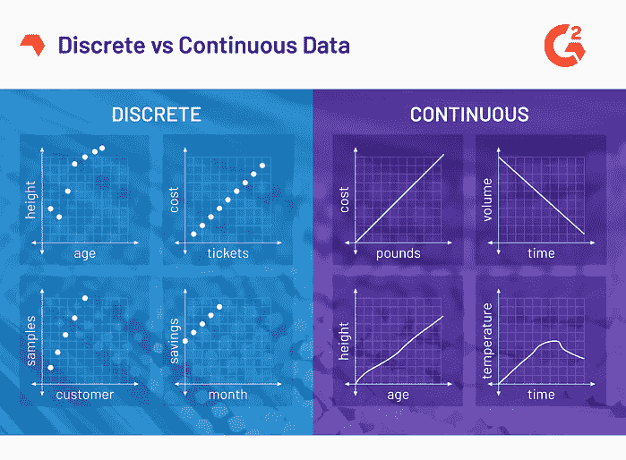

# 数据科学简介—数据类型

> 原文：<https://medium.com/nerd-for-tech/intro-into-data-science-types-of-data-ae1b258d20e8?source=collection_archive---------25----------------------->

凯利·西克玛在 [Unsplash](/s/photos/data?utm_source=unsplash&utm_medium=referral&utm_content=creditCopyText) 上的照片

有几种数据类型，理解数据类型使面对数据更容易，因为不同的数据有不同的分析方法。这三种是主要的数据类型。

# 数字的

数字是常见的数据类型，基本上它代表一些我们可以测量的可量化的东西。举个例子

*   棒球队的高度
*   学生年龄
*   股票价格

图片来自[学习中心](https://learn.g2.com/discrete-vs-continuous-data)

## 分离的

离散数据的同义词有 disconnected、separate 和 distinct。它是只能取某些值的信息。这些值是固定的，但不总是整数。这些数据是用计数法收集的。

*   数学测试结果
*   参加一个班级的儿童人数
*   每个部门的闭路电视数量

## 连续的

连续数据是指两个现实点之间可能测量的不固定数量。这个值不像离散值那样总是固定的。但是，它被设计得具有精确性，所以它经常把小数点的右边尽量拉长。这些数据是用测量方法收集的，可以随时更改。

*   学生的身高
*   婴儿的体重
*   当日温度测量
*   雨量强度

# 绝对的

没有内在数字意义的分类数据。我们仍然可以将数字分配到类别中，以便更简洁地表示它们，但是数字没有数学意义。举个例子

*   性别
*   是/否
*   居住国
*   积范畴
*   人种

这个数据的目的是从数据库中分离出某些数据。

# 序数

序数数据的例子

有序数据是数值数据和分类数据的组合。如果你听说过电影分级，这就是有序数据的一个例子。通常电影的等级是 1-10 级。评级必须围绕它，数值具有数学意义，即 9.1 比 8.8 更好，等等。

# 结论

你可能在读这篇文章之前就明白了。但是，我只是想分享它，所以这个信息将被传播给那些可能在下一次学习它的人。谢谢大家！

> 让我们为每个人免费提供知识