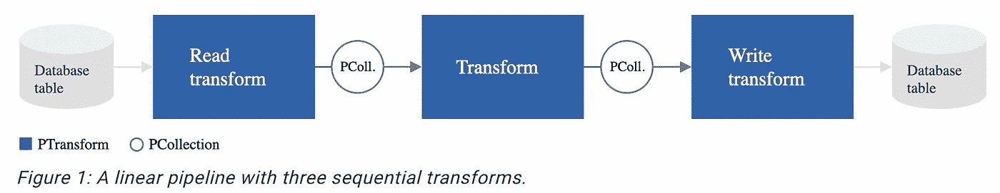

# Apache Beam 简介

> 原文：<https://medium.com/nerd-for-tech/intro-to-apache-beam-496ae64662f5?source=collection_archive---------8----------------------->


Apache beam 是一个开源数据处理工具，它为批处理和流式数据管道提供了统一的模型。

Beam 对于并行数据处理任务非常有用，在并行数据处理任务中，问题可以分解为许多更小的数据束，这些数据束可以独立地并行处理。它也可以用于 ETL 任务。

Apache beam 构建于 Scala 之上，但它支持 Java、Python 和 GO SDKs。beam SDKs 提供了统一的编程模型，可用于有界(批处理)或无界(流)数据集。

使用一个开源的 Beam SDKs，我们可以构建一个定义管道的程序。然后这个管道被 Beam runners 翻译成与我们选择的**分布式处理后端**兼容的 API。

Beam 目前支持 Direct runner、Apache Flink runner、Apache Spark runner、Google Cloud Data Flow runner、Apache Nemo runner、Apache Samza runner、Hazlecast Jet runner 和 Twister2 runner。

Direct runner 用于本地测试和调试目的。

# 阿帕奇波束的组成部分



*   **p 集合** —表示一个数据集，可以是固定的批处理或流数据。
*   **PTransform** —采用一个或多个 p collection 并输出零个或多个 p collection 的数据处理操作。
*   **Pipeline** —表示 PCollection 和 Transform 的有向无环图，因此封装了整个数据处理作业。
*   **I/O 转换** —读取或写入数据的 p 转换。

# beam 是如何工作的？

*   创建一个**管道**对象并设置管道执行选项，包括管道运行器。
*   为管道数据创建一个初始的**p 集合**。
*   将**p 变换**应用于每个 p 集合
*   使用 **IOs** 将最终转换的 PCollection 写入外部源。
*   使用指定的管道运行器运行管道。

# 示例 python 代码

下面是计算文本字数的 python 代码示例。

```
with beam.Pipeline(options=PipelineOptions()) as p:file = '../data/kinglear.txt'output_file = '../data/output.txt'# Read the text file[pattern] into a PCollection.lines = p | 'Read' >> ReadFromText(file)split_lines = lines | 'Split' >> beam.FlatMap(lambda x: re.findall(r'[A-Za-z\']+', x))counts = split_lines | 'PairWithOne' >> beam.Map(lambda x: (x, 1)) | beam.CombinePerKey(sum)output = counts | 'Format' >> beam.MapTuple(format_result)# Write the output using a "Write" transform that has side effects.# pylint: disable=expression-not-assignedoutput | 'Write' >> WriteToText(output_file)
```

1.  我们首先使用管道选项创建管道，并且从头到尾的所有代码都包含在其中。

```
with beam.Pipeline(options=PipelineOptions()) as p:
```

如果没有提到流道，则默认选择直接流道。

2.接下来，我们读取输入文件并创建`lines` PCollection。

```
lines = p | 'Read' >> ReadFromText(file)
```

3.这个转换拆分了`PCollection<String>`中的行，其中每个元素都是文本中的一个单词。

```
split_lines = lines | 'Split' >> beam.FlatMap(lambda x: re.findall(r'[A-Za-z\']+', x))
```

4.接下来，应用两个转换，一个合并每个单词，另一个计算每个键的每个单词。

```
counts = split_lines | 'PairWithOne' >> beam.Map(lambda x: (x, 1)) | beam.CombinePerKey(sum)
```

5.最后，我们执行 IO 转换，获取单词元组及其计数并存储在输出文本中。

```
output | 'Write' >> WriteToText(output_file)
```

输出文件将在目标路径中可用。

# 光束的优点

*   在单个 API 下统一批处理和流式 API——通过最少的代码更改，我们使相同的代码适用于流式和批处理数据管道。
*   跨运行时的可移植性——最初，如果 beam 任务在 Spark runner 中运行，那么切换到 Google Data Flow runner 非常简单。
*   提高抽象层次的 APIs 关注我们的逻辑而不是底层细节。

GitHub 上的[提供了这方面的代码。](https://github.com/Shari18/beam_tutorialhttps://github.com/Shari18/beam_tutorial)

*快乐学习！。*