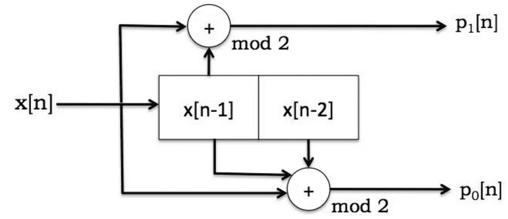
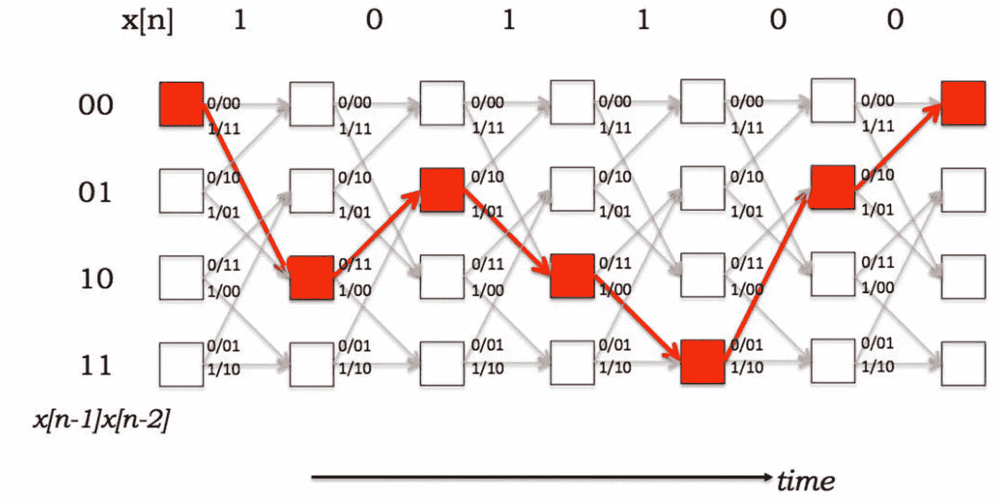
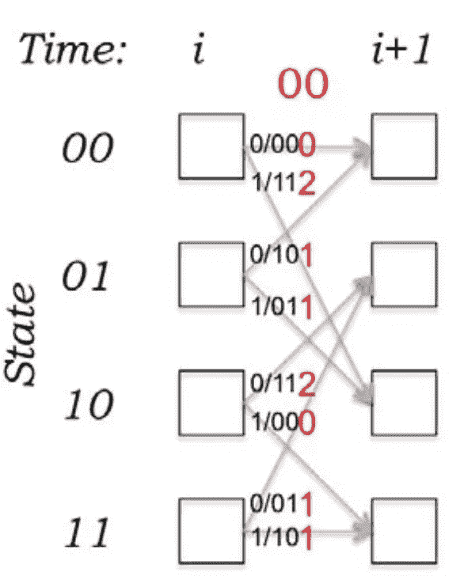

# 卷积编码简介—第二部分

> 原文：<https://medium.com/nerd-for-tech/intro-to-convolutional-coding-part-ii-d289c109ff7a?source=collection_archive---------10----------------------->

这篇文章描述了使用维特比算法的卷积码的解码过程。它延续了我关于这个主题的前一篇文章，这篇文章更全面地介绍了这些代码和编码过程。

# 解码问题

给定一系列*接收比特*，解码问题可以表述为寻找发射机状态(或符号)的“最佳可能”序列。然而，这个定义是模糊的，因为没有什么是最佳的明确定义。维特比算法找到最有可能*的*序列，因此被称为*最大似然* (ML)解码器。

## 可能性和汉明距离

最有可能发送的序列与*汉明距离有关。*两位序列之间的汉明距离是两个序列的异或之和。例如，C₁=1101001 和 C₂=1100111 的距离是:d(C₁，C₂)=3.然而，对于 C₁和 C₃=1100001，d(C₁，C₃)=1.因此，如果 C₁被接收，C₃更有可能是发送的序列，因为它意味着较少的比特翻转发生。从概念上讲，我们检查所有可能的码字，并根据最小权重来决定找到最有可能发送的序列。也就是说，这个概念(在校正子解码中使用)是有挑战性的，因为卷积码的长度是无限的。

## 沿着格子架的小路

使用维特比算法解决了该问题，该算法使用在[之前的](https://yair-mz.medium.com/into-to-convolutional-coding-part-i-d63decab56a0)帖子中显示的代码的网格表示。例如，考虑以下编码器:

码率为 *R=，约束长度为 K=2* 的卷积编码器

该代码的网格表示如下所示。假设输入序列为 101100，沿网格的路径显示为红色。

代码的网格表示。红色表示沿着格子架的路径。

维特比解码器沿着网格找到最可能的**路径**。给定接收的比特序列，可以遍历网格。图中红色箭头所示的每个转换都告诉我们另一个原始信息承载位(沿每个箭头显示为单个位)。解码器维护几个可能的路径和它们的累积误差，以防错误发生。为了避免为一个 *N* 位长的序列保留所有 *2ᴺ* 可能的路径，只保留最可能的路径，而不太可能的路径则被丢弃。

# 维特比解码器

解码器使用两个度量，一个*分支度量*和一个*路径度量*。在给定状态和输入的情况下，分支度量测量接收到的码字和可能发送的码字之间沿着网格的每个边缘的距离(汉明距离用于硬解码)。下图显示了分支度量(红色)，假设收到的代码字是 00。在黑色部分，您可以看到输入和相应的新状态。

给定接收到的码字 00 的分支度量

*路径度量*是沿着每条路径的分支度量的总和。如果我们在某个时间 *t+1，*观察解码器，我们注意到它可能已经到达那里，只是来自两个不同的状态。因此，如果我们不想记住所有的状态，最好是丢弃其中的一个。幸运的是我们可以。解码器通常寻找具有最小路径度量的路径。当讨论通向特定状态的两条路径时，我们可以丢弃具有更重要路径度量的路径。因此，在解码时，我们只需要记住 *2ᴸ* 路径，每条路径通向一个状态。

最后，我们遍历网格(连同所有接收到的码字)并选择最可能的路径作为解码路径。如果使用预定的终止方案，例如零尾终止，这可以简化最终状态的选择。算法迭代步骤:

1.  *将*分支度量加到旧状态的路径度量上。
2.  *比较*进入相同新状态的路径的总和。
3.  *选择*度量最小的路径，进入每个状态作为幸存路径。

最后，选择具有最小路径度量的最可能的路径或通过先验已知的终止方案。

# 来源

在写这篇文章时，我使用了:

*   [麻省理工学院开放式课件笔记](https://ocw.mit.edu/courses/electrical-engineering-and-computer-science/6-02-introduction-to-eecs-ii-digital-communication-systems-fall-2012/readings/MIT6_02F12_chap07.pdf) —编码
*   [麻省理工学院开放课件笔记](https://ocw.mit.edu/courses/electrical-engineering-and-computer-science/6-02-introduction-to-eecs-ii-digital-communication-systems-fall-2012/readings/MIT6_02F12_chap08.pdf) —解码