# R 客户细分简介

> 原文：<https://medium.com/nerd-for-tech/intro-to-customer-segmentation-with-r-63a398206f82?source=collection_archive---------1----------------------->

科特勒和凯勒将细分市场定义为“一群拥有相似需求和欲望的顾客。”是的，我回到了我的课本上。客户群可以是属于相同年龄组、性别、地理区域的一群人，表现出对某种类型的产品或价格范围的亲和力。但是，当你有一个像这样的混合参数包时，你如何决定使用其中的哪一个来创建整洁的小片段，以用于针对营销活动？北方人是否应该构成一个细分市场，中年人应该成为另一个细分市场，而另一个细分市场是为喜欢周末购物的人设立的？但是客户比这复杂得多。一个简单的地理或人口划分可能不再适用。


马库斯·斯皮斯克在 [Unsplash](https://unsplash.com?utm_source=medium&utm_medium=referral) 上的照片

由于人们不仅仅是一维的或特征简单的，用来分组的方法最好不要完全是二元的。由于(数据)科学，我们现在可以将客户可视化并分组为 n 维空间中的点，其中 n 代表您想要用于对他们进行分组的参数的数量，并且可以是您的 RAM 允许的最大值。更简单地说，我们现在可以根据更广泛的参数将客户分组，而不是将所有女性归为一个名为大买家的细分市场。

为了简单起见，我将坚持使用传统的 K-means 算法对来自 Kaggle 的[精选客户数据集进行聚类。如果您参考该链接，您会看到它实际上是一个多类分类数据集，但我将尝试对它进行逆向工程，并不知道数据集附带的那些段。数据集主要涵盖汽车经销商目标客户市场的一些人口统计属性。休假一段时间后，我将使用 R 进行分析，因此可能会显得生疏。](https://www.kaggle.com/vetrirah/customer)

# 数据准备和清理

```
*# Reading the dataset*
data<-read.csv('Train.csv')

*# Removing var 1 and Segmentation that won't be used for this analysis*

drops <- c("Var_1","Segmentation")
data<-data[ , !(names(data) %**in**% drops)]

*# Using kable for aesthetics, viewing the top few rows of the dataset*
knitr::kable(head(data))
```

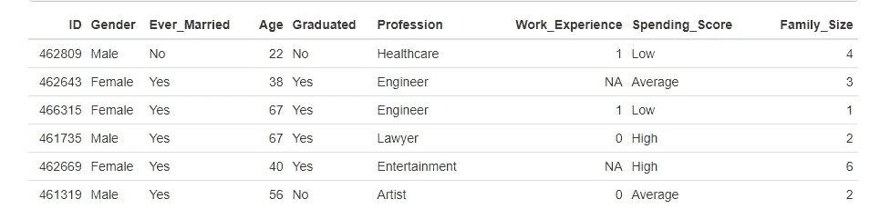

数据集的头部

# 检查缺少的值

```
*# To find the number of NAs in each variable*
lapply(data,**function**(x) { length(which(is.na(x)))})
```


检查空值

```
*# To find the number of blanks in each variable*
lapply(data,**function**(x) { length(which(x==""))})
```

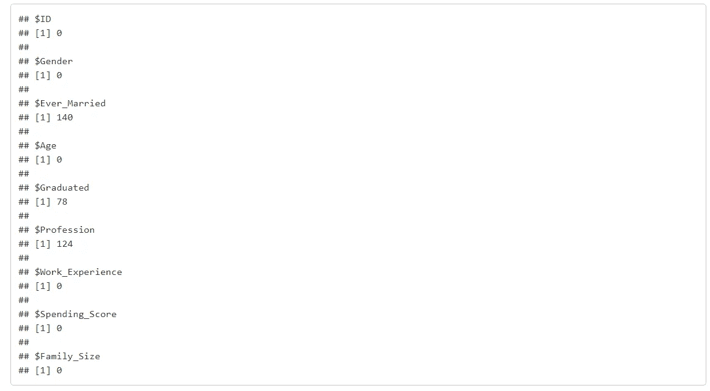

检查空白

数据集包含缺失值，如 NAs 和空格。因为它们可能会干扰聚类算法，所以它们被替换为各自的平均值或众数。

```
*# There are blank values in categorical variables Graduated and Profession, replacing them with NAs for better handling*

data[data==""]<-NA

*# Replacing NA rows with mode* *# Creating a User defined function for finding Mode as R does not come with a base mode function*
getmode <- **function**(v) {
   uniqv <- unique(v)
   uniqv[which.max(tabulate(match(v, uniqv)))]
}

# Replacing categorical variable NAs with their mode and continuous variable NAs with Meandata$Ever_Married[is.na(data$Ever_Married)]<-getmode(data$Ever_Married)

data$Graduated[is.na(data$Graduated)]<-getmode(data$Graduated)

data$Profession[is.na(data$Profession)]<-getmode(data$Profession)

data$Work_Experience[is.na(data$Work_Experience)]<-mean(data$Work_Experience,na.rm=TRUE)

data$Family_Size[is.na(data$Family_Size)]<-mean(data$Family_Size,na.rm=TRUE) 
```

缺失值已成功替换为平均值和众数。为了找到每个变量的潜在趋势，绘制了单变量分布图。

# 数据特征

*   该数据集中客户的一般年龄在 18-60 岁之间。
*   客户有 2 -4 年的工作经验，少数异常者有超过 10 年的工作经验
*   家庭规模在 2- 4 人之间
*   顾客群中男性多于女性
*   已婚的人比未婚的人多
*   大部分顾客是毕业生
*   艺术家是顾客中最常见的职业
*   大多数顾客属于低消费分数类别

```
boxplot(data$Age, horizontal = TRUE,col = 'Purple',main="Age")boxplot(data$Work_Experience, horizontal = TRUE,col = 'Orange',main="Work Ex")boxplot(data$Family_Size, horizontal = TRUE,col = 'Blue',main="Family Size")
```

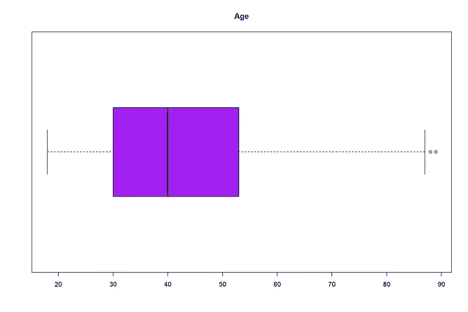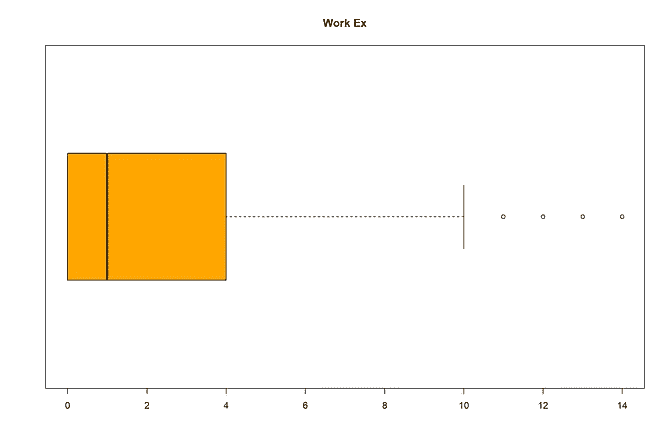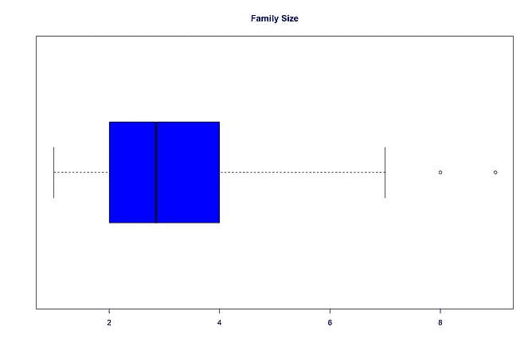

连续/顺序变量的箱线图

```
ggplot(data) + geom_bar(aes(x = Gender))
ggplot(data) + geom_bar(aes(x = Ever_Married))
ggplot(data) + geom_bar(aes(x = Graduated))
ggplot(data) + geom_bar(aes(x = Profession))
ggplot(data) + geom_bar(aes(x = Spending_Score))
```

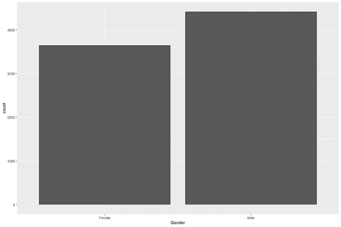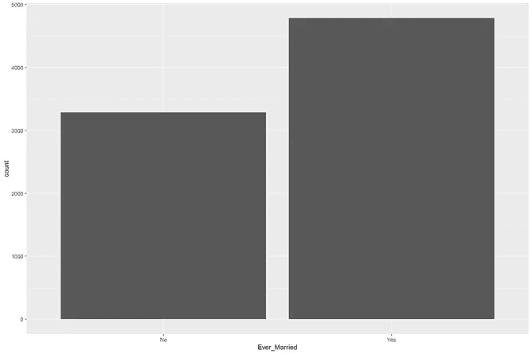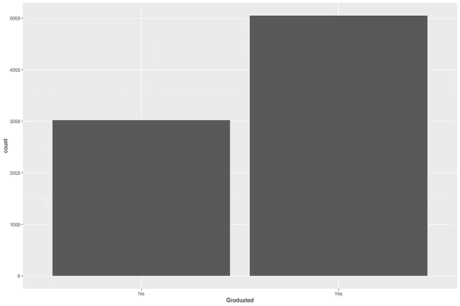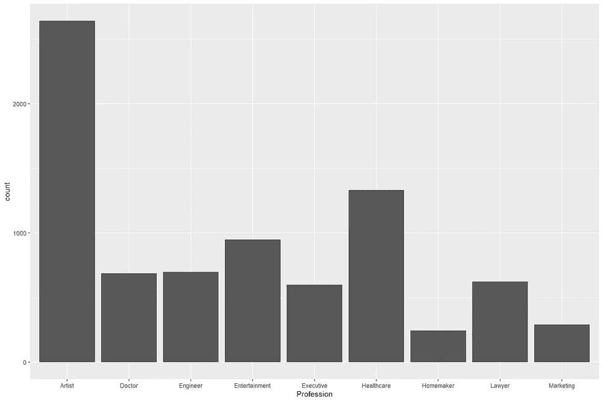

名义分类变量的分布图

因为给定的数据集有许多信息存储在分类变量中，如性别、职业、是否结过婚等。我们的机器无法理解，我们需要把它们编码成数字格式。为此，有两种选择:

1.  等级编码:你基本上给变量的每个不同的类分配一个唯一的数字。例如，当对职业进行编码时，艺术家可能被指定为 1，医生被指定为 2，等等。
2.  一种热编码:在这种变体中，分类变量的每一类都作为二进制变量分布，如果在给定的数据点中出现，则标记为 1，否则标记为 0。例如，如果花费分数被分成一个热编码变量，将有三个新的变量被称为高、中和低，对于具有高花费分数的特定客户，称为高的变量将被编码为 1。

我们将用于聚类相似客户的算法是 K-Means (T [他的视频可能有帮助](https://www.youtube.com/watch?v=4b5d3muPQmA))，它依赖于 n 维空间中两个数据点之间的距离。它容易受到基础数据量的影响，这意味着 19 岁的客户可能会远离 65 岁的客户，而将他们绘制为 n 维空间中的点，这对于数值变量来说是有意义的。然而，如果变量像职业一样是分类的，在等级编码中，等级 7 不一定大于等级 6。在这种情况下，通常建议使用一种热编码，而不是等级编码，因为当两个数字之间没有关系时，算法可能会误解这两个数字之间的关系。

```
*# One Hot encoding categorical variables*

cluster_data<-dummy_cols(data)

*# Dropping columns not required for analysis*

cat <- c("ID","Gender","Ever_Married","Graduated","Profession","Spending_Score")
cluster_data<-cluster_data[ , !(names(cluster_data) %**in**% cat)]knitr::kable(head(cluster_data))
```

在本练习中，我们使用除 ID 以外的所有变量，因为 ID 变量只是每个客户的唯一标识符。它不存储任何会影响其细分市场的客户隐藏信息，因此被排除在分析之外。

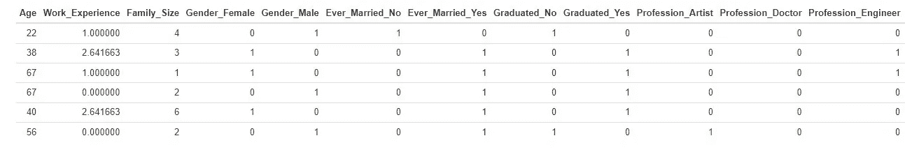

虚拟编码数据集

正如所看到的，数据集现在减少到一个简洁的数字变量的集合，可以很容易地被机器理解。

为了给出 K 意味着什么的一个非常基本的概述，它从分配 K(一个你指定的数字)随机聚类中心开始。下一步是计算这些中心和所有数据点之间的距离，就像你传统的二维坐标几何一样，只是这个点是在一个 n 维空间中；一些我们的大脑不太擅长想象的东西。这些点被分配给离它们最近的聚类中心。一旦这种聚类数据点的迭代完成，就重新计算聚类质心并重复该过程。

有一种很好的方法可以确定最佳聚类数(k ),使用一种称为肘形图或 Scree 图的图来选择，我在这里不做深入探讨。我们选择在这里保留 4 个聚类，这是数据集最初附带的。

```
*#install.packages("ClusterR")*
*#install.packages("cluster")*

**library**(cluster)
**library**(ClusterR)

set.seed(240) *# Setting seed*
kmeans_1 <- kmeans(cluster_data, centers = 4, nstart = 20)
*#kmeans_1*

*#kmeans_1$cluster*

*# Assigning the segments back to the dataset*
data$segment<-kmeans_1$clusterknitr::kable(head(data))
```

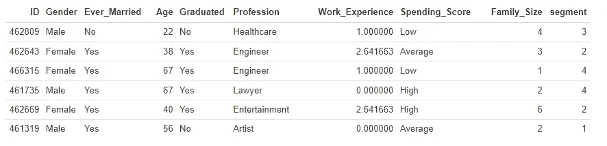

分配各自细分市场后的客户

代表一个客户的每个数据点现在都被分配了一个从 1 到 4 的聚类数。为了更好地理解每个聚类(即客户群)所代表的内容，我们将它们可视化在二维散点图上。由于不可能使用所有使用的变量在多维空间中可视化聚类，我们使用年龄、工作经验和家庭规模等连续变量绘制了三个独立的聚类图。

```
y_kmeans <- kmeans_1$cluster

*# Visualizing segments in terms of Work experience and Age*
clusplot(data[, c("Age", "Work_Experience")],
         y_kmeans,
         lines = 0,
         shade = TRUE,
         color = TRUE,
         labels = 0, *# To remove data labels from the plot*
         plotchar = TRUE,
         span = TRUE,
         main = paste("Customer Segments"),
         xlab = 'Age',
         ylab = 'Work_Experience')
```

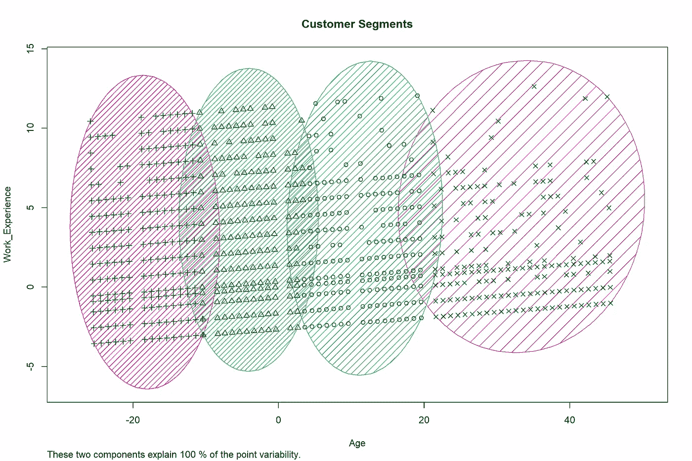

clus plot:Ex X 时代工作

```
clusplot(data[, c("Family_Size", "Work_Experience")],
         y_kmeans,
         lines = 0,
         shade = TRUE,
         color = TRUE,
         labels = 0,
         plotchar = FALSE,
         span = TRUE,
         main = paste("Customer Segments"),
         xlab = 'Family_Size',
         ylab = 'Work_Experience')
```

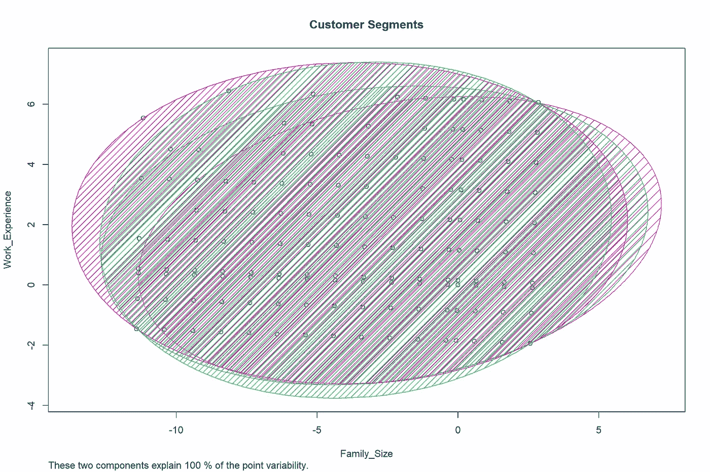

Clusplot:工作 Ex X 家庭规模

```
clusplot(data[, c("Family_Size", "Age")],
         y_kmeans,
         lines = 0,
         shade = TRUE,
         color = TRUE,
         labels = 0,
         plotchar = FALSE,
         span = TRUE,
         main = paste("Customer Segments"),
         xlab = 'Family_Size',
         ylab = 'Age')
```

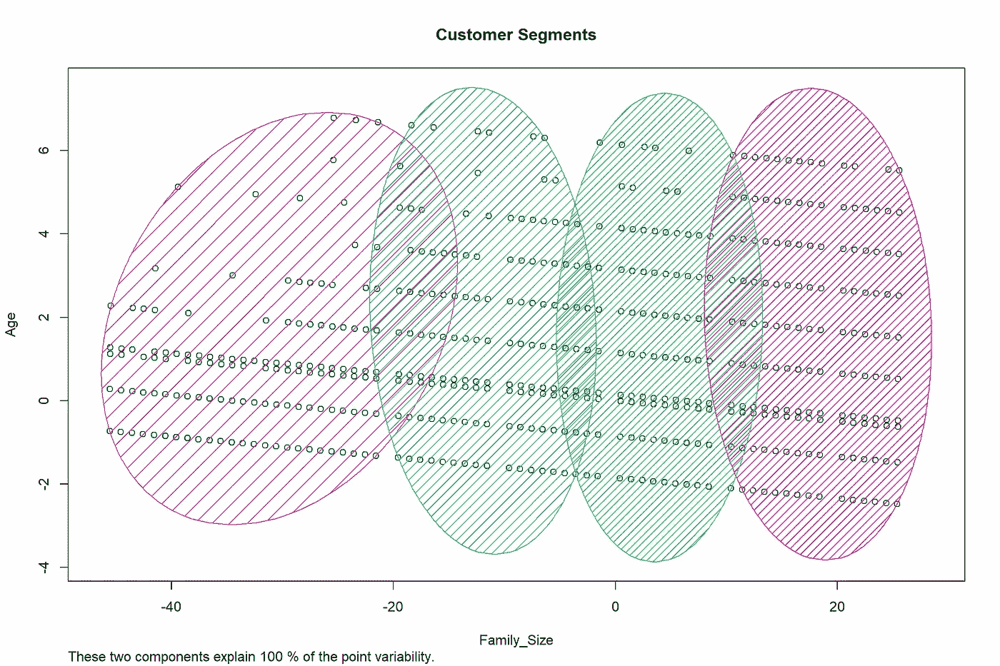

Clusplot:年龄 X 家庭规模

# 聚类分析

总结每个细分市场中的客户属性；

```
data %>% group_by(segment) %>% 
  summarise(Min_Age=min(Age), Work_Experience=mean(Work_Experience),Family_Size=mean(Family_Size),
            Graduated=getmode(Graduated),Gender=getmode(Gender),
       Married=getmode(Ever_Married),Profession=getmode(Profession),
            Spend=getmode(Spending_Score))knitr::kable(segment_summary)
```

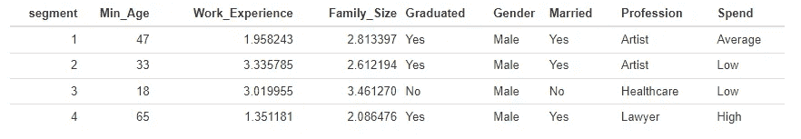

客户细分汇总

在理解平均属性的基础上，我们观察到每个细分市场的年龄组差异很大，而第 1 和第 4 细分市场的家庭规模和工作经验是可比的。

大多数客户群以男性为主，这也是基础数据集中的总体趋势。细分市场 1、2 和 4 以已婚人士为主，而细分市场 3 有更多未婚人士，这与最小年龄为 18 岁的年轻客户群体的观察结果一致。

有趣的是，拥有年轻客户(即 18-45 岁)的细分市场 2 和 3 的消费得分较低，而拥有中老年客户的细分市场 1 和 4 的消费得分较高。

基于这种分析，汽车经销商的营销团队可以确定向每个细分市场发送何种信息。细分市场 1 和 4 可以定位于豪华轿车，因为它们具有良好的消费评分，并且通常家庭规模不大。细分市场 3 的目标是入门级汽车，细分市场 2 的目标是中型 SUV。

***那都是乡亲们！***


托尔加·乌尔坎在 [Unsplash](https://unsplash.com?utm_source=medium&utm_medium=referral) 上拍摄的照片

这是一个初步的分析，试图借助 R 上的聚类来触及客户细分的概念，所有这些都具有小数据集的局限性和舒适性。有了交易数据，分析当然会更丰富，我们会有更多关于客户消费行为的信息；最重要的是它们的新近性、频率和货币模式。希望很快能在帖子中涵盖所有这些内容！

在此之前，感谢您的阅读。请在下面留下你的评论、想法和大声喊出来！