# DistSQL 简介

> 原文：<https://medium.com/nerd-for-tech/intro-to-distsql-an-open-source-more-powerful-sql-bada4099211?source=collection_archive---------9----------------------->

我们相信，如果你正在阅读这篇文章，那么你一定熟悉 SQL(结构化查询语言)，这是一种数据查询和编程语言，也用作关系数据库管理系统的标准语言，用于访问数据、查询、更新和管理关系数据库系统。

与标准 SQL、DistSQL 或分布式 SQL 类似，是 ShardingSphere 独有的内置 SQL 语言，提供了标准 SQL 之外的增量功能。利用 ShardingSphere 强大的 SQL 解析引擎，DistSQL 提供了类似于标准 SQL 的语法结构和语法验证系统，使 DistSQL 更加灵活，同时保持了规律性。

ShardingSphere 的 Database Plus 概念旨在创建一个开放源码的分布式数据库系统，该系统既实用又与实际的数据库业务相关。DistSQL 构建在传统数据库之上，提供既符合标准又具有 ShardingSphere 功能的 SQL 功能，从而更好地激活传统数据库。

## DistSQL 的设计初衷

经过多年的快速发展，随着内核逐渐稳定，核心功能不断完善，ShardingSphere 已经成为数据库中间件领域中独一无二的产品。作为亚洲尤其是中国的开源领导者，ShardingSphere 并没有停止对分布式数据库生态系统的探索。

DistSQL 的设计目标是重新定义中间件和数据库之间的界限，并允许开发人员像使用数据库一样使用 Apache ShardingSphere。它也是 ShardingSphere 从面向开发者的框架和中间件转变为面向运营的基础设施产品的能力的一个组成部分。

## DistSQL 语法系统

考虑到数据库开发人员和操作人员的习惯，DistSQL 从一开始就被设计成面向标准的。DistSQL 的语法基于标准 SQL 语言，考虑到可读性和易用性，同时最大限度地保留了 ShardingSphere 自身的特性，并为用户提供了尽可能多的定制选项，以应对不同的业务场景。熟悉 SQL 和 ShardingSphere 的开发者可以快速上手。

而标准 SQL 提供了不同类型的语法，如 DQL、DDL、DML、DCL 等。为了定义不同的函数 SQL 语句，DistSQL 还定义了自己的语法系统。

在 ShardingSphere 中，DistSQL 语法目前分为三种主要类型:RDL、RQL 和 RAL。

**RDL(资源&规则定义语言)**:用于创建、修改、删除资源和规则的资源规则定义语言。

**RQL(资源&规则查询语言)**:资源规则查询语言，用于查询和展现资源和规则。

**RAL(资源&规则管理语言)**:提示、交易类型切换、分片执行计划查询等增量功能操作的资源规则管理语言。

DistSQL 的语法为 ShardingSphere 走向分布式数据库搭建了一座桥梁，虽然随着更多想法的实现，它仍在不断改进，但 DistSQL 一定会变得更加强大。欢迎有兴趣的开发者加入 ShardingSphere，为 DistSQL 贡献想法和代码。

更详细的语法规则请参考官方文档:[https://sharding sphere . Apache . org/document/current/cn/features/dist-SQL/syntax/](https://shardingsphere.apache.org/document/current/cn/features/dist-sql/syntax/)

项目社区请参考 Slack 官方频道:[https://join . Slack . com/t/Apache shardings sphere/shared _ invite/ZT-sbd de 7 ie-sjd qo 9 ~ I 4 rycr 18 bq 0 sytg](https://join.slack.com/t/apacheshardingsphere/shared_invite/zt-sbdde7ie-SjDqo9~I4rYcR18bq0SYTg)

## 实践中的 DistSQL

了解了 DistSQL 的设计理念和语法体系，下面以数据分片为例，演示如何基于 ShardingSphere 构建数据分片服务。

## 环境准备:

1.  启动 MySQL 服务
2.  为分片创建一个 MySQL 数据库
3.  启动动物园管理员服务
4.  打开分布式治理配置并启动 sharding sphere-Proxy(https://sharding sphere . Apache . org/document/current/cn/quick-start/sharding sphere-Proxy-quick-start/)

## 实际演示:

1.  使用 MySQL 命令行连接到启动的 ShardingSphere-Proxy
2.  创建和查询分布式数据库`sharding_db`

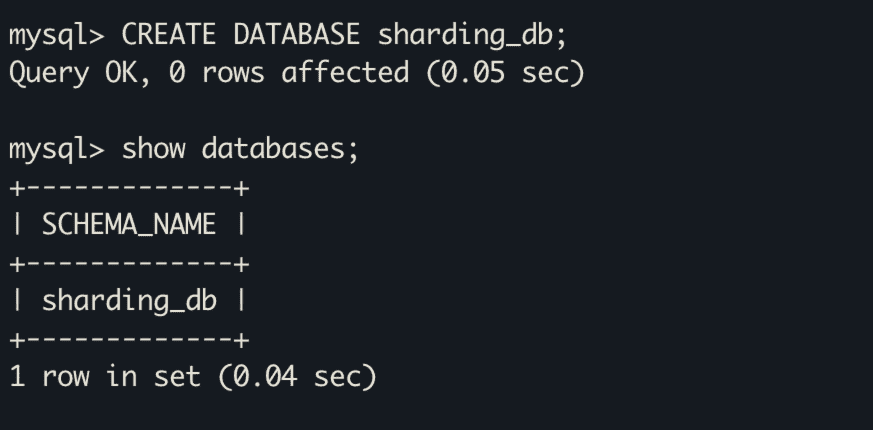

3.使用新创建的数据库

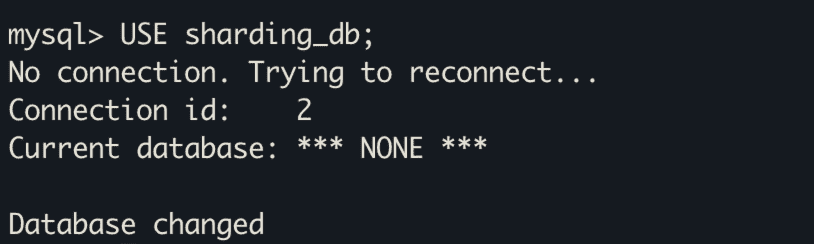

4.执行 RDL 为分片配置 2 个数据源资源`ds_1`和`ds_2`

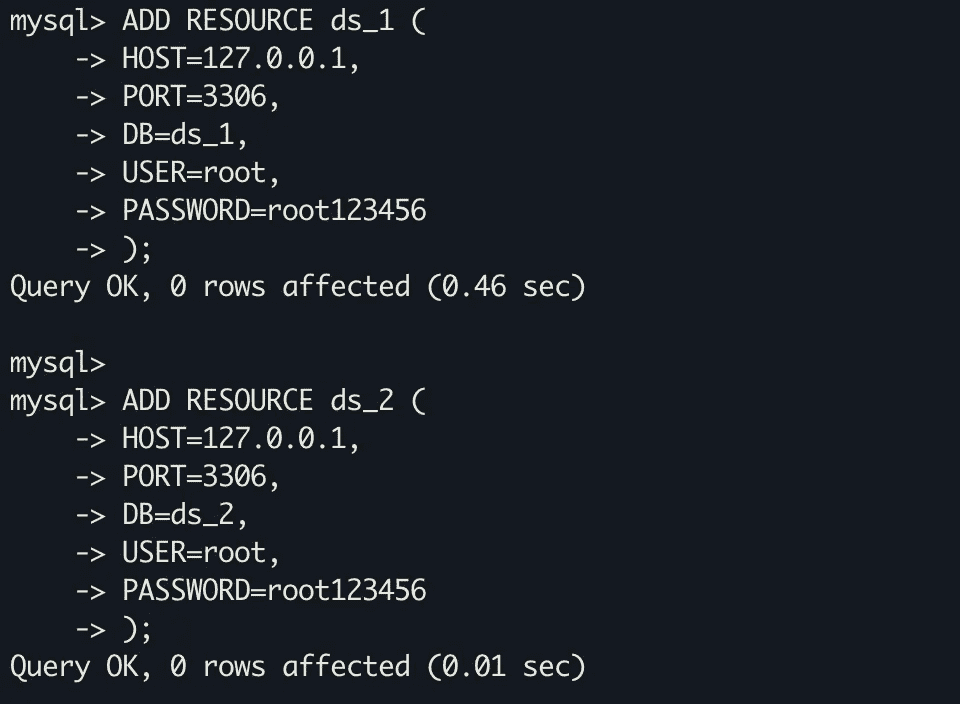

5.执行 RQL 来查询新添加的数据源资源

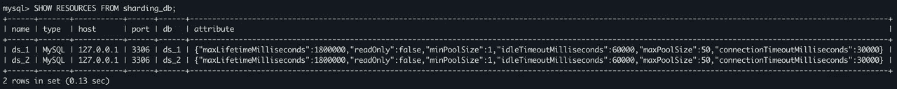

6.执行 RDL 为`t_order`表创建一个分片规则

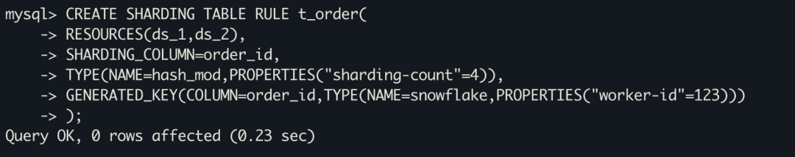

7.执行 RQL 来查询分片规则

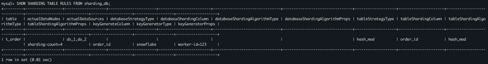

除了查询当前数据库下的所有分片规则，RQL 还可以使用下面的语句`SHOW SHARDING TABLE RULE t_order FROM sharding_db`查询各个表的分片规则

*   创建和查询`t_order`分片表

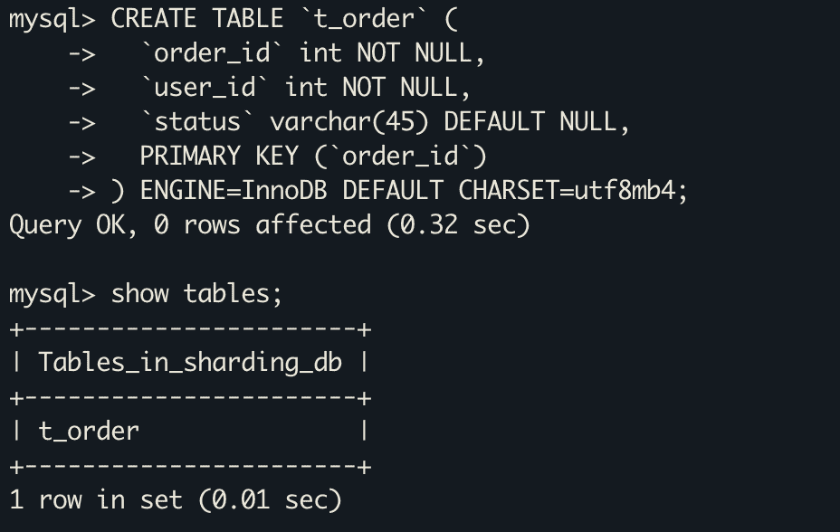

*   在 sharing sphere-Proxy 端成功创建分片表`t_order`后，sharing sphere 通过客户端连接底层数据库`ds_1`和`ds_2`，根据`t_order`表的分片规则自动创建分片表。

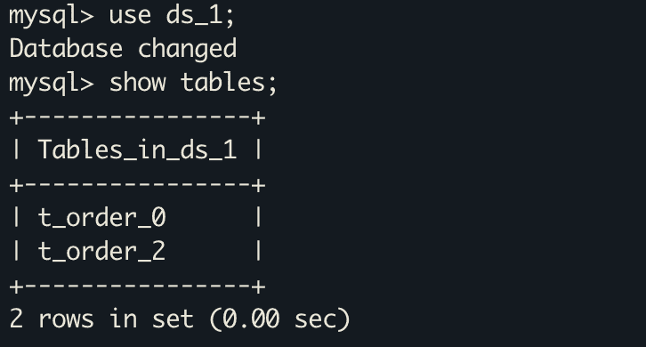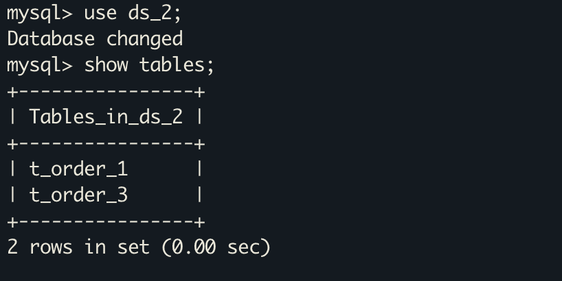

*   一旦创建了分片表，就继续在 sharing sphere-Proxy 端执行 SQL 语句来插入数据

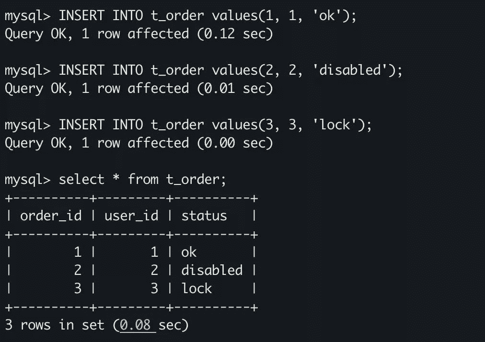

*   通过 RAL 查询执行计划

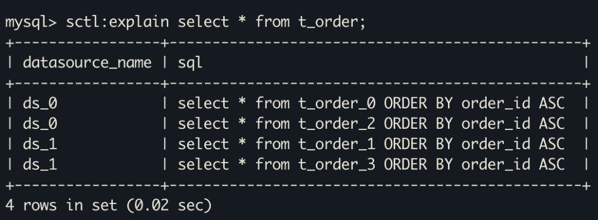

这就完成了使用 DistSQL 的 ShardingSphere 数据分片服务。与以前版本的配置文件驱动的 ShardingSphere 代理相比，DistSQL 在管理资源和规则方面对开发人员更加友好，也更加灵活。此外，SQL 驱动的方法支持 DistSQL 和标准 SQL 之间的无缝接口。

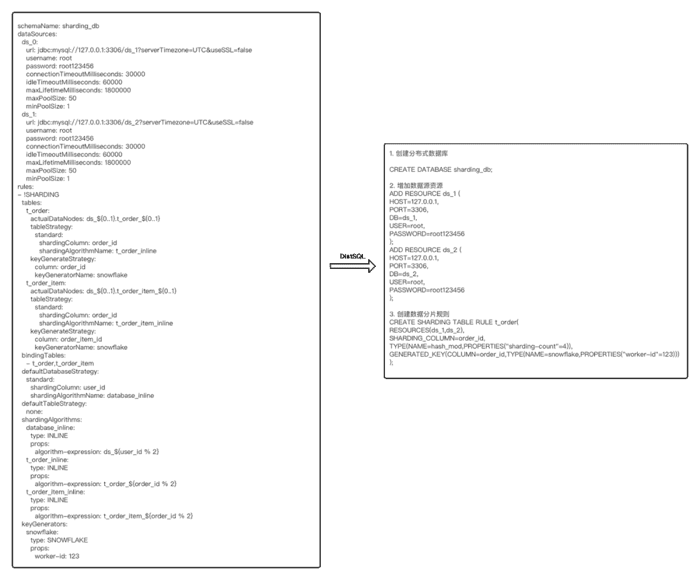

在上面的例子中，只演示了 DistSQL 语法的一小部分。除了通过`CREATE`和`SHOW`语句创建和查询资源和规则，DistSQL 还提供了`ALTRE DROP`等附加操作，支持数据分片核心功能的配置控制、读写分离、数据加密和数据库发现。

# 结论

作为 Apache sharding sphere 5 . 0 . 0-beta 中发布的新特性之一，DistSQL 将继续在此版本的基础上提供改进的语法和日益强大的功能。

DistSQL 为 ShardingSphere 在分布式数据库领域的探索开辟了无限可能，未来 DistSQL 将作为一个纽带连接更多功能，提供一键操作。比如我们会一键分析数据库整体状态，弹性迁移连接，提供一键数据伸缩，control 连接，实现一键主从切换，改变数据库状态。

我们热烈欢迎开源和 Java 脚本爱好者加入我们的 Slack 社区或查看我们的 GitHub 来了解更多关于 ShardingSphere 的最新发展。

# 作者

**孟浩然**

*spherex 高级 Java 工程师*

*Apache ShardingSphere 提交者*

他之前在京东科技负责数据库产品 R&D，对开源和数据库生态系统充满热情。目前，他专注于 ShardingSphere 数据库中间件生态系统的开发和开源社区建设。

sharding sphere Github:[https://github.com/apache/shardingsphere](https://github.com/apache/shardingsphere)

推特:[https://twitter.com/ShardingSphere](https://twitter.com/ShardingSphere)

ShardingSphere 松弛通道:[https://bit.ly/3qB2GGc](https://bit.ly/3qB2GGc)

浩然的 Github:[https://github.com/menghaoranss](https://github.com/menghaoranss)

浩然的推特:[https://twitter.com/HaoranMeng2](https://twitter.com/HaoranMeng2)