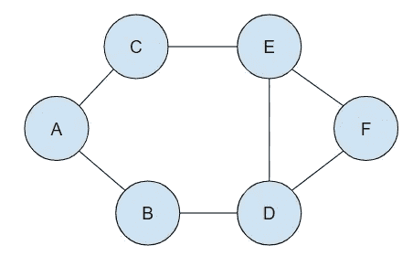
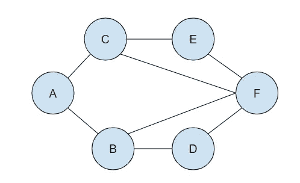

# 图表介绍(第三部分)

> 原文：<https://medium.com/nerd-for-tech/intro-to-graphs-part-3-6e4e5615642b?source=collection_archive---------15----------------------->

Robynne Hu 在 [Unsplash](https://unsplash.com?utm_source=medium&utm_medium=referral) 上的照片

大家好！这是图表介绍系列的第 3 部分。[第一部分](/mlearning-ai/intro-to-graphs-part-1-af14f5901a67)是对什么是图的一般性介绍。总之，图数据结构是顶点(节点)的有限集合和连接一对节点的边的集合。在图中，没有规则规定节点之间的连接。无论节点的位置如何，边都可以连接节点。第 2 部分学习了表示图形的两种标准方法，邻接矩阵和邻接表。这篇文章将讨论图的遍历。

# 实际用途

为什么我们需要知道图形数据结构？我们日常使用的图表有许多实际用途。

*   对等网络
*   网络爬虫
*   寻找“最接近”的匹配/推荐
*   最短路径问题:

o GPS 导航

o 解决迷宫

o AI(赢得游戏的最短路径)

# 深度优先搜索

深度优先搜索沿单个路径遍历，一次一个子节点，直到分支结束。深度优先搜索将告诉我们是否存在从起始节点到结束节点的路径。DFS 可以使用递归或迭代来实现。

# **DFS 递归**

递归实现通过查看起始节点的所有子节点直到到达结束节点来确定两个节点之间是否有路径。它通过递归地一次又一次地采取相同的步骤来确定两个节点之间是否存在这样的路径。我们沿着一条路走下去，直到到达终点，或者无法再继续走下去。如果这条路变成了死胡同，我们就往回走，沿着原路返回，直到找到另一条可行的路。

**实施**

*   创建一个数组来存储最终结果
*   创建一个对象来存储访问过的顶点
*   创建一个接受顶点的辅助函数:

o 如果顶点是空的，辅助函数应该提前返回

辅助函数应该将它接受的顶点放到被访问的对象中，并将该顶点推入结果数组

o 循环遍历该顶点的邻接表中的所有值

如果这些值中的任何一个没有被访问过，递归调用这个顶点的帮助函数

*   用起始顶点调用辅助函数
*   返回结果数组

DFS 图

我们希望从节点 A 开始访问图中的每个节点。我们将 A 添加到结果数组中，并在被访问的对象中将 A 标记为已访问。我们从 A 到 B，将其标记为已访问，并将其添加到我们的结果数组中。我们可以在 B 处选择去 A 或 d。我们检查 B 是否有任何被访问过的边。已经访问了 A，所以我们忽略 A，转到下一个节点 D，我们将 D 标记为已访问，并将其添加到结果数组中。b 已经被访问过，所以我们转到下一个节点 d。我们可以转到 E 或 f。我们转到 E，然后转到 c。我们现在是在一个死胡同。我们仍然没有访问 F。节点 E 有三条边，C，D 和 F。使用我们的 helper 方法的递归，我们访问 F。结果数组将是[A，B，D，E，C，F]

# **DFS 迭代**

迭代实现与递归实现非常相似。我们使用堆栈数据结构来跟踪顶点，而不是使用递归。[这里的](https://javascript.plainenglish.io/stack-of-pancakes-solving-remove-all-adjacent-duplicates-in-string-c3ace240f4f7)是我关于书库的文章，如果需要提醒的话。

**实现**

*   创建一个堆栈来帮助跟踪顶点(使用列表/数组)
*   创建一个数组来存储最终结果
*   创建一个对象来存储访问过的顶点
*   将起始顶点添加到堆栈中，并将其标记为已访问
*   当堆栈不为空时:

o 从堆栈中弹出下一个顶点

o 如果那个顶点还没有被访问过:

将其标记为已访问

将其添加到结果列表中

将其所有邻居推入堆栈

*   返回结果数组

我们将使用与上面相同的图，我们仍然希望访问从节点 A 开始的每个节点。我们将 A 标记为已访问，将其添加到结果数组中，并将其从堆栈中弹出。我们检查 A 的邻居 B 和 C 是否被访问过。它们还没有，所以我们把它们添加到堆栈中，并把它们标记为已访问。堆栈现在是[B，C]。由于 C 是堆栈中的最后一个，我们从堆栈中弹出 C，转到 C，并将其添加到结果数组中。然后，我们将 C 的尚未访问过的邻居添加到堆栈中。堆栈现在是[B，E]。我们遵循同样的模式，直到堆栈为空。结果数组将是[A，C，E，F，D，B]。

# 广度优先搜索(BFS)

广度优先搜索图遍历依赖于在访问子节点之前访问邻居节点，而不是遍历单个路径。从起始节点开始，它有子节点，而这些子节点又有自己的子节点。我们一层一层地遍历这个图。我们先访问一个节点，然后再访问它的所有子节点，最后再访问孙节点。我们使用队列数据结构来跟踪在移动到另一层之前要访问的节点。这里是我的一篇关于排队的文章，作为复习。广度优先搜索图遍历通常用于确定图中两个节点之间的最短路径。

**实施**

*   创建一个队列，并将起始顶点放入其中
*   创建一个数组来存储最终结果
*   创建一个对象来存储访问过的节点
*   将起始顶点标记为已访问
*   只要队列中有任何东西，就进行循环
*   从队列中删除第一个顶点，并将其推入存储已访问节点的数组中
*   循环遍历邻接表中你正在访问的顶点。
*   如果它不在存储已访问节点的对象内部，则将其标记为已访问，并将该顶点排队
*   返回结果数组

BFS 图

该图略有不同，但我们仍然希望从节点 A 开始访问图中的每个节点。我们将 A 标记为已访问，将其添加到结果数组中，并将其从队列中移除。我们检查 A 的邻居 B 和 C 是否被访问过。他们没有，所以我们将他们添加到队列中，并标记为已访问。现在的队列是[B，C]。与使用堆栈相反，我们从队列的前面移除。B 是队列中的第一个节点，所以我们从队列中移除 B，转到 B，并将其添加到结果数组中。然后，我们将 B 的尚未访问过的邻居添加到队列中。队列现在是[C，D]。我们遵循同样的模式，直到队列为空。结果数组将是[A，B，C，D，E，F]。

# 资源

关于图表的更多资源，我建议看看这些有用的链接。

图遍历代码:[https://gist . github . com/chanson 9892/3 A8 aa 720 e 93 a5c 06630 ea 10 c 73153 eef](https://gist.github.com/Chanson9892/3a8aa720e93a5c06630ea10c73153eef)

第一部分:[https://medium . com/mlearning-ai/intro-to-graphs-part-1-af 14 f 5901 a 67](/mlearning-ai/intro-to-graphs-part-1-af14f5901a67)

第二部分:[https://medium . com/mlearning-ai/intro-to-graphs-part-2-954 F6 F8 af 70 f](/mlearning-ai/intro-to-graphs-part-2-954f6f8af70f)

Stack 文章:[https://JavaScript . plain English . io/stack-of-pancakes-solving-remove-all-adjacent-duplicates-in-string-C3 ace 240 F4 f 7](https://javascript.plainenglish.io/stack-of-pancakes-solving-remove-all-adjacent-duplicates-in-string-c3ace240f4f7)

队列篇:[https://JavaScript . plain English . io/how-to-use-queues-33370 A0 c8 f3b](https://javascript.plainenglish.io/how-to-use-queues-33370a0c8f3b)

Udemy 课程:[https://www . udemy . com/Course/js-algorithms-and-data-structures-master class/](https://www.udemy.com/course/js-algorithms-and-data-structures-masterclass/)

图表:【https://medium.com/swlh/data-structures-graphs-50a8a032db03 

DFS 图遍历:[https://medium . com/basecs/deep-dive-through-a-Graph-DFS-Traversal-8177d F5 d0f 13](/basecs/deep-dive-through-a-graph-dfs-traversal-8177df5d0f13)

BFS 图遍历:[https://medium . com/basecs/going-broad-in-a-Graph-bfs-Traversal-959 bd1a 09255](/basecs/going-broad-in-a-graph-bfs-traversal-959bd1a09255)