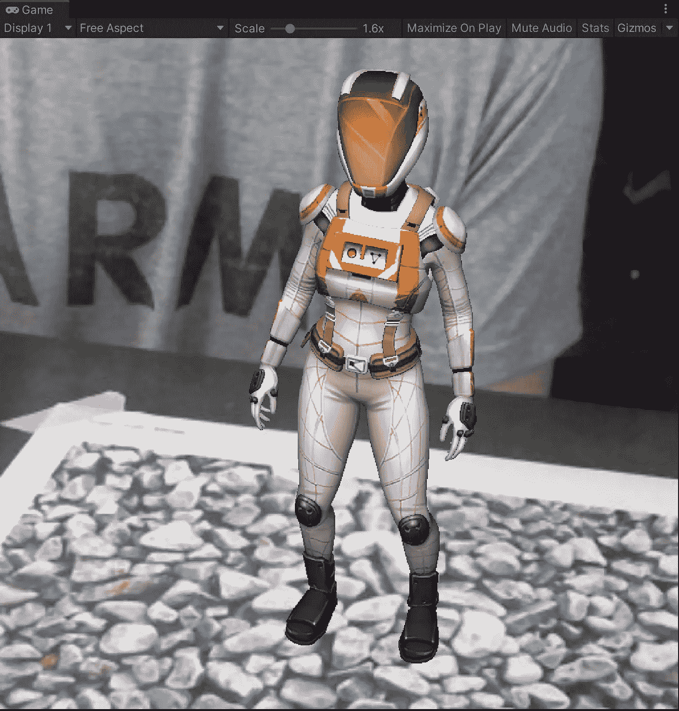
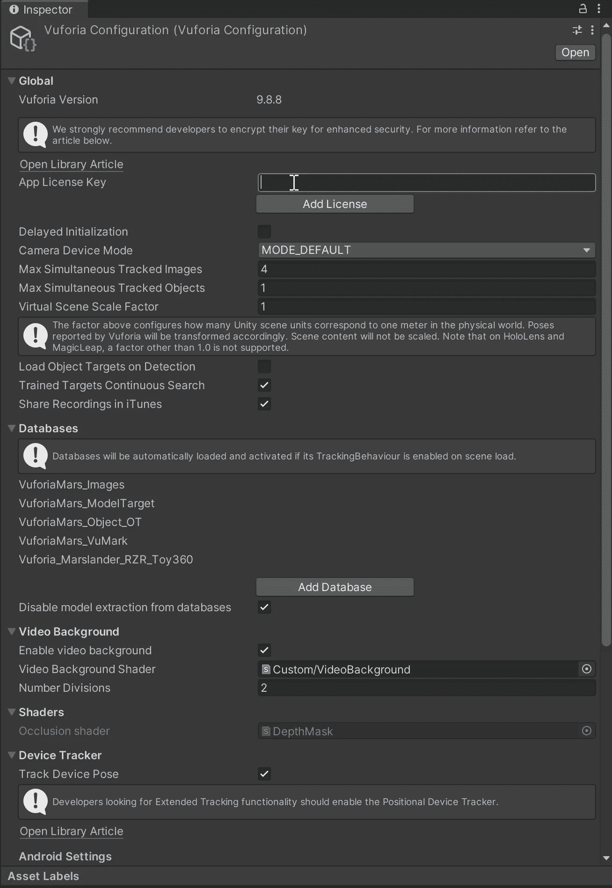
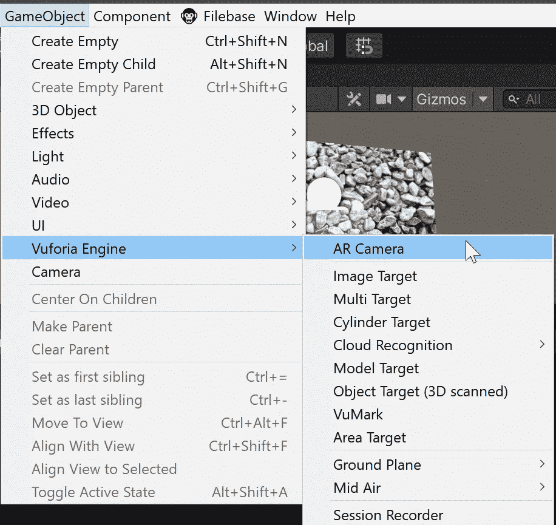
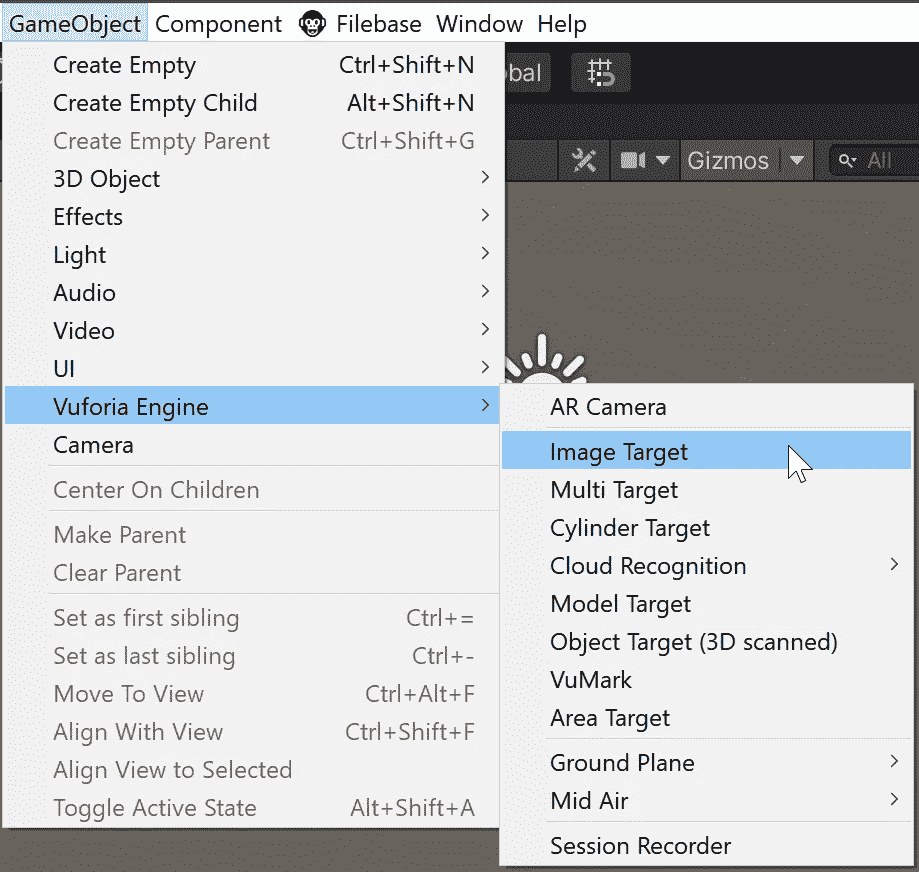
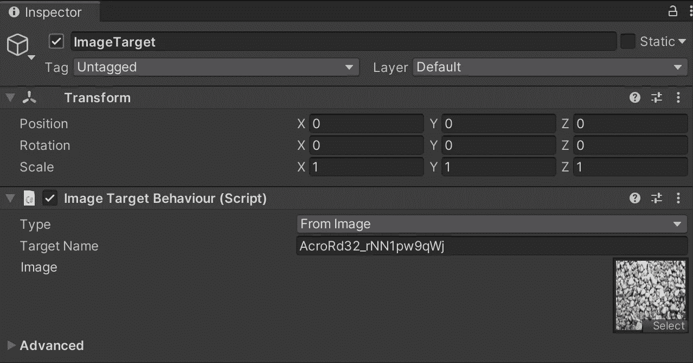
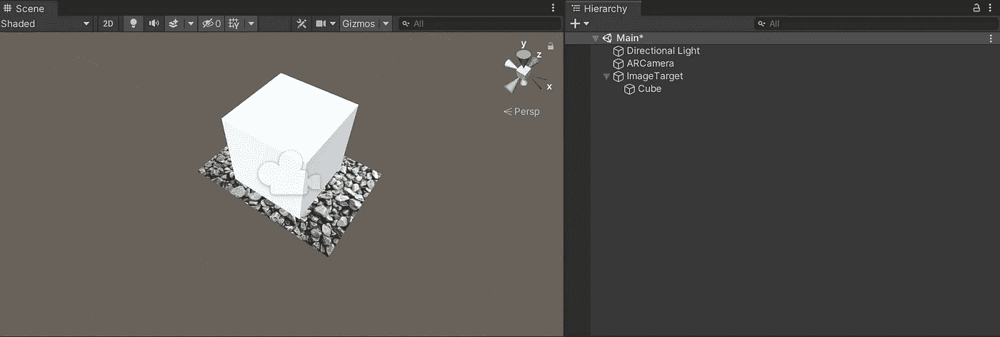
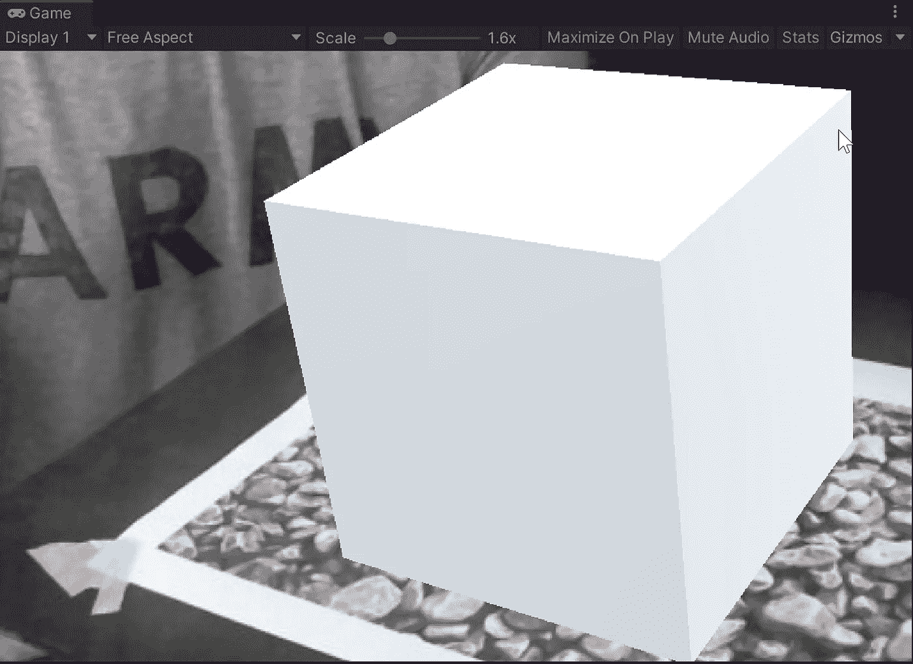
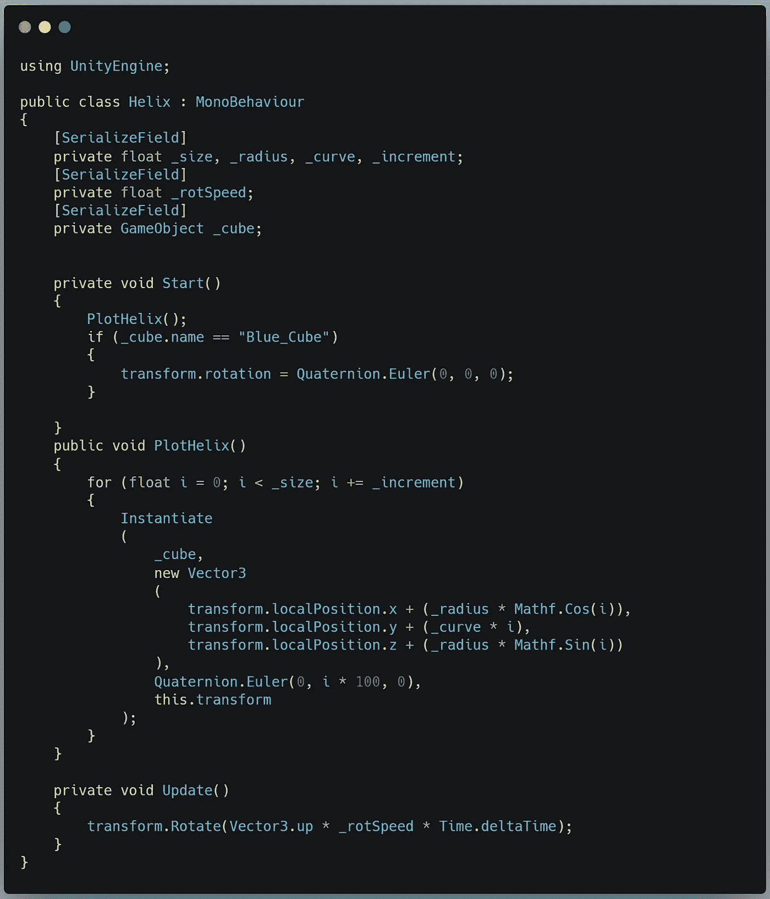
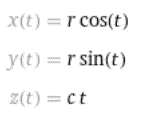
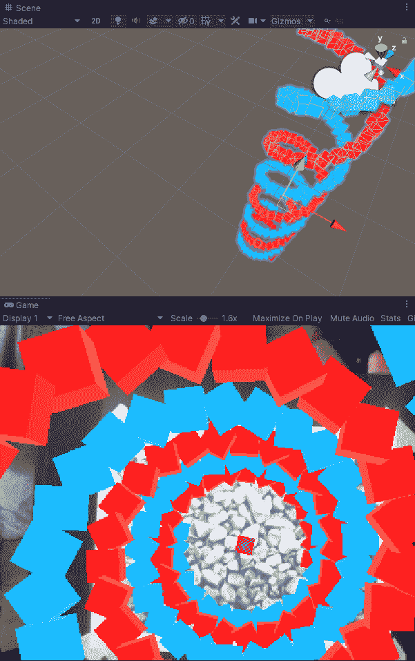

# 使用 Unity3D 和 Vuforia 介绍增强现实世界

> 原文：<https://medium.com/nerd-for-tech/intro-to-the-world-of-augmented-reality-with-unity3d-and-vuforia-cf566eda85b2?source=collection_archive---------16----------------------->

## 将你的创作带入虚拟生活！

今天我们将回顾使用 [Vuforia AR 插件](https://developer.vuforia.com/downloads/sdk)在 Unity 3D 中实现增强现实的基础知识。

https://developer.vuforia.com/

下载插件并将其导入 Unity。你可能需要下载额外的插件支持——如果是这样，Unity 会提示你。只需点击提示，一切都应该加载好。

要使用 Vuforia，您需要有一个帐户，然后导航到您的开发者仪表板上的[许可管理器屏幕](https://developer.vuforia.com/vui/develop/licenses)。单击“获取开发者密钥”,您将看到以下屏幕:

键入一个名称并确认。下一个屏幕将显示一个带有您的(非常长的)密钥的框。

在 Unity 中，您需要将密钥放在 Vuforia 配置菜单中:

别担心，会合身的。

如果你已经正确安装了所有的东西，你应该会在游戏对象菜单中看到一个新的选项:

添加一个 AR 相机到场景中，删除主相机对象——AR 相机现在是我们的主相机。游戏视图变黑了，但这不是我们现在需要担心的问题。

下一步是将图像目标对象添加到场景中。

这个对象将为我们在层次结构中放置的任何对象的 AR 投影提供参考。我们需要一张打印出来的高清图像，就在现实中。任何图像都可以，但是 Vuforia 提供了一组非常好用的样本图像。图像的数字版本将成为图像目标对象的纹理。

只需将您的图像拖到这个框中，您就可以设置好了。我们可以通过放置一个原始立方体作为图像目标对象的子对象来测试它。

*瞧！*

好吧，但那有点无聊。让我们试试我做的一个有趣的小脚本，以旋转螺旋模式创建对象。它需要两个 Spawner 对象(可以是任何类型的对象)和一个预置立方体来实例化。我用不同的材料制作了两个立方体和两个产卵器(彼此旋转了 180 度)，所以我得到了一个旋转双螺旋的效果。

剧本是这样的:

我基本上遵循螺旋的公式，那就是:

谢谢，沃尔夫拉姆阿尔法

因此，要将这个等式转换成代码:

*   我们交换 *y* 和 *z* (因为 math 使用 z 轴表示上下，Unity 使用 y 轴表示上下)
*   *t* 变为 *i* (for 循环中的迭代次数)
*   *r* 成为 x 轴和 z 轴的 _ 半径变量
*   *c* 成为 y 轴的 _curve 变量

这是结果:

整洁！

明天我将使用 Vuforia 和 Unity 3D 创建一个关于解剖学的教育应用程序。