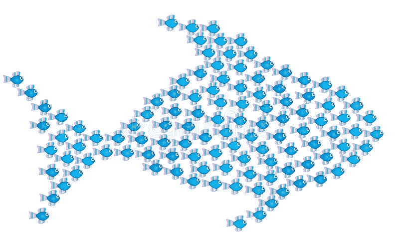
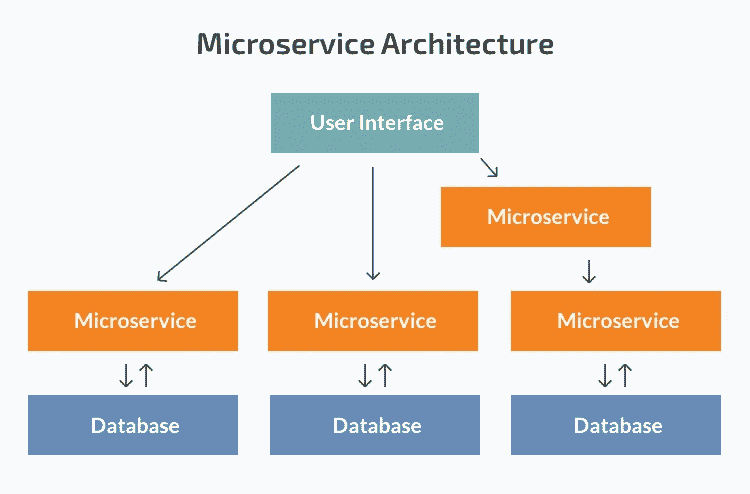

# 向微服务世界介绍自己

> 原文：<https://medium.com/nerd-for-tech/introduce-yourself-to-the-world-of-microservices-7b917251a763?source=collection_archive---------15----------------------->

图片来自- [谷歌](https://www.google.com/search?q=lot+of+fishes+create+big+fish&tbm=isch&ved=2ahUKEwjmt6CqvIzxAhW42nMBHfwXCDMQ2-cCegQIABAA&oq=lot+of+fishes+create+big+fish&gs_lcp=CgNpbWcQA1DcSFjhbmCAcmgAcAB4AIABiQKIAfkYkgEEMi0xNJgBAKABAaoBC2d3cy13aXotaW1nwAEB&sclient=img&ei=mrXBYOaCDLi1z7sP_K-gmAM&bih=625&biw=1366#imgrc=BvuOMP8ODst4DM)

要更深入的掌握微服务，首先要了解微服务和单片架构的区别。

# 单片应用。

单片应用程序意味着一个单一的、不可分割的软件。这种系统通常包括客户端用户界面、服务器端程序和数据库。它是集成的，所有功能都从一个中心位置处理和服务。一般来说，单片应用程序有一个大的代码库，缺乏模块化。当开发人员希望更新或替换某些东西时，他们使用相同的代码库。

图片来自— [n-ix](https://www.n-ix.com/microservices-vs-monolith-which-architecture-best-choice-your-business/)

## 单片架构的优势

*   **易于管理:**易于记录、处理、缓存和监控性能。因为单片应用程序是一个单一的单元。
*   **易于测试:**与微服务架构相比，单片应用更易于测试。由于单片应用程序是一个单一的不可分割的单元，您可以更快地运行端到端测试。
*   **易于部署:**整体式应用更易于部署。对于整体应用程序，您只需处理一个文件或目录进行部署。

## 整体架构的问题

*   在如此紧密耦合的大型复杂应用程序中实现更改更加困难。任何代码修改都有可能影响整个系统，因此必须仔细规划。这使得整个开发过程要长得多。
*   因为当开发人员希望更新或替换某些内容时，他们会使用相同的代码库。因此，他们应该再次压缩整个应用程序，即使是很小的改动。
*   只能缩放整个应用程序，而不能缩放单个组件。
*   将新技术应用于一个单一的程序是极其困难的，因为可能整个应用程序都要重写。

# 微服务架构

单片应用程序是一个统一的单元，但是微服务架构将它分成更小的自治单元。每个申请程序都由这些单位作为单独的服务来处理。因此，每个服务都有自己的逻辑和数据库，以及执行自己的专门操作的能力。

> 微服务架构风格是一种将单个应用程序开发为一套小型服务的方法，每个应用程序都在自己的进程中运行，并通过轻量级机制(通常是 HTTP 资源 API)进行通信。
> -马丁·福勒-

应用程序的全部功能被分解成可独立部署的模块，这些模块通过微服务架构中称为 API(应用程序编程接口)的已定义方法相互通信。每项服务都有自己的范围，可以独立更新、部署和扩展。

图片来自-[n-ix.com](https://www.n-ix.com/microservices-vs-monolith-which-architecture-best-choice-your-business/)

# 微服务的特征

1.  微服务有特定的生存目的(领域驱动开发)，每个微服务都应该有自己明确的范围。
2.  微服务必须运行在自己的进程上，不能依赖于另一个进程。它应该运行在自己的 web 容器上。
3.  微服务可以通过一种轻量级机制相互通信——大多数时候它使用 HTTP 协议进行通信。
4.  微服务应该具有独立扩展和部署的能力。
5.  微服务应该以尽可能分散的控制来构建。
6.  不同的编程语言可以用来创建不同的微服务，它们可以协同工作。
7.  一个较小的团队应该能够开发一个微服务(平均 8-12 个团队成员)

## 微服务的可扩展性

**Scale Cube** 是《可伸缩性的艺术**一书中描述的三维可伸缩性范例。**

图片由- [微服务. io](https://microservices.io/articles/scalecube.html)

## x 轴缩放(水平复制)

在负载均衡器后面运行应用程序的大量副本被称为 X 轴扩展。如果有 N 个副本，则每个副本处理 1/N 的负载。这是一种简单且广泛使用的扩展程序的方法。

一个应用程序应该能够通过 x 轴缩放。如果一个实例不够，我们应该能够产生另一个实例并继续下去。

## z 轴缩放(数据分区)

当使用 Z 轴缩放时，每台服务器运行相同的代码副本。但是在数据库级别，数据被划分到不同的分片中。因此，每台服务器只负责数据的一个子集。系统的某个组件负责将每个请求路由到适当的服务器。例如:欧洲客户被定向到欧洲服务器，亚洲客户被定向到亚洲服务器，等等。

## y 轴缩放(功能分解)

这种扩展方法可以通过将应用程序分解成更小的、可独立部署的单元来实现。微服务非常适合这种扩展模式，因为微服务是独立的小型服务，拥有自己的数据库。

因此，如果我们的应用程序有一个高需求的服务，我们只能克隆那个特定的服务，而不是克隆整个应用程序。

# 开发微服务时要记住的事情

*   每个服务应该能够使用不同的编程语言、框架。
*   **领域驱动的设计:**服务应该以这样一种方式开发，即一个服务可以独立运行而不依赖于其他服务。
*   **必须实现服务弹性和容错:**因为所有的服务都将相互通信，如果一个或一些服务无法工作或没有响应，我们需要有一个适当的机制来维护这种情况(断路器模式、代理等)。
*   **使用合适的可用框架进行微服务开发和部署:**我们不必发明一切；有各种框架可以完成我们需要的各种任务。
*   我们需要一个能够处理项目所有方面的完整团队。

# 微服务的优势

*   所有服务都可以独立部署和更新，这提供了更大的灵活性。
*   单个微服务中的错误只会影响该服务，不会影响整个应用程序。
*   向微服务应用添加新特性要比向单一程序添加新特性容易得多。
*   易于理解和管理，因为服务有自己明确定义的范围
*   每个元素都可以独立缩放。性价比很高。
*   灵活选择技术，开发团队不限于任何技术。他们可以自由地为每个微服务应用各种技术和框架。
*   当故障发生时，我们可以通过简单地修复中断的服务来减少停机时间。

# 微服务的缺点

*   格外复杂。因为微服务架构是一个分布式系统，所以您必须仔细选择和配置所有模块和数据库的连接。此外，每个服务必须单独部署。
*   当微服务相互通信时，会有一些延迟。
*   依赖性管理很难。
*   应注意版本控制和部署，因为升级您的版本可能会对您依赖的服务产生影响。
*   由于大量可独立部署的组件，集成测试要困难得多。

# 留住 Learning❤️

# 参考

 [## 微服务 vs Monolith:哪种架构最适合您的企业？

### 微服务在几年前刚刚出现，现在正呈加速趋势。的确，微服务…

www.n-ix.com](https://www.n-ix.com/microservices-vs-monolith-which-architecture-best-choice-your-business/)  [## 比例立方体

### 《可伸缩性的艺术》这本书描述了一个非常有用的三维可伸缩性模型:scale cube。在这个…

微服务. io](https://microservices.io/articles/scalecube.html)  [## 比例立方体:微服务的简化比例模型- DZone 微服务

### 微服务架构的主要优势之一是易于扩展。在经历各种部署和…

dzone.com](https://dzone.com/articles/scale-cube-simplified-scale-model)