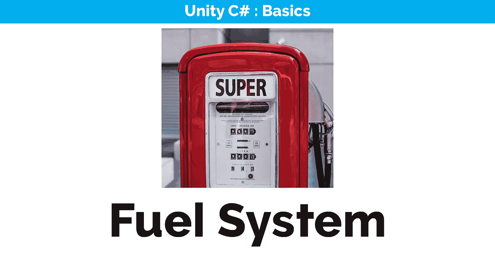
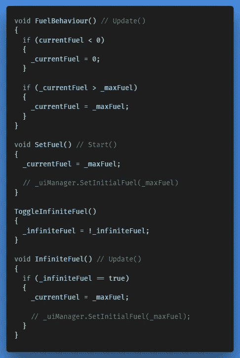
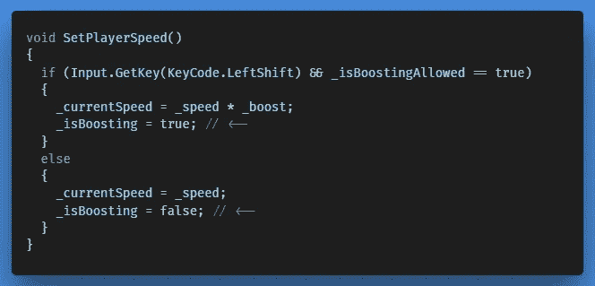
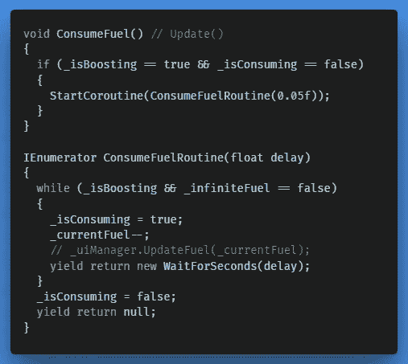
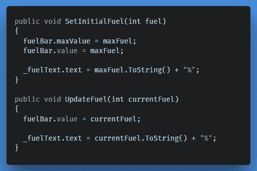
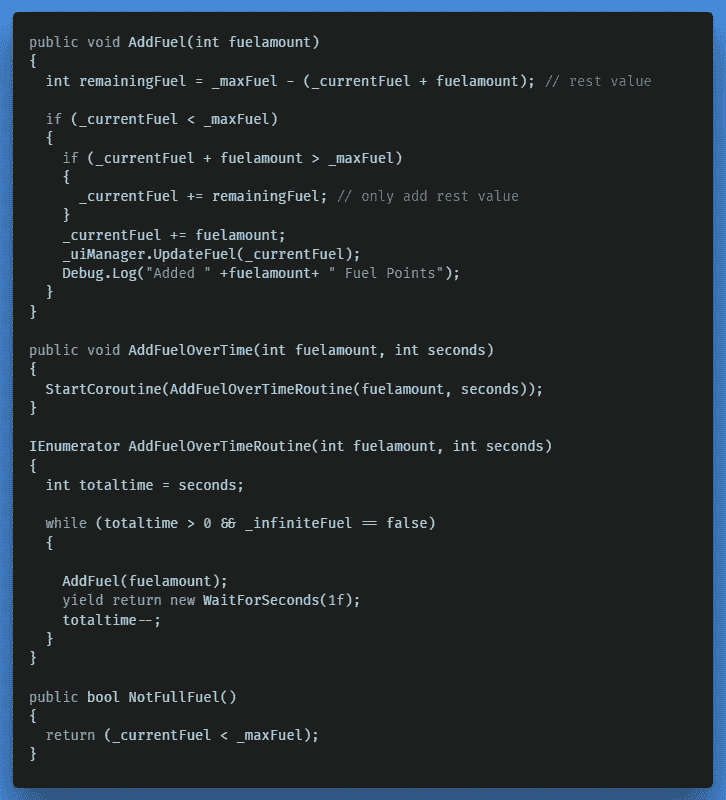

# 引入燃油系统

> 原文：<https://medium.com/nerd-for-tech/introducing-a-fuel-system-cef229d1bcfd?source=collection_archive---------3----------------------->

## 游戏功能

福尔科·马西在 [Unsplash](https://unsplash.com/s/photos/fuel?utm_source=unsplash&utm_medium=referral&utm_content=creditCopyText) 上的照片

在今天的文章中，我们将提高玩家的速度。我们将实现一个燃料机制，只有当玩家有足够的燃料时才允许增压，此外，只要玩家增压，燃料就会被消耗。我们也将视觉上表现玩家的增强，并为它制作新的增强。

## 燃油系统

类似于我们如何创建健康和护盾行为，我们必须在 *Player.cs* 中创建一些新方法:

## 消耗燃料

为了减少升压过程中的燃料消耗，我们可以使用 while 循环实现一个协程。首先，在我们当前的 *SetPlayerSpeed()* 方法中，我们检查我们是否在加速。

然后我们可以创建一个协程，由 *Update()* 中的 *ConsumeFuel()* 初始化:

人们可能会想:为什么不将 *ConsumeFuel()* 绑定到一个键码？嗯，我们可以这样做，它会运行得很好，除了后来，当我们要添加燃料动力时，我们会遇到一个问题:在拿起燃料动力之前按住键会导致一个持久的提升，直到玩家松开那个键。
如果我们要使用*输入。GetKeyDown* (按下键时)它会正常工作，但如果我们在按住该键期间添加燃料，协程将不会重新激活，因为我们在添加燃料之前只启动了一次。这将导致只要钥匙被按住，就能一直推进，因为没有燃料被消耗。使用*输入。GetKey* (按键按下期间)也不是一个选项，因为它会在每一个帧中运行 *Update()* 协程，这不是我们想要的。因此，我们必须使用一个外部变量，独立于一个键绑定。可选地，我们可以使用*输入。协程本身内部的 GetKey* 。

## 添加燃料棒

现在我们可以为它创建一个新的 UI 元素，这次我还添加了一个文本引用来显示燃油量，单位为%。目前这是好的，因为我们的最大。燃料是 100，每当我们选择调整，我们可以回来，数学上更新函数。

这一次我没有使用水平条，而是使用了一个圆形背景图像和一个类似的重叠图像，其图像类型设置为 Filled，使用 Fill 方法；径向 360 度。

## 燃料动力不间断电源

现在我们可以添加燃料动力 Ups 的逻辑:

注意这次当我们添加燃料时，我们做的有点不同。举例来说，玩家有 97 个燃料，我们得到一个燃料能力，加上 5 个燃料，我们得到 102 个燃料。在 *FuelBehaviour()* 中，当当前值超过最大值时，我们确实会将其设置回最大值，但我们还有另一种方法可以防止这种情况。在我们添加一些燃料量之前，我们检查它是否超过最大值。燃油并计算剩余燃油。如果更多，那么把剩余的燃料加到(从)燃料量中，然后我们再把它加到当前的燃料中。

我们现在要做的是修改加电枚举，更新负责激活不同加电行为的开关方法，并创建三个我们可以添加的新预置。如果你一直在关注这篇文章，那么你很有可能已经熟悉如何让它有一个好的结局。

在下一篇文章中，我们将会看到当小行星或敌人被摧毁时，如何将我们在小行星或敌人身上投放的各种物品随机化。之后我们将为玩家引入一种新的武器。

← [上一张](https://gert-coppens.medium.com/adding-the-player-shield-f56b7fea039b) | [下一张](https://gert-coppens.medium.com/randomising-item-drops-9c5c32c08327) →