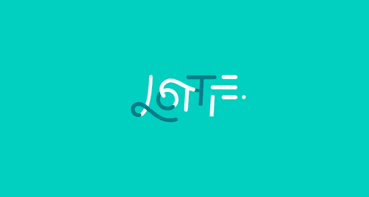

# SwiftUI 动画简介

> 原文：<https://medium.com/nerd-for-tech/introducing-lottie-animations-to-swiftui-7f298e324c23?source=collection_archive---------11----------------------->

如何让 Lottie 动画在 SwiftUI 中很好的播放…之类的。



动画是每个应用程序用户体验的一部分。 [Zcash ECC 钱包](https://github.com/zcash/zcash-ios-wallet)也不例外。不要误会，SwiftUI 是一个非常强大的制作动画的工具。但是让我们面对现实吧，如果你不是一个专家，你最好使用那些为你做所有繁重工作的工具。

# 第一步:谷歌搜索…

我在 2020 年初没有得到太多，老实说，在发表这篇文章之前也没有得到太多。这里有一些基本的方法，我从这篇文章中的[开始。但这有很多问题。](/swlh/how-to-use-lottie-animations-in-swiftui-caaf19944d96)

[https://gist . githubusercontent . com/Spencer feng/a 59106419 f 0593560 EDF 88 fc 39 b 7662/raw/3233 d0b 1 e 46 c 939648 b 17379 a 164290543903 DCA/loti view . swift](https://gist.githubusercontent.com/spencerfeng/a59106419f0593560dedf88fc39b7662/raw/3233d0b1e46c939648b17379a164290543903dca/LottieView.swift)

首先，你不会得到比“播放一次”动画更多的东西。此外，任何更新都会被忽略。那很可能不是作者的错。最初的 SwiftUI 文档基本上描述了这种代码。

# 第二步:了解 UIRepresentable 是如何工作的

也许你正在谷歌搜索摆脱一些紧急情况，你到了这里。但是让我告诉你，如果你能抽出几分钟的时间，阅读这篇来自瓦迪姆·布拉文的非常好的文章，它会给你所需要的知识来理解正在发生的事情，甚至改进我将要描述的代码。

UIViewRepresentable 是一种告诉 SwiftUI 视图结构必须管理 UIKit 视图的方式。您应该知道，视图结构一直被 SwiftUI 渲染引擎重新创建和刷新，出于很好的原因，您不应该知道、假设甚至关心用于在屏幕上表示视图的具体实现是什么。

这与 UIKit 视图的情况不同。你确实关心这些。这就是为什么 UIViewRepresentable 让你在 *makeUIView* 和 *updateUIView* 函数上定义你的 UIView。

```
**func** makeUIView(context: UIViewRepresentableContext<LottieAnimation>) -> AnimationView {
  // your instantiation code
}**func** updateUIView(**_** uiView: AnimationView, context: UIViewRepresentableContext<LottieAnimation>) { 
//leaving this empty is probably a bad idea.
}
```

你真正想做的是告诉 SwiftUI 如何让 UIKit Lottie 动画视图有家的感觉。为此，有一个协调器关联类型，UIRepresentable 使用它来委托主机/主人角色，以使内容在视图结构和 UIView 子类之间流动。

```
**func** makeCoordinator() -> Coordinator {
    Coordinator(parent: **self**)
}
```

# 第三步:粘合代码

我们要做的，是制作一个可再现的视图结构，称为 LottieAnimation，它将带来 Lottie UIView，并将其与可再现的期望进行混合和匹配，这样我们就可以做这些事情:
-在循环中播放动画
-播放动画的一部分
-通过动画进行播放

```
**enum** AnimationType {**case** progress(progress: Float)**case** frameProgress(startFrame: Float, endFrame: Float, progress: Float, loop: Bool)**case** circularLoop}
```

在我的例子中，我有一个单一的动画文件，其中有许多部分，我可能想循环或前进通过。因此，我将创建一个暂停，并恢复洛蒂的动画

```
**func** makeUIView(context: UIViewRepresentableContext<LottieAnimation>) -> AnimationView {**let** animationView = AnimationView()**let** animation = Lottie.Animation.named(filename)animationView.backgroundBehavior = .pauseAndRestoreanimationView.animation = animationanimationView.contentMode = .scaleAspectFit**return** animationView}
```

为了更流畅的动画，我需要得到最后一步的进度。所以我的协调员会知道的

```
class Coordinator: NSObject {
        var lastProgress: Float
        var parent: LottieAnimation

        init(parent: LottieAnimation) {
            self.parent = parent

            if case AnimationType.frameProgress(let startFrame,_,_,_) = self.parent.animationType {
                self.lastProgress = startFrame
            } else {
                self.lastProgress = 0
            }
        }
    }
```

然后 updateUIView 将完成剩下的工作。这段代码很奇怪，**还好它是**，因为它是 UIKit 的命令海洋与 SwiftUI 的声明河流相遇的地方

```
func updateUIView(_ uiView: AnimationView, context: UIViewRepresentableContext<LottieAnimation>) {
        guard isPlaying else {
            uiView.stop()
            return
        }

        switch self.animationType {

        case .circularLoop:
            if !uiView.isAnimationPlaying {
                uiView.play(fromProgress: 0, toProgress: 1, loopMode: .loop, completion: nil)
            }
        case .progress(let progress):
            uiView.currentProgress = AnimationProgressTime(progress)
            if !uiView.isAnimationPlaying {
                uiView.play(fromProgress: 0, toProgress: 1, loopMode: .loop, completion: nil)
            }
        case .frameProgress(let startFrame, let endFrame, let progress, let loop):
            let progressTimeFrame = AnimationFrameTime(startFrame + (progress * (endFrame - startFrame)))uiView.play(fromFrame: context.coordinator.lastProgress, toFrame: progressTimeFrame, loopMode: loop ? .loop : .none, completion: nil)
            context.coordinator.lastProgress = progress
        }
    }
```

要查看完整的代码，请点击项目上的[链接](https://github.com/zcash/zcash-ios-wallet/blob/0.3.7-112/wallet/wallet/Components/LottieAnimation.swift)

# 最后一件事:使用 LottieAnimation 视图

现在我们实际上可以利用它了，就像我用我的应用程序的同步按钮一样！

```
struct SyncingButton<Content: View>: View {

    var label: Content
    var animationType: LottieAnimation.AnimationType
    init(animationType: LottieAnimation.AnimationType, [@ViewBuilder](http://twitter.com/ViewBuilder) content: () -> Content) {
        self.label = content()
        self.animationType = animationType
    }

    var body: some View {
        ZStack {
            LottieAnimation(isPlaying: true, filename: "lottie_button_loading_new", animationType: self.animationType)
            label
        }
    }
}
```

我的 SyncingButton 视图只是创建了一个 ZStack 层，这样我就可以用父视图想要传达的状态来覆盖文本。像这样

```
case .downloading(let progress):
            SyncingButton(animationType: .frameProgress(startFrame: 0, endFrame: 100, progress: 1.0, loop: true)) {
                Text("Downloading \(Int(progress.progress * 100))%")
                    .foregroundColor(.white)
            }
```

如果你正在寻找一个使用 SwiftUI 的开源项目，不要这个美妙的 SwiftUI 项目[https://github.com/zcash/zcash-ios-wallet](https://github.com/zcash/zcash-ios-wallet)

感谢阅读！