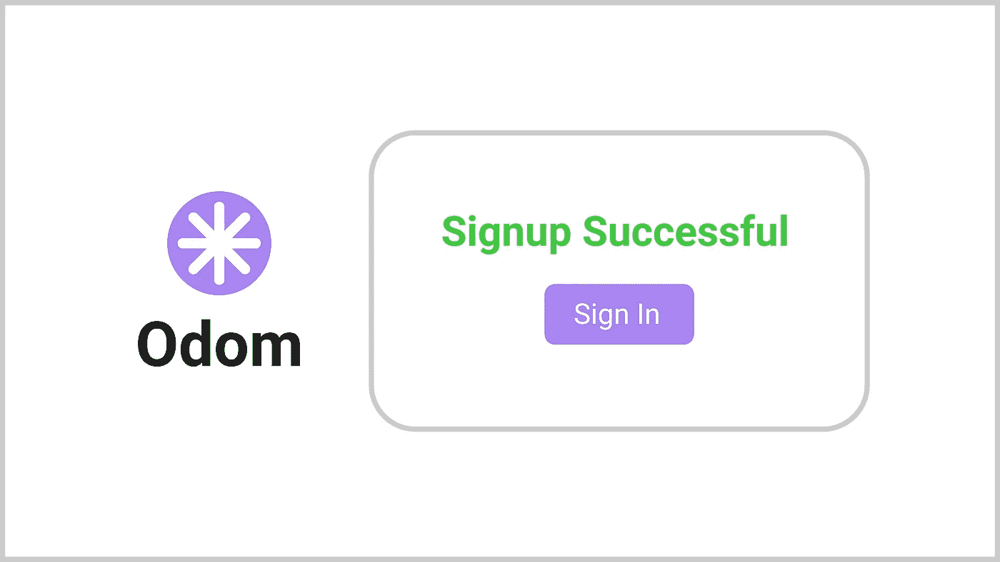
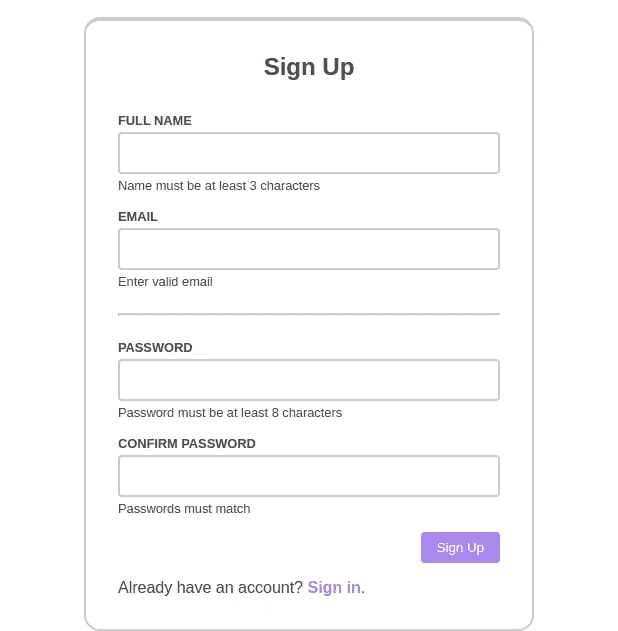

# 介绍 Odom:创建一个反应式注册页面

> 原文：<https://medium.com/nerd-for-tech/introducing-odom-creating-a-reactive-signup-page-6dc95c81224?source=collection_archive---------17----------------------->



由[米谢克·姆瓦尔](https://mishieckmwale.medium.com/)设计。

# 介绍

在开发注册页面时，有几件事情需要考虑。在设计符号方面，用户必须容易地弄清楚在每个字段中输入什么信息。如果信息必须采用特定的格式，最好给用户一个提示，告诉他们应该怎么做。在表单处理方面，验证确保表单不会被发送到服务器，其中包含无效信息。在输入或提交时，可以通知用户信息的有效性。当报告错误时，错误越具体，用户就能越早发现问题所在。

实现这一切需要做大量的工作。我们可以通过使用[奥多姆](https://github.com/riu-web/odom)让实施过程变得更容易。Odom 是一个用于构建用户界面的 JavaScript 框架。这是系列[介绍奥多姆](/nerd-for-tech/introducing-odom-the-open-ui-framework-ed29572a46bb)的第二部分。在第一集中，[开放的 UI 框架](/nerd-for-tech/introducing-odom-the-open-ui-framework-ed29572a46bb)，看了一下奥多姆的基本特性。在这一集里，我们将通过创建一个单页应用程序(SPA)来看看奥多姆是如何工作的。该应用程序将包含一个注册部分。注册部分将包含一个注册表单。下图显示了应用程序的快照(在宽屏上)。



应用程序的快照。被[米谢克·姆瓦尔](https://mishieckmwale.medium.com/)抓获。

我们将关注以下主题:

*   [标记](https://github.com/riu-web/odom/blob/master/docs/api/create-component/create-component.md#markup)
*   [款式](https://github.com/riu-web/odom/blob/master/docs/api/create-component/create-component.md#styles)
*   [事件](https://github.com/riu-web/odom/blob/master/docs/api/create-component/create-component.md#eventlisteners)
*   [动态数据](https://github.com/riu-web/odom/blob/master/docs/data.md#data-binding)

该应用的回购发布在 [GitHub](https://github.com/Mishieck/introducing-odom/tree/creating-a-reactive-signup-page) 上。现场演示发布在 [Netlify](https://festive-tereshkova-7b87cb.netlify.app/) 上。如果你愿意，你可以克隆或下载回购。然而，在这篇文章中，我将包括所有的代码，并给出如何构建这个项目的说明。

# 文件结构

我们将为应用程序使用以下文件结构:

```
.
└── odom-signup/
    ├── src/
    │   ├── assets/
    │   │   └── index.css
    │   ├── components/
    │   │   ├── alert-message.js
    │   │   ├── app.js
    │   │   ├── confirmation-message.js
    │   │   ├── form.js
    │   │   ├── input-group.js
    │   │   └── signup.js
    │   └── index.js
    └── index.html
```

使用空文件创建如上所示的文件系统。我们稍后将填充所有文件。

# 创建组件

为了简单起见，我们将使用一个 [CDN](https://github.com/riu-web/odom/blob/master/docs/quick-start.md#cdn) 来创建应用程序。析构将用于从`window`对象`window.odom`中获取方法。如果你更愿意和像 NPM 这样的包管理人员一起工作，这将使你很容易转换项目。下面的代码演示了如何用 import 语句替换析构赋值。

我们将把`/odom-signup/src/components`模块中的所有导出称为组件，因为它们是自包含的实体。然而，一些模块将导出返回 DOM 节点的函数，而不是 Odom 提供的组件[的实例。这样做的原因在第一集](https://github.com/riu-web/odom/blob/master/docs/api/component/component.md)中给出。

我将把一些模块分成多个代码片段，以使代码更具可读性。

## 应用

我们应用程序的根组件将是 **App** 。这是我们将要呈现给 DOM 的组件。我们将在`/odom-signup/src/components/app.js`在模块中创建组件。将以下代码粘贴到文件中:

在模块中，导入组件注册。方法`createComponent`是从`odom`中获得的。`markup`包含两个要素。根元素是一个`div`，内部元素的属性`odom-node`被设置为`Signup`，这是指我们已经导入的组件。用下面的 CSS 代码替换变量`styles`的模板文本中的注释(`/* styles */`):

选择器`:scope`选择组件的根元素。在`:scope`中，我们声明了颜色主题和间隔的 CSS 变量(用于边距、填充等等)。CSS 的其余部分设置组件的宽度、最小高度、字体系列和文本颜色。

让我们看看模块中的每一个功能是做什么的。

*   `App`:组件的[构造器](https://github.com/riu-web/odom/blob/master/docs/assets.md#constructor)。在 Odom 中，构造函数是一个返回组件、dom 节点、标记或文本实例的函数。调用时，`App`会返回`[Component](https://github.com/riu-web/odom/blob/master/docs/api/component/component.md)`的一个实例，也是`[createComponent](https://github.com/riu-web/odom/blob/master/docs/api/create-component/create-component.md)`的返回值。构造函数的名字不一定要大写。我们将以此为惯例。我们还将以小写字母开始组件实例的名称。您不能像使用 JavaScript 本地构造函数那样使用`new`关键字来调用 Odom 构造函数。
*   `createComponent`:创建组件。参数是一个具有三个属性的对象。`markup`将用于为组件创建 DOM 元素。`styles`将被用来设计组件的样式。对象`utils`有一个属性`nodes`，用于提供节点资产。因此，标记中属性`odom-node`的值`Signup`指的是`utils.nodes.Signup`。

## 注册

报名是 **App** 的唯一板块。它将处理表单提交和提交失败或成功的报告。将以下代码放入模块中的`/odom-signup/src/components/signup.js`:

在该模块中，我们导入组件表单和确认消息。我们还从`odom`中得到方法`createComponent`和`[replaceNode](https://github.com/riu-web/odom/blob/master/docs/api/replace-node.md)`。`markup`中属性`odom-src`的值`form`引用了`Form`的一个实例。值`form`没有大写，因为它引用了一个组件的实例，而不是组件本身。`styles`中的媒体查询在宽度至少为`576px`的窗口上的组件顶部设置一个填充。注意，我们使用了在**应用**中声明的变量`--spacer-xl`。Odom 中的所有组件都继承了祖先的风格。

让我们看看模块中每个功能的作用:

*   `Signup`:节点的构造器。在函数内部，我们创建一个组件，使用它并返回一个 DOM 节点`signup.scope`。我们返回一个节点而不是一个组件，因为不再需要组件接口了。
*   `onvalid`:如果所有输入都有效，则发送表单。如果表单已成功发送，它会显示一条确认消息。方法`replaceNode`用于将表单替换为`confirmationMessage`。如果表格发送失败，调用`form.onSignupFail`通知用户由于错误，他们没有注册。
*   `createComponent`:用于创建组件。参数的属性`components`提供了标记中引用的组件资产。
*   `sendForm`:发送表单到服务器。该函数模拟发送到服务器的过程。它会提前返回一个解析为响应对象模型的承诺。删除 return 语句会留下一些代码，您可以使用这些代码将表单发送到实际的服务器。

注意，我们将`onvalid`作为道具传递给了`Form`。在下一节中，我们将看到`onvalid`是如何在`Form`中使用的。

## 形式

**表单**发起表单提交。它还报告来自输入验证和表单提交的错误。将以下代码放入`/odom-signup/src/components/form.js`的模块中:

在该模块中，我们正在导入组件`AlertMessage`和`InputGroup`。用以下 HTML 代码替换`markup`值中的注释:

`section`元素中属性`odom-src`的值指的是组件的实例。

用以下 CSS 代码替换样式值中的注释:

选择器`> *:not(footer)`相当于`:scope > *:not(footer)`。媒体查询在至少`576px`宽的窗口上的组件上设置边框和固定宽度。

用以下代码替换`props`的空对象:

对象`props`包含所有`InputGroup`实例的道具。以下是每个实例的每个属性的用途:

*   `type`:输入元素的类型。
*   `name`:通过属性`name`设置的输入元素的名称。
*   `label`:每个输入组标签的文本内容。
*   `pattern`:用于验证输入值的模式。
*   `instruction`:用户期望信息格式的说明。
*   `errorMessage`:输入无效时显示的信息。
*   `successMessage`:输入有效时显示的信息。

让我们看看模块中使用的函数的用途:

*   `Form`:组件的构造器。
*   `onsubmit`:事件`submit`的监听器。它检查所有输入是否有效。如果输入有效，它通过调用**注册**的道具`onvalid`启动发送过程。它还禁用了 submit 按钮，这样用户就不会在发送过程中点击它。它从用于确认密码的元素中删除了属性`name`，这样元素的值就不会随表单一起发送到服务器。如果任何输入无效，它会通过调用`onerror`显示一条错误消息。
*   `onerror`:调用`alertMessage.show`显示错误信息。
*   `onSignupFail`:如果注册失败，显示错误信息。它还启用了提交按钮，使用户能够重试。
*   `password.addObserver`:用于在`InputGroup`组件中添加一个输入值变化的观察器。由于`password`是`InputGroup`的一个实例，该方法用于观察密码的变化。注意`confirmPassword`的`pattern`(在`props`中)与`password`的相同。我们希望用户通过重新输入密码来确认他们的密码。观察器用于更新`confirmPassword`的模式，使其与密码相匹配。它还将`confirmPassword`的有效性设置为假，以防止用户在输入确认密码后编辑密码时提交无效的确认密码。
*   `createComponent`:用于创建组件。属性`props`指定了组件的属性。以这种方式指定的属性可以在标记中引用，并最终出现在组件的接口上。在这种情况下，**注册**通过接口使用`onSignupFail`方法。参数的属性`eventListeners`将 CSS 选择器`:scope`映射到一个包含事件对象的数组。选择器用于选择我们想要应用事件侦听器的元素，在本例中是组件的根元素。该数组可以包含任意数量的事件对象。属性`type`指定了我们想要收听的事件类型。属性`listener`指定了事件的监听器。

## 警报消息

组件**报警信息**处理**表格**中错误信息的显示。将以下代码放入`/odom-signup/src/components/alert-message.js`处的模块:

`markup`包含一个根元素及其唯一的子元素。默认情况下，设置类别`hide`是为了隐藏警告消息。`styles`中的选择器`:scope.hide`选择根元素，当它有类`hide`时。这些功能有以下目的:

*   `AlertMessage`:组件的构造器。
*   `show`:显示警告信息。
*   `createComponent`:创建组件。参数中的属性`props`用于将`show`添加到组件接口中。

## 输入组

InputGroup 获取用户输入并执行验证。将以下代码放入模块中的`/odom-signup/src/components/input-group.js`:

`markup`包含一个`section`作为根元素。`label`表示用户应该输入什么。值`@props.inputID`指的是`createComponent`参数的属性`props`中设置的值(后面会详细介绍)。`label`内`span`的属性`odom-text`表示该元素将被文本替换。注意在`input`元素上没有属性。我们稍后将设置这些属性。这是因为输入元素有几个属性，直接在`markup`中设置它们会使`markup`难以阅读。

用以下 CSS 代码替换`styles`值中的注释:

让我们看看模块中每个功能的作用:

*   `InputGroup`:组件的构造器。
*   `updateValue`:用于更新组件中输入的值。每当用户更改输入字段中的值时，该值都会更新。
*   `updateValidity`:更新输入的有效性。每次用户更改输入时都会执行更新。
*   `updateMessage`:更新验证信息。如果输入无效，信息将显示为绿色。否则，该消息将被染成红色。
*   `hasValidValue`:检查输入是否有效。它还通过调用`updateInputBorder`触发边框颜色更新。
*   `updateInputBorder`:更新输入字段的边框。如果输入无效，边框会变成红色。否则，它将被染成灰色，这是默认颜色。
*   `props.addObserver`:为输入值添加一个观察者。每次值发生变化时，都会用新值调用观察器。
*   `props.setValidity`:设置输入值的有效性。这用在组件的接口上。
*   `createComponent`:创建组件。这些函数以`options`为参数。

参数`options`的属性`props`用于设置界面上的属性，并提供可以在`markup`中引用的值。在标记中，值`@props.inputID`是指`props.inputID`。属性`attributes`用于设置输入元素的属性。CSS 选择器`input`选择输入字段。设置为`input`的对象包含输入元素的属性名和值的键-值对。

属性`utils.data`包含可以在标记中引用的数据。属性`utils.data.dynamic`包含在应用程序执行期间可能改变的数据。数据可以绑定到 DOM，这样对 DOM 的更改就会反映在组件数据中，反之亦然。所以，值`::@data.value`指的是`utils.data.dynamic.value.data`。两个冒号表示 DOM 更新和组件数据之间有双重绑定。数组`utils.data.dynamic.value.updaters`指定了响应更新的函数。属性`utils.data.dynamic.valid`遵循相同的模式，但是没有 DOM 绑定。

属性`utils.texts`指定了属性`odom-text`在`markup`中引用的文本资产。

在`data`中指定的所有动态数据都在`inputGroup.dynamicData`中结束。要更新像`data.dynamic.valid.data`这样的值，可以直接在`inputGroup.dynamicData`上设置值。例如，`setValidity`使用指令`inputGroup.dynamicData.valid = valid`直接设置数值。这样做会调用`updateValidity`。函数`updateValidity`获取新值作为参数，并在更新消息后返回一个`Boolean`值。注意方法`updateValue`将`inputGroup.dynamicData.valid`设置为它的参数`value`，这是一个字符串。函数`updateValidity`截取该值，检查它是否有效，并返回一个布尔值。如果该值不是一个字符串，则假定它是一个`Boolean`，因此它被不加修改地返回。返回值是`inputGroup.dynamicData.valid`将被设置的值。

## 确认消息

成功注册的确认将通过**确认消息**完成。将以下代码放入模块中的`/odom-signup/src/components/confirmation-message.js`:

用以下代码替换`styles`值中的注释:

媒体查询在宽度至少为`576px`的窗口上设置组件边框。函数`ConfirmationMessage`是构造函数。它返回一个解析为 DOM 节点的承诺。

# 翻译

在这一节中，我们将把组件 **App** 呈现给 DOM。将以下代码放入模块中的`/odom-signup/src/index.js`。

在该模块中， **App** 被导入。在生命周期中，组件的一个实例(`app`)被创建。方法`app.render`将组件呈现给 DOM。该方法的参数是一个元素的 CSS 选择器，该元素将被 DOM 中的 **App** 替换。

在文件`/odom-signup/index.html`中，放入以下代码:

`head`元素中的`link`元素为页面添加样式。在文件`/odom-signup/assets/index.css`中，放入以下 CSS 代码:

这些样式用于重置一些默认样式。所有元件的`box-sizing`值被重置为`border-box`。`body`元件的`margin`和`padding`被重置为`0`。

元素`div#app`是将要被组件 App 替换的内容。第一个`script`元素包括通过 CDN 到页面的 Odom。第二个`script`元素将我们之前创建的主 JavaScript 文件添加到页面中。

保存文件。确保所有创建的文件都已保存。在浏览器中打开 HTML 文件(`/odom-signup/index.html`)。您应该能够看到带有表单的页面。如果任何事情看起来不对劲，你可以检查你是否没有正确地遵循任何步骤，或者你可以使用回购中的文件。

在所有字段中输入有效值，然后提交表单。您应该能够看到确认消息。刷新页面，在任何字段中输入无效值，然后提交表单。您应该能够在表单标题下方看到一条错误消息。刷新页面并提交表单，无需在任何字段中输入任何值。您应该能够看到像以前一样显示的错误消息。

# 最佳化

## 风格

如果您使用浏览器中的开发工具检查页面元素，您应该在`head`元素中看到 8 个`style`元素。`style`元素用于 **App** 、**签约**、**表单**、 **Alert** 和 **InputGroup** (4)的组件。输入组的所有 4 个实例使用相同的样式。这使得 3 个`style`元素变得多余。我们可以通过告诉 Odom,**input group**的 4 个实例来自同一个组件来消除冗余。我们可以通过在输入组的**上设置一个 ID 来实现。在**输入组** ( `/odom-signup/src/components/input-group.js`)的模块中，将属性`options.id`设置为`odom-"input-group"`或任何您喜欢的`String`值。下面的代码说明了如何做到这一点。**

保存文件，刷新页面并再次检查元素。这次您应该只看到 5 个`style`元素。奥多姆能够通过在第一个实例之后不处理和添加样式来防止冗余。所有实例都使用相同的样式。

## DOM 节点嵌套

在 Odom 中，尽可能避免 dom 节点的嵌套对于优化非常重要。给定组件的所有子组件都是一次生成的。这意味着构建所有子组件所花费的时间大约等于构建花费最长时间构建的组件所花费的时间。

让我们假设构建 **AlertMessage** 需要 100 毫秒，构建 **InputGroup** 需要 200 毫秒。构建表单的**的所有子组件大约需要 200 毫秒。如果我们决定将所有的 **InputGroup** 元素放入一个类似于`section`元素的元素中，那么将首先构建 **InputGroup** 实例。之后将构建 **AlertMessage** 实例。这意味着构建所有组件所需的时间大约等于 300 毫秒(100 + 200)。我们已经通过使所有组件都是表单**的根元素的直接后代来执行这种优化。

# 结论

无论是添加 OAuth、将注册过程分成多个步骤还是其他什么，我想看看你如何定制应用程序。如果你有时间，请在评论区分享你的项目和经验。感谢您的阅读。