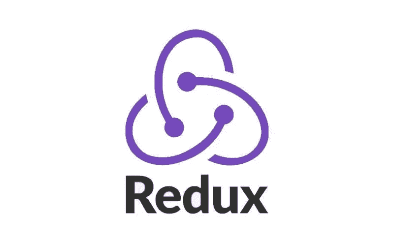

# Redux 工具包简介

> 原文：<https://medium.com/nerd-for-tech/introduction-of-redux-toolkit-c96b404ffdd3?source=collection_archive---------2----------------------->



# 介绍

Redux Toolkit 是一个教条的、包含序列的工具集，用于组织良好的 Redux 开发。Redux 为处理全局反应状态开发了一个有价值的资产。它旨在解决 Redux 的三个常见问题:

*   配置 Redux 商店也很复杂。
*   添加许多包来获取 Redux 做任何有用的事情。
*   Redux 需要太多样板代码。

在这篇文章中，我们将了解为什么 Redux Toolkit 在 React 社区中受到更多关注。

# 描述

[React 和 Redux 被认为是在广泛的 React 应用程序中管理状态的最佳安排。](https://www.technologiesinindustry4.com/2021/11/iot-sensors-in-plant-maintenance.html)丹·阿布拉莫夫是 Redux 的创作者。他在自己发表的文章中指出，人们只有在需要的时候才使用 Redux。在开发难度较低的应用程序时，也要遵循其他方法。

Redux 工具包提供了一些配置全局存储的选项。它通过尽可能多地提取 Redux API 来更有效地创建动作和缩减器。

# Redux 工具包包含

*   这源于一些有用的软件包，如 Immer、Redux-Thunk 和 Reselect。
*   这让 React 开发人员的生活变得轻松，因为他们可以直接改变状态。
*   [它应用了像 Thunk 这样的中间件来处理异步操作。](http://technologiesinindustry4)
*   类似地，它使用 Reselect——Redux 的一个简单选择器库——来制作更简单的 reducer 函数。

# Redux 工具包 API 函数

我们可以使用下面的 API 来简化 Redux 中的样板代码。特别是使用 create action 和 create reduced 方法。另一方面，这可以使用 createSlice 进一步简化，create slice 可以自动生成动作创建者和缩减者功能。

**配置存储:**

[它创建了一个 Redux store 实例，类似于 Redux 中的原始 createStore。但是，它接受一个命名的 options 对象，并自动设置 Redux DevTools 扩展。](https://www.technologiesinindustry4.com/)

**创建动作:**

它有一个动作类型字符串，并返回一个使用该类型的动作创建函数。

**createReducer:**

[它有一个早期状态值和一个动作类型查找表，用于缩减器功能。它制造了一个处理所有动作类型的减速器。](https://www.technologiesinindustry4.com/)

**创建切片:**

它接受一个原始状态和一个带有缩减器名称和功能的查找表。它自动创建动作创建器函数、动作类型字符串和缩减器函数。

# 还原器和动作出现在传统的 React-Redux 应用程序中

**动作**

```
import {**GET_USERS,CREATE_USER,DELETE_USER**} from "../constant/constants";export const GetUsers = (data) => (dispatch) => {
 dispatch({
  type: **GET_USERS**,
  payload: data,
 });
};export const CreateUser = (data) => (dispatch) => {
 dispatch({
  type: **CREATE_USER**,
  payload: data,
 });
};export const DeleteUser = (data) => (dispatch) => {
 dispatch({
  type: **DELETE_USER**,
  payload: data,
 });
};
```

# 还原剂

```
import {**GET_USERS,CREATE_USER,DELETE_USER**} from "../constant/constants";const initialState = {
 errorMessage: "",
 loading: false,
 users:[]
};const UserReducer = (state = initialState, { payload }) => {
**switch (type) {**
 case **GET_USERS**:
  return { ...state, users: payload, loading: false };
**case** **CREATE_USER**:
  return { ...state, users: [payload,...state.users],
 loading: false };
**case** **DELETE_USER**:
  return { ...state, 
  users: state.users.filter((user) => user.id !== payload**.**id**),** , loading: false };
**default**:
  return state;
 }
};export default **UserReducer**;
```

**使用 createSlice 简化相同的功能。**

```
import { createSlice } from '@reduxjs/toolkit';export const initialState = {
  users: [],
  loading: false,
  error: false,
};const userSlice = createSlice({
  name: 'user',
  initialState,
  **reducers**: {
    getUser: (state, action) => {
      **state.users = action.payload;**
      state.loading = true;
      state.error = false;
    },
    createUser: (state, action) => {
      **state.users.unshift(action.payload);**
      state.loading = false;
    },
    deleteUser: (state, action) => {
      **state.users.filter((user) => user.id !== action.payload.id);**
      state.loading = false;
    },
  },
});export const { createUser, deleteUser, getUser } = userSlice.**actions**;export default userSlice.**reducer**;
```

同时，一个切片制作动作和还原器，我们可以导出它们。在组件和存储中使用它们来配置 Redux，这些 Redux 没有用于操作和 reducers 的不同文件和目录，如下所示。

```
**import { configureStore } from "@reduxjs/toolkit";**
**import userSlice from "./features/user/userSlice";**export default **configureStore**({
 reducer: {
  user: **userSlice**,
 },
});
```

# 结论

*   [Redux Toolkit 是入门 Redux 的最佳选择。](https://www.technologiesinindustry4.com/)
*   它简化了代码，并通过减少样板代码来支持管理 Redux 状态。
*   和 Redux 一样，Redux Toolkit 并不是只为 React 而造的。
*   我们可以将它与任何其他框架一起使用，例如 Angular。

更多详情请访问我的网站:[工业 4.0 技术——在这个网站上，你可以了解到工业 4.0 物联网(IoT)智能制造的所有新兴技术。云计算。人工智能](https://www.technologiesinindustry4.com/)