# 箭头函数简介

> 原文：<https://medium.com/nerd-for-tech/introduction-to-arrow-functions-3c92d73b7d6c?source=collection_archive---------15----------------------->

# 什么是箭头函数？

箭头函数是用 JavaScript 编写函数的一种简洁的替代方法(在 ES6，modern JavaScript 中引入)。箭头函数可能很简洁，但是有一些限制。

# 将常规函数更改为箭头函数

让我们从一个常规函数开始:

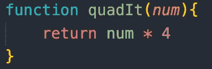

箭头函数不需要' function '关键字，这样可以去掉，并在参数后加上' = > ':

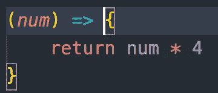

现在这是一个箭头函数，但是不能被调用。我们调用它的方法是给它一个名字:

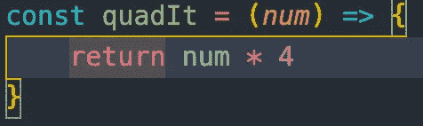

这个箭头函数的工作方式与常规函数相同，但优点是语法会变得简洁。

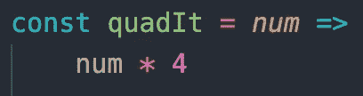

这之所以可能，是因为 JavaScript 不关心“空白”。JS 不需要参数' num '用'()'括起来，对于单参数，单行代码也不需要' {} '，可以写成一行。

对于有两个或更多参数的函数，需要'()'和花括号' {}。在' = > '后面，当有一个开花' { '时，JS 认为这是函数体的' { '。JS 现在希望开发人员显式返回代码，并且不识别对象，除非它们被括在括号内。

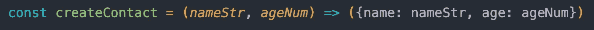

# 其他使用案例

假设我们有一个数字数组，我们想对数组做些什么。我们可以使用箭头函数将代码简化为一行。

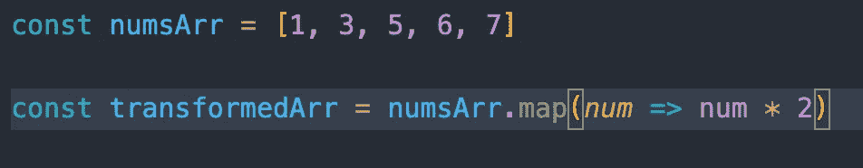

这里的“num”是回调函数，数组中的每个元素都会调用这个函数

下面是 MDN Web Docs 中 map 函数的箭头函数语法。

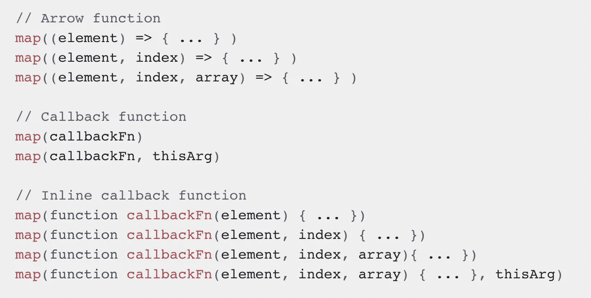

[https://developer . Mozilla . org/en-US/docs/Web/JavaScript/Reference/Global _ Objects/Array/map](https://developer.mozilla.org/en-US/docs/Web/JavaScript/Reference/Global_Objects/Array/map)

再举一个例子，假设我们想使用 filter 方法过滤掉长度大于 4 个字符的歌曲标题。值得注意的是，filter 方法返回一个满足条件的“子数组”,不改变原始数组，回调返回一个布尔值。

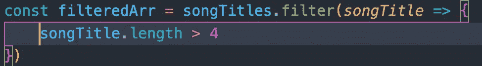

这里我们有一个“songTitles”数组，设置为变量“filteredArr”。我们正在使用。使用回调函数“songTitle”对数组使用“filter”方法。回调函数用于条件为“songTitle.length > 4”的“songTitles”数组中的每个元素。这段代码告诉我们，我们希望获得所有字符长度大于 4 的歌曲标题。然而，由于箭头函数的功能，这段代码可以简化为一行

这也是可能的，因为只有一行代码(songTitle.length > 4)

# 使用箭头函数进行“提取”

作为一名全栈开发者，你应该能够在应用的前端和后端操作数据。在前端(JS)工作时，您可能需要从后端“提取”数据，然后带到前端。对于从后端和前端更改数据的情况，箭头函数是保持代码简洁的关键。

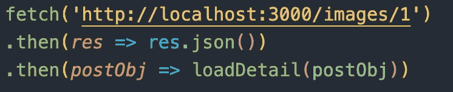

在这个获取示例中，我们从后端获取 url。然后，是。然后让我们代表前端，我们第一次看到一个箭头函数。第一个。then 也可以写成。然后(response => response.json())。第二个。那么()就是前端正在改变的东西。最好在“()”中打开 console.log，以查看您正在处理的内容:。然后(console.log)。在这种情况下，我们有一个名为“postObj”的对象，该对象用作另一个函数“loadDetail”的回调，该函数将此回调作为参数:“loadDetail(postObj)”。现在，无论 loadDetail 函数做什么，都将操作前端，这对于函数的命名来说是不言自明的。

另一个例子是。然后()在 console.log 之后，我们发现我们有了一个数组。comArr 用作回调函数，调用. forEach 函数时使用另一个回调函数或参数 comObj，然后调用一个名为 showComments 的函数，使用 comObj 作为参数。

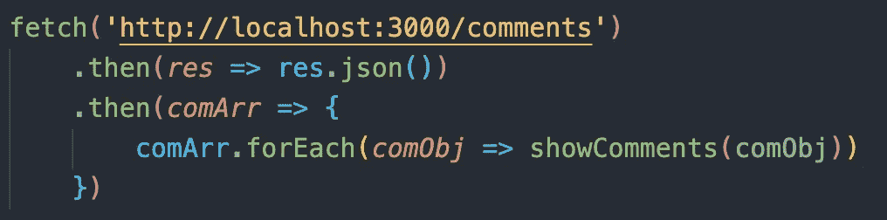

正如本博客中的几个例子所示，箭头函数用于简化和压缩我们的代码，这是开发人员的目标。但是，箭头函数有一些限制。以下是 MDN Web 文档中这些限制的截屏:

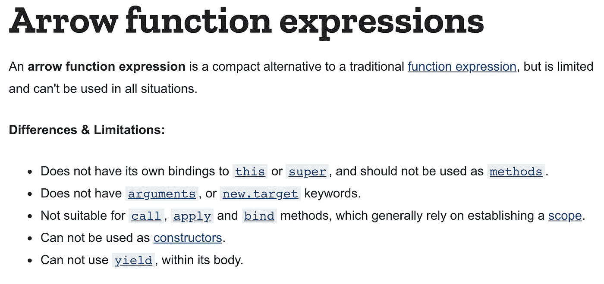

[https://developer . Mozilla . org/en-US/docs/Web/JavaScript/Reference/Functions/Arrow _ Functions](https://developer.mozilla.org/en-US/docs/Web/JavaScript/Reference/Functions/Arrow_functions)

尽管有这些限制，为了简化我们的代码和方便访问，arrow 函数对开发人员来说还是很有用的。这些限制不会在这篇博客中讨论，但是希望这有助于你理解箭头函数是如何工作的。