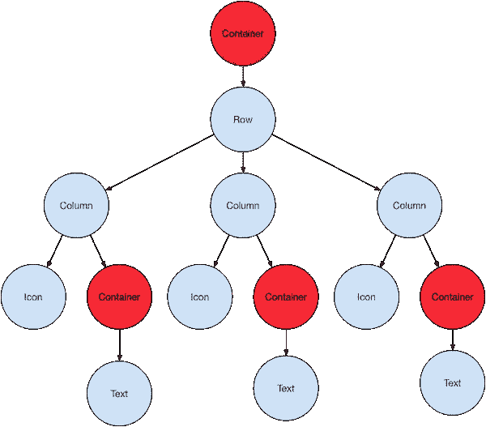
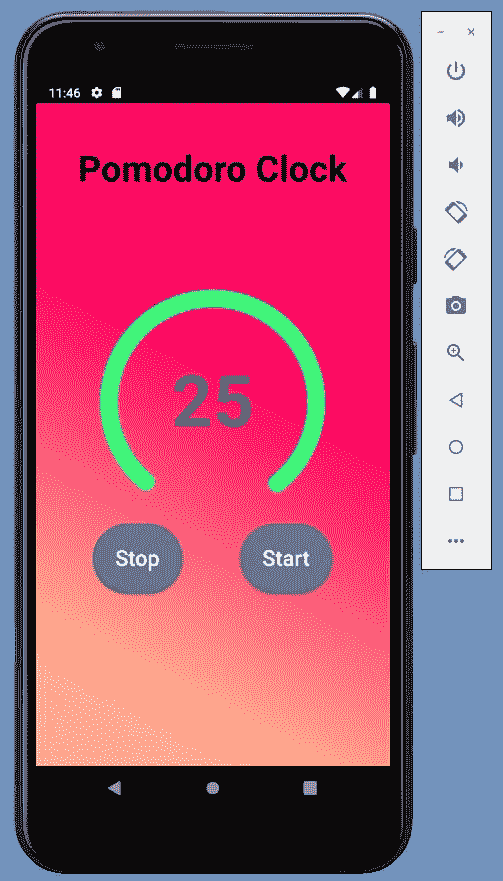

# 使用 Flutter 构建应用程序简介

> 原文：<https://medium.com/nerd-for-tech/introduction-to-building-an-app-with-flutter-fcb24e04868?source=collection_archive---------3----------------------->

## 什么是颤振？

Flutter 是谷歌的 UI 工具包，用于从单个代码库为[移动](https://flutter.dev/docs)、[网络](https://flutter.dev/web)、[桌面](https://flutter.dev/desktop)和[嵌入式](https://flutter.dev/embedded)设备构建漂亮的本地编译应用。

Flutter 非常新，但却是一个有前途的平台，它已经吸引了已经发布应用程序的大公司的注意。它之所以有趣，是因为它比开发 web 应用程序简单，也因为它比本地应用程序快。

Dart 是用来编写 Flutter 应用程序的编程语言。Dart 是谷歌的另一款产品，在 Flutter 之前于 11 月发布了 2.1 版本。刚开始时，扑动群落不像反应型、离子型或 Xamarin 那样广泛。

## 颤振的特征

Flutter framework 为开发人员提供了以下特性

*   现代和反应式框架。
*   使用 Dart 编程语言，非常容易学习。
*   快速发展。
*   漂亮流畅的用户界面。
*   巨大的部件目录。
*   为多个平台运行相同的用户界面。
*   高性能应用。

## 安装和设置

安装用:[https://flutter.dev/docs/get-started/install](https://flutter.dev/docs/get-started/install)

编辑:[https://flutter.dev/docs/get-started/editor](https://flutter.dev/docs/get-started/editor)

首先，必须为 Flutter 找到最好的 IDE(集成开发环境)。有许多 ide 可用于跨平台移动应用程序开发，如 Android Studio、Visual Studio Code、Xcode、IntelliJ、Xamarin。在上面 Android Studio 和 Visual Studio 代码是 Flutter app 开发最常见的 ide。

Visual Studio code 是微软的一个 IDE，用于开发跨平台移动应用程序的计算机程序和网站。从 VS 代码中使用 DevTools 需要 Dart 扩展。你也可以在调试 Flutter 应用的时候添加 Flutter 扩展。在 VS Code 中打开项目的根文件夹(包含 pubspec.yaml 的文件夹),并选择 Run > Start Debugging 为您的应用程序启动一个调试会话。

Dart: Open DevTools 命令出现在 VS 代码命令面板中，直到调试会话处于活动状态并且应用程序已经启动。在 VS 代码中，没有开发项目的选项。在 VS 代码中，只有项目名称和位置是可选的。

在这两个 IDE 中，Android Studio 被认为是 Flutter 的最佳 IDE，因为它在开发人员中很受欢迎。VS 代码也很受欢迎，但是对于一个新人来说，通过使用命令面板和添加扩展来创建应用程序以使应用程序更有吸引力似乎更复杂。

## 一些基本概念

Flutter 布局机制的核心是 widgets。在 Flutter 中，几乎所有东西都是小部件——甚至布局模型也是小部件。你在 Flutter 应用中看到的图像、图标和文本都是小部件。但是您看不到的东西也是小部件，例如排列、约束和对齐可见小部件的行、列和网格。通过组合其他小部件构建的小部件通常使用布局小部件。如果事先你有一个应用程序的草图，比如你想在应用程序中加入的基本布局和功能，那么构建一个应用程序真的很容易，然后你可以将应用程序的功能与 flutter 中存在的所需功能/包相匹配。

颤振建筑

布局小部件可以根据其子部件分为两个不同的类别

*   支持单个孩子的小部件
*   支持多个子组件的小部件

## 一些重要的小部件:

> **布局小部件:**为了将多个小部件组合成一个小部件， *Flutter* 提供了大量具有布局功能的小部件。例如，可以使用*居中*小部件将子小部件居中。一些流行的布局小部件如下
> 
> **-容器**-使用 *BoxDecoration* 小工具装饰的矩形盒子，带有背景、边框和阴影。
> 
> **-居中**-居中其子部件。
> 
> - **行**-在水平方向排列其子行。
> 
> - **列**-在垂直方向排列其子列。
> 
> - **堆叠**-将一个堆叠在另一个之上。
> 
> **状态维护窗口小部件:**在 Flutter 中，所有窗口小部件要么是从 *StatelessWidget* 派生而来，要么是从 *StatefulWidget* 派生而来。
> 
> 从 *StatelessWidget* 派生的 Widget 没有任何状态信息，但它可能包含从 *StatefulWidget* 派生的 Widget。应用程序的动态本质是通过小部件的交互行为和交互过程中的状态变化来实现的。例如，点击计数器按钮会将计数器的内部状态增加/减少 1，而 *Flutter* 微件的反应特性会使用新的状态信息自动重新呈现微件。
> 
> **平台无关/基本小部件:** *Flutter* 提供大量基本小部件，以平台无关的方式创建简单和复杂的用户界面。Flutter 附带了一套功能强大的基本小部件，其中常用的有:
> 
> `[**Text**](https://api.flutter.dev/flutter/widgets/Text-class.html)``Text`小部件允许您在应用程序中创建一系列样式化的文本。`[**Row**](https://api.flutter.dev/flutter/widgets/Row-class.html)` **、** `[**Column**](https://api.flutter.dev/flutter/widgets/Column-class.html)`这些 flex 小部件让您可以在水平(`Row`)和垂直(`Column`)方向上创建灵活的布局。这些对象的设计基于 web 的 flexbox 布局模型。
> 
> `[**Stack**](https://api.flutter.dev/flutter/widgets/Stack-class.html)`一个`Stack`小部件可以让你按照绘制顺序将小部件一个放在另一个上面，而不是线性定向(水平或垂直)。然后，您可以在`Stack`的子对象上使用`[Positioned](https://api.flutter.dev/flutter/widgets/Positioned-class.html)`小部件，将它们相对于堆栈的顶部、右侧、底部或左侧边缘进行定位。堆栈基于 web 的绝对定位布局模型。
> 
> `[**Container**](https://api.flutter.dev/flutter/widgets/Container-class.html):`小部件`Container`允许您创建一个矩形可视元素。容器可以用`[BoxDecoration](https://api.flutter.dev/flutter/painting/BoxDecoration-class.html)`来装饰，比如背景、边框或者阴影。一个`Container`也可以有边距、填充和应用于其大小的约束。此外，可以使用矩阵在三维空间中变换`Container`。

## 项目结构

让我们先看看由 Flutter 框架生成的项目中有什么:

*   **lib/** —就像 [pub](https://www.dartlang.org/guides/libraries/create-library-packages) (Dart 的包管理器)一样，所有的代码都会在这里
*   **pubspec.yml** —存储运行应用程序所需的包列表，就像 **package.json** 做的那样。你应该记住，在 Flutter 项目中，你不能直接使用 pub，而是使用 Flutter 命令:`flutter pub get <package_name>`
*   我相信你知道这是怎么回事。对吗？你可以通过颤振测试来运行它们
*   **IOs/**&**【Android/**—特定于每个平台的代码，包括应用程序图标和设置，您可以在其中设置应用程序所需的权限(如访问位置、蓝牙)。

> 让我们开始用 Flutter 构建一个简单的应用程序

## 我们将建造什么？

嗯，我们将建立一个 Pomodoro 应用程序，具有一些非常简单的功能-开始和停止。它有一个计时器，当你点击开始时，它会运行 25 分钟，25 分钟过后，它会自动重置。您可以在计时器运行时停止/暂停计时器。

您可以从在 main.dart 文件中导入 Flutter 所需的包开始。

在 main()函数内部:

对于我们可以使用任何布局的应用程序，我使用了无状态窗口小部件，因为在它里面，构建函数只被调用一次，这使得屏幕的 UI 很容易使用。

要创建无状态小部件，一般要求是:

1.  新类的名称(在我们的例子中是 Pomodoro)。
2.  从 **StatelessWidget** 扩展类。
3.  实现 **build()** 方法，该方法将接收一个类型为 **BuildContext** 的参数，并返回类型为 **Widget** 的结果。

从 **StatelessWidget :** 扩展 Pomodoro 类

现在下一步是为应用程序创建所需的功能和用户界面。

您可以在 build 函数中自由使用任意数量的小部件来创建您想要的 UI。

用于应用程序的参考用户界面

## 参考

*   对于【https://pub.dev/】的和[的](https://flutter.dev/)应用程序[的](https://pub.dev/)[官方包库](https://dart.dev/)
*   布局小工具:[https://flutter.dev/docs/development/ui/widgets/layout](https://flutter.dev/docs/development/ui/widgets/layout)
*   Pomodoro 应用程序的 GitHub 库:[https://github.com/AmimaShifa/Flutter-APP](https://github.com/AmimaShifa/Flutter-APP)