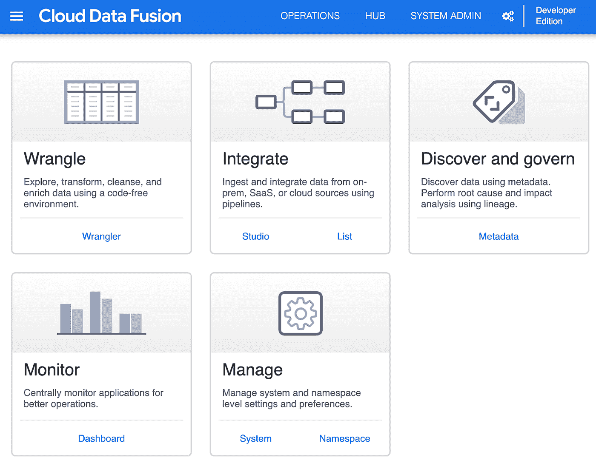
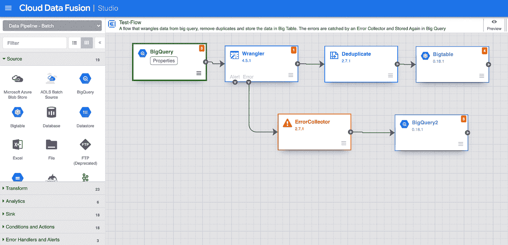
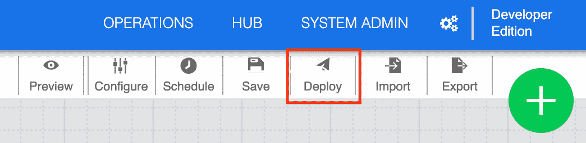
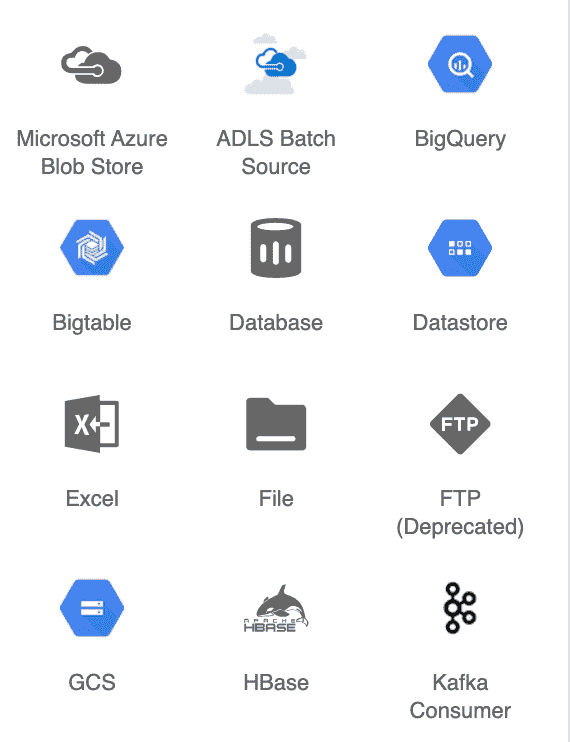
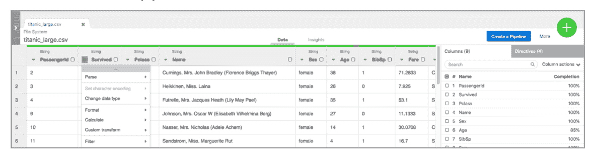
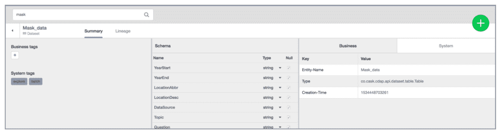
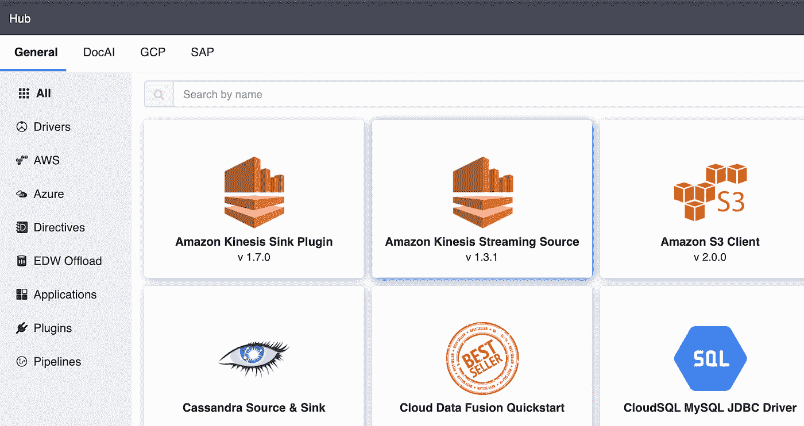

# 云数据融合简介

> 原文：<https://medium.com/nerd-for-tech/introduction-to-cloud-data-fusion-1e2a3c2bf5ca?source=collection_archive---------3----------------------->

## 介绍云数据融合的功能、设置、插件元素和定价。艾伦·科勒

由[弗兰克·麦肯纳](https://unsplash.com/@frankiefoto?utm_source=unsplash&utm_medium=referral&utm_content=creditCopyText)在 [Unsplash](https://unsplash.com/s/photos/fusion?utm_source=unsplash&utm_medium=referral&utm_content=creditCopyText) 上拍摄的照片

云数据融合(Cloud Data Fusion)是 Google 在 Google Cloud 上创建的完全托管的服务，支持任意规模的多个来源的数据集成。它支持在一个可视化的点击环境中实现 ETL 和 ELT 管道的无代码部署，同时在一个云 Dataproc 环境中自动执行。不需要任何代码来混合来自多个云资源和本地数据库的环境，无论是批处理还是流源。此外，创建的管道可以很容易地在组织中的各个团队之间进行验证、共享和重用。

数据融合建立在 [CDAP](https://cdap.io/) 之上，这是一个开源框架，用于构建数据分析应用程序，该应用程序将用户界面与 Hadoop 集群中的后端服务堆栈相结合。

为了构建可靠的管道，它使用了 150 多个插件元素，包括数据连接器和数据转换器。

此外，它还跟踪整个管道中底层数据的数据沿袭。企业级安全是通过谷歌云的标准安全服务实现的。这篇博文的受众可以是完全的云数据融合初学者，但最好已经对普通数据概念有了基本的了解。

# 设置

要设置云数据融合管道，您必须执行以下步骤:

步骤 1 —创建数据融合实例:

*   选择实例的名称
*   选择要使用的版本(即 Developer、Basic 或 Enterprise)
*   如果需要，可以添加一个加速器，例如，支持数据复制

第 2 步—单击视图实例。您将被重定向到云数据融合用户界面。在这里，您将有五个选项可供选择:争论、整合、发现和治理、监控和管理。

*数据融合菜单*

步骤 3 —选择 Integrate Studio 创建数据管道

步骤 4 —在 Integrate Studio 下创建一个数据管道，方法是将插件元素拖到管道画布上，并在 properties 下选择每个构建块的适当配置。在下面截图的左上角，您可以选择数据是以批处理还是流的形式，而在左下角，您可以选择要添加到管道中的元素。在画布上，您可以用箭头手动连接不同的部分。它遵循源-转换-接收器的结构。

*Studio 中的数据融合示范管道*

第 5 步—对数据管道感到满意后，单击右上角的 Deploy。

*部署当前管线*

# 插件元素

该插件包含 150 个元素，可归纳为以下类别:

*   source——sources 是数据库的起始点，数据将从这里(以批处理或实时方式)被接收。它支持 Google 云产品，如 BigQuery、Spanner 或 BigTable，其他云环境，如 Amazon 和 Azure，外部数据库源，如 Oracle、Cassandra 或 PostgreSQL，多种格式的单个文件，如 CSV、XML、JSON 和其他外部源，如 Github、Google Analytics 或 Splunk。
*   接收器——接收器是 ETL 管道末端存储数据的地方。潜在的汇与支持的源非常相似，包括来自 Google、Amazon 和 Azure Cloud 的产品、外部数据库或多种文件类型。
*   转换——转换是在接收之后操纵和处理数据的操作。例如，可以格式化 JSON 或 CSV 文件，应用编码或加密，添加新字段，使用压缩或复杂的 ML 转换，如语音到文本转换或从图像中提取人脸。
*   操作-操作是自定义操作，可以在工作流期间触发基础源中的特定流程。例如，它可以在连接的数据库上运行查询或命令，或者在 Python 中执行 spark 代码。
*   分析——分析插件用于聚合数据、合并数据源或应用分析操作。一些示例包括分组依据、连接、窗口、采样、重复数据删除和数据分析。
*   警报发布器——警报发布器旨在以 JSON 对象的形式显示通知，以防罕见的流事件发生。
*   条件-条件根据表示布尔值的特定规则将管道分成多个分支。
*   错误处理程序——错误处理程序旨在提取逻辑错误或空错误，并在并行管道中单独分析它们。唯一可用的块是错误收集器。

*源插件*

您可以在这个[链接](https://cloud.google.com/data-fusion/plugins#/Plugin%20Type=Source)上找到所有可用插件的完整概述。

# 牧马人 UI

在 Wrangler UI 中，您可以清理、转换和进一步准备您的数据集。加载数据集后，您可以选择各种函数来清理它，包括更改数据类型、使用特定条件过滤数据、处理空值、创建新字段等。此外，它还有一个 insights 部分，您可以在其中快速可视化您的数据。

*快速启动中的牧马人用户界面*

# [计]元数据

在元数据部分，您可以通过跟踪数据的沿袭来搜索和检查数据治理。通过写入数据集的名称、字段名称、属性、标记或通配符，可以在数据集中进行搜索。

*快速启动中的元数据*

# 中心

在右上角的 Hub 部分，您可以在整个组织内共享您的管道和争论方法。此外，您还可以选择一些管道模板和一些附加的基于社区的插件。

*数据融合枢纽*

# 定价

云数据融合对每个账户每月前 120 个小时的管道开发是免费的，之后每增加一分钟就要收费。该时间从数据融合实例的创建时间开始计算，直到它被删除。

价格结构分为两个部分:管道开发和执行。

根据您组织的可用性、可靠性和可扩展性需求，开发部分有三个定价等级(即开发人员、基础或企业级)。开发版每小时每个实例的成本为 0.35 美元，基础版为 1.8 美元，企业版为 4.2 美元。注意，开发者版仅限两个账号。

在执行部分，费用与处理链接到数据融合管道的作业的 Dataproc 集群有关。Dataproc 集群每使用一个虚拟 CPU 内核和每秒的作业持续时间大约花费 0.01 美元。

有关云数据融合定价的更多信息，您可以查看此[链接](https://cloud.google.com/data-fusion/pricing)。

# 结论

在这篇博文中，简要介绍了云数据融合。它包括一个关于其设置的部分，可用于开发数据管道的构建模块，其定价结构，以及关于牧马人 UI、元数据治理和云融合中心的快速介绍。下一篇博文将对牧马人 UI 和元数据部分进行更全面的解释。

云数据融合的唯一限制是分配给实例的资源和机器类型以及您的价格限制。此外，可能存在这样的用例，即仍然无法使用特定的连接器或特定的特定转换，这将需要一些编码，并且可能需要在不同的工具中运行。

总的来说，它是一个方便的工具，可以快速有效地开发数据管道，而无需使用代码，并根据您组织的需要对其进行缩放。

# 更多链接

这篇文章是我们在 [datadice](https://www.datadice.io/) 的[数据学校](https://medium.com/data-school)的新谷歌云系列的一部分。我们将分享我们通过多年创建数据解决方案而获得的最佳见解。

如果你想了解更多关于使用 Google Data Studio 的知识，并结合 BigQuery 更上一层楼，请点击这里查看我们的 Udemy 课程[。](https://www.udemy.com/course/bigquery-data-studio-grundlagen/?referralCode=49926397EAA98EEE3F48)

如果您正在寻求帮助，以建立一个现代化且经济高效的数据仓库，或者只是一些分析仪表板，请发送电子邮件至 hello@datadice.io，我们将安排一个电话。