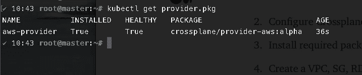
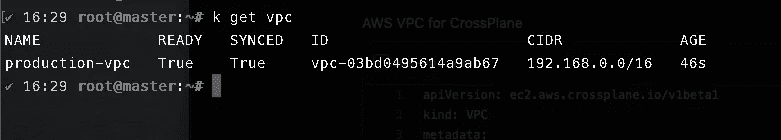
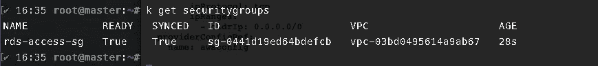

# 交叉平面简介

> 原文：<https://medium.com/nerd-for-tech/introduction-to-crossplane-2f873ae0f9f3?source=collection_archive---------1----------------------->

如何使用 Kubernetes 清单和 Crossplane 在云上创建任何资源。

在 Kubernetes 时代，所有的应用蓝图都被打包成大量的 Kubernetes 清单文件，或者也可以使用 helm 之类的工具打包成图表。那么如何在云上创建任何云资源呢？你也许可以用

1.  创建资源的外部地形模块。
2.  使用 Kubernetes 作业并使用 AWS SDK 创建资源。
3.  使用 bash / Python 脚本并在内部调用 AWS CLI 命令。

但这有多靠谱？与 Kubernetes 清单不同，在 Kubernetes 清单中，yaml 文件可以动态编辑，每次属性发生变化时，您都必须显式调用这些依赖资源。在现代 GitOps 时代，拥有这样的外部依赖对于您的 GitOps 解决方案来说可能不是一个可行的选择。那我们怎么解决这个问题？这里出现了 [**交叉平面**](https://crossplane.io/) 进入画面。Crossplane 使您能够使用 Kubernetes API 在任何**云服务提供商中提供、组合和消费基础设施。使用 Crossplane，您可以使用简单的清单在云上创建资源，然后可以将其与您的 CI/CD 或 GitOps 管道集成。Crossplane 是一个开源项目。它由 Upbound 发起，后来被 CNCF 采纳为沙盒项目。**


图像来源:[交叉平面](https://crossplane.github.io/)

# 整个故事是关于什么的？(TLDR)

1.  在我们的 Kubernetes 集群(AK、GKE、EKS、KIND)上安装交叉平面
2.  配置交叉板以与 AWS 通信。
3.  安装交叉板所需的软件包，以便与 AWS 通信。
4.  使用 Kubernetes 集群中的交叉平面创建 VPC、SG、RDS。
5.  验证已经从 AWS 控制台创建了资源。

# 先决条件

1.  Kubernetes 集群(可以是本地、AKS、EKS、GKE、Kind)。
2.  AWS 账户。

## 故事资源

1.  **GitHub 链接**:[https://github.com/pavan-kumar-99/medium-manifests](https://github.com/pavan-kumar-99/medium-manifests)
2.  **GitHub 分支**:交叉平面

## 在 Kubernetes 集群中安装交叉平面

在这个演示中，您可以使用现有的 Kubernetes 集群。或者，您也可以使用 kind 或 GitHub 操作来安装 Kubernetes 集群。您可以参考我以前的文章，了解如何使用

1.  [**GitHub 动作**](/nerd-for-tech/creating-a-gke-cluster-with-github-actions-dd34e2de50a6)
2.  [**善良**](/nerd-for-tech/create-a-kubernetes-cluster-using-kind-b364a67437b7)

## 资源

1.  GitHub 链接:[https://GitHub . com/pavan-Kumar-99/medium-manifests/tree/cross plane](https://github.com/pavan-kumar-99/medium-manifests/tree/crossplane)

创建 Kubernetes 集群后，现在让我们在集群中安装 Crossplane。对于本文中使用的所有清单，您可以用 crossplane 分支克隆我的 repo。

```
**###Clone the repo** git clone [https://github.com/pavan-kumar-99/medium-manifests.git](https://github.com/pavan-kumar-99/medium-manifests.git) -b crossplanecd medium-manifests/crossplane-aws**#Create the namespace and install the components using helm**kubectl create namespace crossplane-system

helm repo add crossplane-stable https://charts.crossplane.io/stable
helm repo update

helm install crossplane --namespace crossplane-system crossplane-stable/crossplane**#Check the components are up and healthy** kubectl get all -n crossplane-system **( OR )** git clone [https://github.com/pavan-kumar-99/medium-manifests.git](https://github.com/pavan-kumar-99/medium-manifests.git) -b crossplanecd medium-manifests/crossplane-awsmake install_crossplane 
```

或者，您也可以使用我编写的 makefile。这将在您的 MAC / Linux 机器上安装 kind，创建一个 Kind 集群，然后在 Kind 集群中安装 crossplane。

现在让我们安装 AWS 提供程序。这将安装在云上创建资源所需的所有 CRD(自定义资源定义)。例如:**rds instances . database . AWS . cross plane . io**、**ec2.aws.crossplane.io/v1alpha1,**等。

```
kubectl apply -f aws-provider.yaml 
```



提供商包

```
**###****Once you install the Provider, wait for the Provider to be healthy by executing**kubectl get provider.pkg 
```

一旦提供者健康了，现在让我们通过创建一个`ProviderConfig`定义来配置提供者与 AWS 通信。确保您已经使用 **AWS configure 配置了您的凭证(如果您从本地集群运行命令，请从 cli 配置)。**

```
**###Generate the configuration files with the AWS Credentials.** AWS_PROFILE=default && echo -e "[default]\naws_access_key_id = $**(**aws configure get aws_access_key_id --profile $AWS_PROFILE**)**\naws_secret_access_key **=** $(aws configure get aws_secret_access_key --profile $AWS_PROFILE)" > creds.conf**###Create a Kubernetes secret with the configuration file generated.** kubectl create secret generic aws-secret-creds -n crossplane-system --from-file=creds=./creds.conf**###Once the secret is created let us now create the Provider config for our AWS account.**kubectl apply -f provider-config.yaml 
```

成功创建后，您的本地集群现在应该能够与 AWS 通信了。现在让我们尝试创建以下场景。让我们创建一个 VPC 和一个安全组，允许从世界任何地方通过端口 3306 进行访问。让我们同时创建一个 RDS 并将前面提到的 SG 附加到同一个 RDS 实例上，这样就可以公开访问它了。创建该资源后，我们将在本地集群中创建一个 pod，并检查它是否可以访问 RDS 实例。似乎不错？让我们现在行动起来。

让我们用下面提到的规格在 us-east-1 地区创建一个 VPC。

```
kubectl apply -f aws-vpc.yaml **###Let us check the status of the VPC. We are now referring to the provider created earlier in ( line no 20 ).** kubectl get vpc
```



VPC 使用 VPC ID 和 CIDR 数据块以及同步和就绪状态创建

成功创建 VPC 后，让我们创建 2 个子网，将一个互联网网关连接到我们的 VPC，并为其添加一个路由表，以便我们可以在这些公共子网中创建 RDS，然后从我们的本地 pod 进行访问。但是，这不是生产环境中的建议方法，您永远不应该在生产环境中的公共子网中运行 RDS。

```
kubectl apply -f aws-subnet.yaml**###Let us check the status of the subnets.**kubectl get subnets
```

现在让我们创建相应的互联网网关和路由表。

```
kubectl apply -faws-igwrt.yaml**###Let us check the status of the Route table and Internet Gateway**kubectl get InternetGateway,RouteTable
```

现在让我们创建允许通过端口 3306 与互联网通信的安全组。稍后，我们将把这个安全组附加到 RDS 实例。

```
kubectl apply -faws-sg.yaml**###Let us check the status of the Route table and Internet Gateway**kubectl get SecurityGroup
```



在上述 VPC 创建的安全组。

现在让我们创建 RDS 实例，但在此之前，我们需要一个子网组，RDS 实例必须在其中创建。我们将使用之前在 DB 子网组中创建的子网。

```
kubectl apply -faws-rds.yaml**###Let us check the status of the RDS Instance. The credentials are stored in a secret called production-rds-conn-string in the default namespace. ( line no 56 )** kubectl get RDSInstance
```


AWS Infra 现已准备好为我们服务…..

现在让我们尝试访问我们的 Mysql RDS 实例。我们可以通过解码在默认名称空间中创建的秘密**production-rds-conn-string**来访问它。您可以使用 MySQL 客户端连接到数据库

> mysql -h <hostname>-u <user_name>-p<password></password></user_name></hostname>

或者，您可以旋转 pod 并从 pod 本身进行连接。

```
**###Create a testpod that shows all the databases in the RDS Instance**
kubectl apply -faws-rds-connection-test.yaml 
```

现在，您应该可以在 Pod 的日志中看到数据库。


在整篇文章中，我们已经对名称进行了硬编码，我们还可以选择使用标记来过滤资源。但出于某种原因，我的资源即使在标记后也没有被过滤。如果你能够使用标签过滤它们，请随意将解决方案粘贴到评论部分。

直到我们再次相遇……

# 结论

感谢阅读我的文章。希望你喜欢它。以下是我的一些其他文章，你可能会感兴趣。

# 被推荐的

[](/swlh/introduction-to-jenkins-operator-f4cb7ebc2e0b) [## 詹金斯算子简介

### Kubernetes 中的 Jenkins 运算符入门

medium.com](/swlh/introduction-to-jenkins-operator-f4cb7ebc2e0b) [](/faun/introduction-to-bitnami-sealed-secrets-bb5ae74d9a25) [## 比特纳米密封秘密介绍

### 如何使用 Sealed Secrets 和 Kubese 在 GitHub 中存储您的秘密

medium.com](/faun/introduction-to-bitnami-sealed-secrets-bb5ae74d9a25) [](/faun/introduction-to-external-dns-in-kubernetes-654aa4cf38e6) [## Kubernetes 中的外部 DNS 简介

### 如何使用外部 DNS 在 Kubernetes 中自动创建 DNS 记录

medium.com](/faun/introduction-to-external-dns-in-kubernetes-654aa4cf38e6) [](/nerd-for-tech/creating-a-gke-cluster-with-github-actions-dd34e2de50a6) [## 使用 GitHub 操作创建 GKE 集群

### 使用 GitHub 动作自动化 Kubernetes 集群创建和引导

medium.com](/nerd-for-tech/creating-a-gke-cluster-with-github-actions-dd34e2de50a6) 

# 参考

[](https://github.com/crossplane/crossplane) [## 交叉平面/交叉平面

### Crossplane 是一个云计算基础沙盒项目，它是一个开源的 Kubernetes 插件，可以扩展任何…

github.com](https://github.com/crossplane/crossplane) [](https://www.buymeacoffee.com/bettercallpavan)