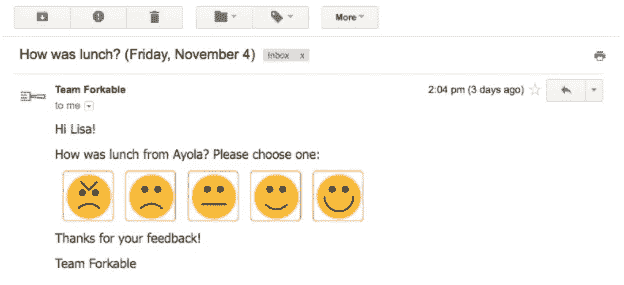
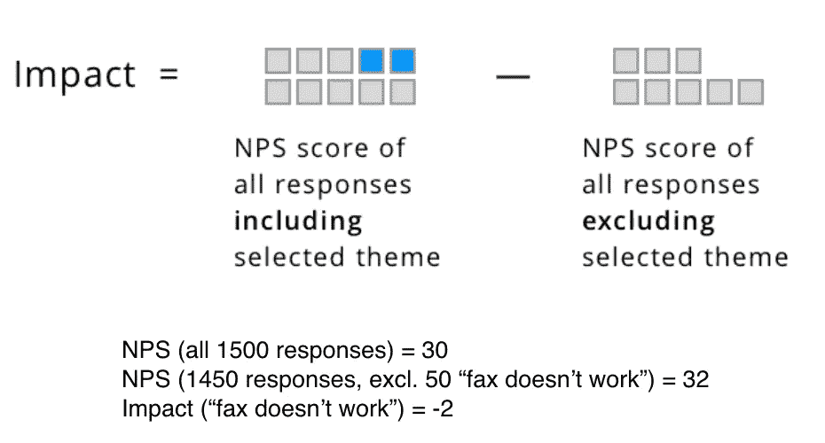

# 客户分析简介

> 原文：<https://medium.com/nerd-for-tech/introduction-to-customer-analytics-4154483ef229?source=collection_archive---------4----------------------->

在 [Unsplash](https://unsplash.com/photos/744oGeqpxPQ) 上由 [Austin Distel](https://unsplash.com/@austindistel) 拍摄的照片

# 量化客户体验

一家科技公司与客户的关系已经成为增长的重要杠杆(我想到了像 [Nubank](https://blog.nubank.com.br/nubanks-culture-the-key-to-keeping-customer-focus/) 和 [Zappos](https://hbr.org/2010/07/how-i-did-it-zapposs-ceo-on-going-to-extremes-for-customers) 这样的例子)。然而，提供高于平均水平的客户体验的效果仍然难以追踪。因此，客户体验(和/或客户成功、客户支持和其他高度面向客户的团队)最终通常被视为一个软学科。

但是，数字业务处于独特的地位(至少与远离键盘的同行相比)，通过 [**测量结果**和**分析客户相关数据**，可以更好地理解**客户体验如何影响他们的底线**。](https://hbr.org/2014/08/the-value-of-customer-experience-quantified)

# **测量与客户相关的关键结果**

*净推介值(NPS)* 是一个长期的客户关系指标，它通过一个特定的问题来调查客户:“在 0 到 10 的范围内，您向朋友或同事推荐我们的可能性有多大？”我们可能会考虑谁得了 9 分或 10 分就是产品或服务的推广者，而得了 7 分或 8 分的就被认为是被动者，6 分或 6 分以下的就被归类为诋毁者。

它通常被称为品牌或公司-客户关系整体指标，因为它旨在捕捉每个人对所述产品或服务的体验总和。

来源: [Wootric](https://www.wootric.com/blog/a-primer-on-3-most-important-cx-metrics-csat-nps-and-ces/)

*客户满意度得分(CSAT)* 是一个短期客户关系指标，用于调查客户对最近的互动(通常是购买或客户支持问题)的满意度。

与 CSAT 相关的一个指标是*产品满意度得分(PSAT)* ，这是对前者的一种改进，侧重于衡量短期满意度和收集关于特定产品或功能的背景反馈。

来源: [Wootric](https://www.wootric.com/blog/a-primer-on-3-most-important-cx-metrics-csat-nps-and-ces/)

*客户努力分数(CES)* 衡量客户在特定互动或流程上花费了多少努力(通常是客户支持和/或产品上线，这是产品使用的重要驱动因素)。

来源: [Wootric](https://www.wootric.com/blog/a-primer-on-3-most-important-cx-metrics-csat-nps-and-ces/)

# **分析客户反馈**

客户反馈分析可以通过执行三个主要任务来定义:

1.  处理非结构化数据(即标记客户支持票据)；
2.  分析处理后的数据(即客户支持标签频率)；
3.  将客户数据洞察转化为产品和/或服务改进；

尽管这些任务同样重要，但将洞察力转化为改进意味着避免“数据丰富，但洞察力贫乏”的陷阱。非深入的数据提供已知的信息，而深入的数据导致否定当前的假设，确认某个假设，或量化特定问题的重要性水平。

# **客户运营标准和指标**

*代理人的票据*指标衡量在特定时间段内，工作负载在客户支持代理之间的平均(或不平均)分布情况。

> ***受让人提交的票证=受让人提交的票证的绝对数量***

*提交的票据数量*指标衡量工作负载在特定时间段内的波动情况。

> ***申报票数=一个时间段内的申报票总数***

按渠道划分的*票证*指标衡量在特定时间段内工作负载在沟通渠道中的分布情况。

> ***按渠道售票数=按渠道归档售票的绝对数量***

*按标签列出的票证*指标衡量每个标签被归因于客户提交给客户支持团队的票证的频率。

> ***标签票=标签票绝对数量***

*平均首次响应时间(AFRT)* 是一项指标，用于衡量客户在收到对其支持请求的首次响应之前需要等待多长时间。第一次回应前的可接受时间因行业和沟通渠道而异，例如，社交媒体问题预计在 24 小时内得到答复，而聊天互动预计在几分钟甚至几秒钟内得到答复。

***平均回复时间(ART)* 是一个衡量跟进客户所有互动(包括首次回复)所需时间的指标。但是，这个指标容易受到异常值的影响(例如，关键合作伙伴 API —应用程序编程接口的意外中断)。最小化异常值对 ART 的影响的替代方法是使用*响应时间带(RTB)* 图表来查看特定时间范围内的门票百分比。**

> *****平均回复时间(ART) =每条及所有客户信息得到回复所用时间的总和除以一段时间内收到的客户信息的绝对数量*****

***首次联系解决率(FCRR)* 是一项指标，用于衡量在单次互动中解决支持问题的百分比，是衡量流程效率和客户保留率的重要指标。**

> *****首次联系解决率(FCRR) =在单次互动中解决的所有客户支持票据的总和除以已归档票据的绝对数量，然后在一个时间段内乘以 100*****

**每个请求的平均回复数(ANRR)衡量解决一个客户请求需要多少个接触点，表明支持团队的自主程度及其问题路由流程的运作效率。**

> ****每个请求的平均回复数(ANRR) *=每个和所有发生的客户接触点(即收到的消息)的总和除以已归档票据的绝对数量*****

***平均解决率(ARR)* 衡量考虑到收到的票证数量，支持请求得到解决的百分比。该指示器可以帮助诊断关于收到的票据数量、团队中的代理数量以及所述问题的复杂性的瓶颈。**

> *****平均解决率(ARR) =所有已解决票据的总和除以已归档票据的绝对数量，再乘以一个时间段内的 100*****

# ****分解客户指标以获得更多见解****

**在处理与非结构化数据相关的指标(即标记的客户支持单或 NPS 意见)时，可以使用一种简单的技术来了解某些问题对总体分数的影响程度。**

**例如，考虑一个带有标记的客户支持票据的数据库，您可以通过在比较之前从后面的计算中排除所有与运输相关的问题来计算整体 AFRT 和延迟运输票据的影响。**

****

**来源: [Getthematic](https://getthematic.com/insights/customer-service-unstructured-data/)**

# ****结束语****

**虽然客户体验总是会表现出相当程度的主观性，但当目标是在公司内建立数据文化时，测量和分析数据是基本的实践。无论是指科技公司还是非科技公司，都是如此。我希望这些内容能帮助你迈出客户分析实践的第一步。**