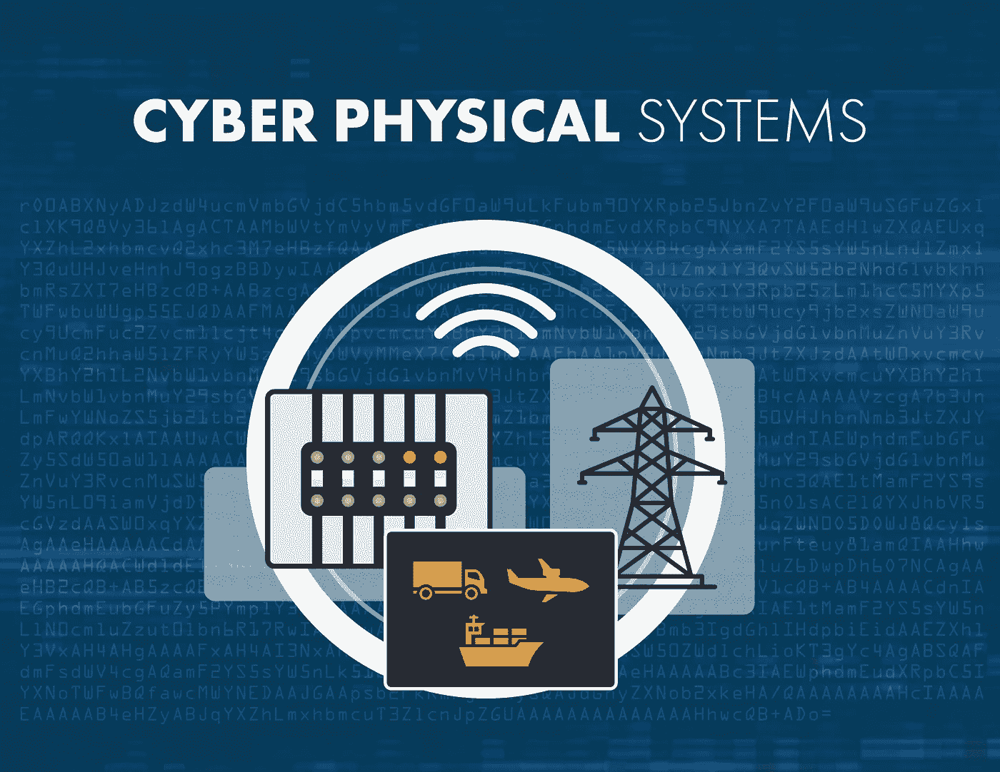

# 网络安全和网络物理系统简介

> 原文：<https://medium.com/nerd-for-tech/introduction-to-cyber-security-and-cyber-physical-systems-8948f03469d8?source=collection_archive---------4----------------------->

# **网络安全:**

网络安全是保护计算机、服务器、手机、电子架构、组织和数据免受报复性攻击。它是旨在保护网络、设备和数据免受攻击或窃取的技术和流程的集合。网络安全本质上是关于个人、过程和技术的合作，以整合全方位的威胁减少、漏洞减少、执法等。由于尖端行业严重依赖计算机来存储和传输大量有关人员的机密和基本数据，网络安全是许多组织的一项关键职能和必要保障。

# **网络安全原理:**

网络安全的三个重要原则是 C I A Triad，即机密性、完整性和可用性。

**保密**

*保密性只是指保护授权用户及其批准的数据。

**用于确保机密性的方法有:**

-数据加密

-密码

-安全令牌

**诚信**

完整性基本上是指关注数据的一致性、准确性和可靠性。

未经授权的人不能修改数据。

**用于确保完整性的方法有:**

-校验和

-用户访问控制

-加密校验和

**可用性**

*授权人员可在需要时获得数据，无需更多麻烦。

*防止数据丢失或网络连接中断。

**用于确保可用性的方法有:**

-备份

-防火墙

-代理服务器

# 什么是协议？

协议是一种数字语言，通过它我们可以在互联网上与他人交流。这是一套相互接受的正确交换信息的规则。有各种类型的协议。其中一些列举如下:

*   TCP/IP(传输控制协议/互联网协议)

TCP(传输控制协议)用于网络通信。这里实际发生的是，数据被分解成小数据包，然后发送到目的地。此外，IP(互联网协议)与 TCP 一起工作，并对这些数据包进行寻址，从而向它们显示到达目的地的路由。IP 确保数据包传输到正确的地址。

*   动态主机配置协议

DHCP(动态主机配置协议)是一种客户端-服务器协议。它为网络上的任何设备分配一个 IP 地址，以便它们可以使用该 IP 进行通信。

*   域名系统

DNS(域名服务器)是互联网的电话簿。他们维护一个域名目录，并将它们转换成 IP 地址。

*   文件传输协议

FTP(文件传输协议)主要用于将文件传输到不同的网络。可能有大量文件，如文本文件、多媒体文件等。因此，这种文件传输方式比其他方式更快。

*   地址解析协议

ARP(地址解析协议)是一种网络协议，用于从 IP 地址中找出设备的硬件(MAC)地址。当一台设备想要与本地网络中的其它设备通信时，就会用到它。

*   超文本传输协议

HTTP(超文本传输协议)是基于客户端和服务器模型的。它用于在 web 客户端和 web 服务器之间建立连接。HTTP 一般在网页中显示信息。

*   SMTP(简单邮件传输协议)

SMTP(简单邮件传输协议)管理互联网上邮件的传输和发送。它基本上是用来收发电子邮件的。

## 为什么有必要将协议转换为 IP 地址？

这是必要的，因为尽管域名很容易被人们记住，但计算机或机器是基于 IP 地址访问网站的。因此，当你输入一个网址，例如，[www.google.com，](http://www.google.com,)你的互联网服务提供商(ISP)查看与该域名相关的 DNS，将其翻译成一个机器友好的 IP 地址(比如 74.125.224.72 ),并将你的互联网连接定向到正确的网站。

# **网络世界的威胁**

网络安全面临的威胁主要有三个方面:

1.  **网络犯罪**由个人或团体组成，他们以系统为目标获取金钱利益或造成破坏。
2.  网络攻击通常涉及政治鼓动的数据收集。
3.  **网络恐怖主义**意在破坏电子框架以引起恐慌或恐惧。

那么，恶意攻击者是如何监督计算机系统的呢？以下是一些用来破坏网络安全的常用策略:

**恶意软件**

恶意软件基本上意味着恶意软件。这是黑客为扰乱或破坏合法用户的计算机而制造的最常见的网络威胁之一。恶意软件通常通过未经请求的电子邮件附件或看似真实的下载进行传播，可能会被网络犯罪分子用来赚钱或进行有政治动机的网络攻击。

恶意软件有几种类型。其中一些关键因素是:

*病毒:*一种自我复制的程序，它将自己附加到干净的文件上，并通过计算机框架传播，用恶意代码污染文件。

*木马:*伪装成真实软件的一类恶意软件。网络罪犯诱骗客户将特洛伊木马转移到他们的计算机上，在那里他们造成伤害或收集信息。

*间谍软件:*秘密记录用户行为的程序，以便网络罪犯可以利用他们的数据。例如，间谍软件可以收集信用卡信息。

*勒索软件:*锁定用户记录和信息的恶意软件，威胁要删除这些记录和信息，除非赎金能带来金钱利益。

*僵尸网络:*由感染了恶意软件的个人电脑组成的网络，网络攻击者在未经用户许可的情况下利用这些电脑执行在线任务。

**网络钓鱼**

网络钓鱼是指网络罪犯向受害者发送看似来自合法公司的邮件，索要敏感数据。网络钓鱼攻击经常被用来欺骗人们交出信用卡数据和其他个人信息。

**SQL 注入**

SQL(结构化语言查询)注入是一种用于控制和窃取数据库数据的网络攻击。网络罪犯利用数据驱动应用程序中的漏洞，通过恶意 SQL 语句将恶意代码插入数据库。这使他们能够访问数据库中包含的敏感信息。

**中间人攻击**

中间人攻击是一种网络威胁，网络犯罪分子截取两个人之间的通信，以窃取信息。例如，在不安全的 WiFi 网络上，网络攻击者可以拦截从受害者设备传输到网络的数据。

**拒绝服务攻击**

拒绝服务攻击是指网络犯罪分子通过使网络和服务器流量过大来阻止计算机系统满足合法请求。这使得系统无法使用，使一个组织无法履行重要职能

# 为什么网络安全很重要？

鉴于行政、军事、企业、金融和医疗机构在计算机和其他设备上收集、处理和存储空前数量的信息，网络安全非常重要。这些数据的关键部分可能是敏感信息，无论是知识产权、财务信息、个人信息，还是未经授权的访问或暴露可能会产生不利影响的其他类型的数据。组织在开展业务时会通过多个网络传输关键数据，网络安全描述了致力于保护这些数据和用于存储这些数据的系统的规则。随着网络攻击范围的扩大，组织，特别是那些被分配保护与国家安全、健康或财务记录相关的信息的组织，需要采取必要的措施来保护其敏感的业务和个人信息。2013 年 3 月，美国最高情报官员警告称，网络攻击和数字间谍活动是国家安全的最大威胁，甚至笼罩着恐怖主义。

# 信息物理系统(CPS):

网络物理系统(CPS)基本上意味着计算机辅助软件片段与机械和电子部件的混合，可以通过像服务器中心这样的数据基础进行访问，互联网通常在服务器中心进行通信*。*这是一种旨在由基于 PC 的算法控制或监控的机制。在 CPS 中，硬件和软件组件在不同的空间和时间尺度上运行。此外，它的特点是高度复杂。CPS 的假设基础来自于通过有线或无线通信网络的已安装系统的联网。

# CPS 的功能:

自动控制和监控不同类型的工业、科学和商业测量。

作为一个大规模系统运行，并分配任务和角色。

需要相互高度依赖的跨学科系统。

最终即兴发挥他们的表演。

能够自适应并随实时场景逐步变化。

需要强大的决策系统。

# **CPS 的使用案例:**

CPS 的一些例子包括汽车框架、临床监测、测量控制系统、机器人系统、自动飞行员飞行、交通物流系统等等。在我们的日常生活中，CPS 的例子很多。在家里，我们有吸尘器、智能照明系统、智能供暖、通风和空调系统。出于交通目的，我们有汽车、飞机、摩托车和电动自行车。像这样的现有系统代表了我们可以期待在未来看到巨大进步和改进的领域。例如，虽然汽车已经存在了近 300 年，但随之而来的是一些新功能的增加，这些新功能现在已经出现在汽车产品线中。

临床解决方案包括起搏器、胰岛素泵、个人辅助机器人和智能假肢。这些技术中有许多甚至直到最近才出现，它们具有拯救生命和显著改善繁荣和福祉的潜力。可穿戴健身和健康监测系统保证对用户产生非常积极的影响，无论他们是健康的还是身体或智力残疾的。健康监测系统只是传感器网络整个空间的一个例子，它包括那些由微型传感器制成的用于观察大型陆地、海洋或空中空间的系统。

# **信息物理系统的挑战:**

以下是与工业 4.0 相关的 CPS 所涉及的挑战和风险:

信息保护和数据安全

缺乏效益量化

最高管理层没有确定优先顺序

工业宽带结构

工业间谍/破坏活动

由于数据不可访问导致生产中断

所以，这是我们所有人都必须意识到的事情。现在，几乎整个世界都沉迷于这样或那样的网络活动，无论是社交网络、教育、游戏还是网上冲浪，我们都非常有必要保持警惕，防范上述威胁和攻击。希望这篇文章对你有所帮助和帮助！感谢阅读。