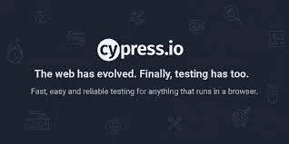

# Cypress 测试自动化框架简介

> 原文：<https://medium.com/nerd-for-tech/introduction-to-cypress-test-automation-framework-107790b5f6cc?source=collection_archive---------23----------------------->

**柏树是什么？**
它是一个框架，类似于 Selenium WebsDriver、WebDriverIO、TestCafe 和其他用于测试自动化的工具。

**这个工具为什么这么有趣？**
它没有构建在 Selenium WebDriver 上。在建筑上，柏树和硒树完全不同。

**为什么不一样？**
因为它是由开发人员从前端和前端设计的。

**为什么 Cypress 不是自动化工具？**
对摩卡和柴进行柏树试验。JavaScript 用户可以熟悉它的语法。这意味着如果您曾经使用过 JavaScript，那么开始使用 Cypress 将会非常简单。

**有哪些可用的功能？**
1。自动等待测试命令的执行，并在执行下一个命令之前进行陈述。
2。在有助于调试的测试用例期间捕获图像。
3。当测试运行程序使用日志进行虚拟运行时，能够更有效地执行调试测试。
4。它甚至可以模仿服务器的回答。
5。由于其相对于其他测试框架的架构差异，它为用户提供了快速而准确的测试执行。

**有什么坏处？**
1。这是一个纯 JavaScript 的工具。
2。这个工具是摩卡专用的。
3。该工具仅适用于 Chrome。

**有什么优势？**
1。快速配置和运行。设置测试及其执行非常简单快捷。
2。编写时，测试需要的时间比其他结构少。
3。任何具有无头运行功能和命令行选项的 CI 工具都可以结合使用。
4。如果出现错误，自动捕获测试执行快照。这在调试和诊断问题时特别有用。
5。当对测试进行任何修改时，它会自动重新加载测试运行程序。