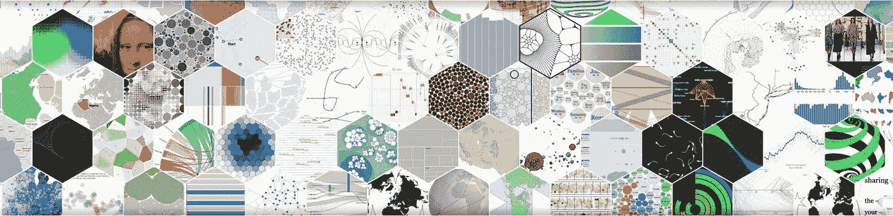
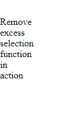
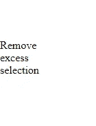

# D3 js 简介

> 原文：<https://medium.com/nerd-for-tech/introduction-to-d3-js-8fbce95b1008?source=collection_archive---------8----------------------->

了解 D3 js。



数据驱动文档

这篇文章旨在给你一个 D3(数据驱动文档)的概述。它是一个开源的 JavaScript 库，可以通过使用 HTML、CSS 和 SVG 在 web 上创建数据可视化。

我们用 D3 JS 做什么:

*   为数据创建不同风格的可视化表示。
*   创建带有过渡和转换的动态可视化。
*   DOM 操作
*   互动和动画

所以，事不宜迟，让我们开始理解一些与 D3 相关的概念。

将 d3 安装到您现有的项目中非常简单。只要通过这个[环节](https://www.npmjs.com/package/d3)就可以了。

**D3**的基本概念

*   **选择**:类似 Jquery 的选择用于选择 DOM 元素。
*   **DOM 操作:**选择 DOM 元素后，在 DOM 元素中添加或修改一些东西。
*   **方法链接:**创建方法管道，每个方法转换一个对象。
*   **数据连接:**将数据绑定到选定的元素上，以使 DOM 操作更容易。

1.  **选择**:

我们可以用不同的方式选择 DOM 元素。我通常以三种方式使用选择。

*   按元素:

```
<body><div>Showing effect of the style method</div></body>
```

例如:如果我们的 DOM 结构看起来像这样。我们可以像这样简单地调用我们的选择来选择 div。

```
d3.select('div');
```

如果我们想选择 DOM 中存在的所有 div。我们可以使用 D3 的 selectAll 函数。

```
d3.selectAll('div');
```

*   按类名:

```
<body><div class="select-me">Showing effect of the style method</div></body>
```

我们可以通过使用类似 Jquery 语法的类名来选择 DOM 元素。

```
d3.selectAll('.select-me');
```

这将选择所有与类“select-me”匹配的 DOM 元素。

*   按 id:

```
<body><div id="select-me">Showing effect of the style method</div></body>
```

通过以下方式选择 DOM 元素

```
d3.select('#select-me');
```

2. **DOM 操作:**

我们可以在 DOM 元素被选中后对它们进行操作。我们可以对选择使用 style()方法来设计元素的样式。

类似地，我们可以使用 attr()、append()等操作方法来操作选择。

3.**方法链接**:

顾名思义，它让我们将多个方法链接在一起。例如:

```
d3.select('#select-me').style("color", "red").style("width", "40px");
```

上面的代码暗示了什么？

首先，选择一个带有“select-me”id 的 DOM 元素。将“红色”应用到选区，然后将“40px”宽度应用到选区。很简单，对吧？

```
d3.select('#select-me').style("color", "red").style("width", "40px").selectAll('div');
```

类似地，上面的例子完成了前面解释的所有任务，然后选择了所有 div，这些 div 是前面选择的子 div。从那里，我们可以对新选择的孩子进行更多的操作。

4.**数据连接:**

这个概念一开始对我来说有点难以理解。

数据连接允许我们将选定的元素绑定到数组的数据上。通过使用数据连接，我们创建的可视化变得对数据更加敏感。

数据连接过程的三种主要方法是

*   data():用于绑定数据。这很像是在一组数据中循环。data()函数将指定的数据数组连接到选定的 DOM 元素，并返回更新后的选择。

```
<script>
        var myData = ["Hello World!"];

        var p = d3.select("body")
            .selectAll("p")
            .data(myData)
            .text(function (d) {
                return d;
            });
</script>
```

在上面的例子中，它将返回“Hello world”一次，因为 myData 在数组中只有一个元素。

*   enter():这用于在绑定数据中有剩余数据但没有选择时执行某些操作。D3.js 中的 **d3.selection.enter()** 函数用于创建缺失的元素并返回输入的选择。例如:

```
<body>
// NO div are here
</body>
<script>
        var myData = ["Hello","World","!"];

        var p = d3.select("div")
            .data(myData)
            .enter().append('div')
            .text(function (d) {
                return d;
            });
</script>
```

这将导致添加三个新的 div，其中包含数组 myData 的文本内容。


enter()的示例

*   merge():这用于将 enter()前后的 DOM 操作合并在一起。

```
u.enter().append("circle").attr("r",5)
     .merge(u)//after this, any update applies to both u & enter()             
     .attr("cx", d => d.x)
     .attr("cy", d => d.y)
```

*   exit(): D3 不会自然删除多余的选择。当您想要对多余的选择进行一些操作时，Exit()就派上了用场。通常，我用它来删除多余的选择，因为这是更期望的输出。

```
function print(data) {
var divs = d3.selectAll('div').data(data);divs.enter();
   .append('div')
   .merge(divs)
   .text(d => {
     return d;
    });// divs.exit().remove();}print(['The','great', 'exit', 'function', 'in', 'action']);print(['Remove', 'excess', 'selection'])
```

通过移除 divs.exit()。remove()，我们会得到一个奇怪的输出，可能是这样的。



是的，我们期望打印“Remove”、“excess”和“selection”div，但我们得到的是“function”、“in”和“action”div，它们是由前面的函数调用追加的。我们可以通过取消注释 divs.exit()来解决这个问题。拆下()线。之后，我们对左侧的附加选择执行 remove()。



修好了。唷！:D

我希望通过这篇文章，您对 D3 的工作原理有了一个基本的了解。D3 提供了更多的功能。另一个需要理解的有趣概念是 D3 提供的标度。我将在下一篇文章中写关于规模的内容。到那时，我希望这篇文章能帮助对 D3 感兴趣的人。快乐学习！