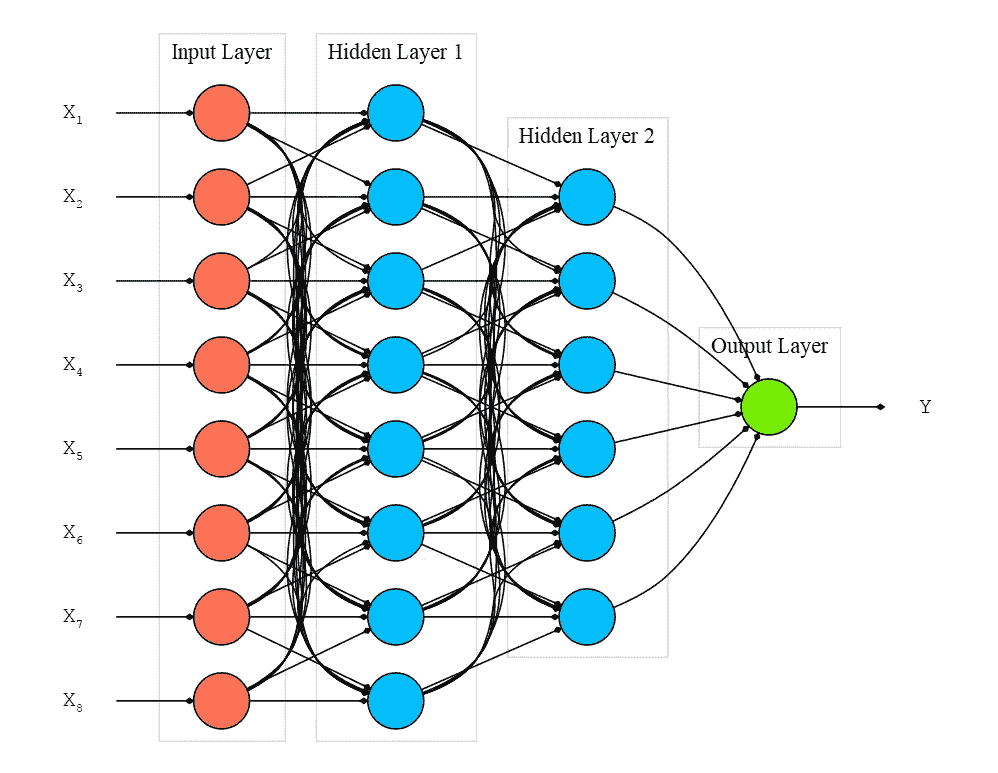
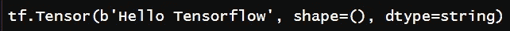
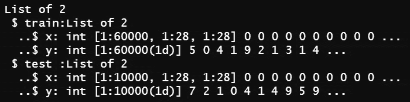
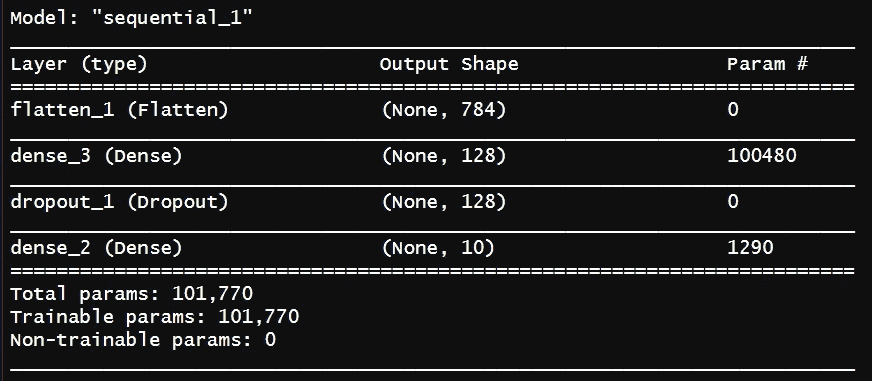
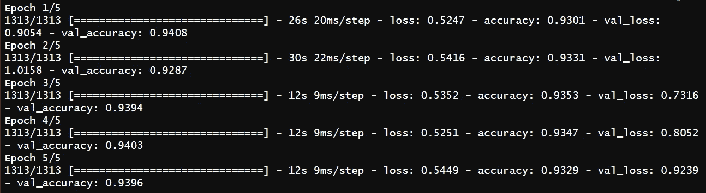
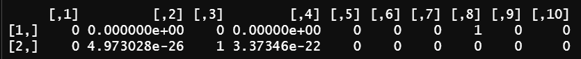
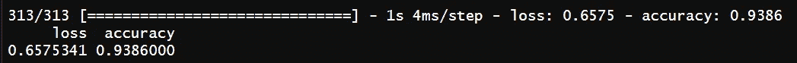

# 用 R 介绍深度学习

> 原文：<https://medium.com/nerd-for-tech/introduction-to-deep-learning-with-r-cc5bdb9629f?source=collection_archive---------6----------------------->

## 在 R 编程中使用 TensorFlow 和 Keras 对初学者进行图像分类。


[绿色变色龙](https://unsplash.com/@craftedbygc?utm_source=medium&utm_medium=referral)在 [Unsplash](https://unsplash.com?utm_source=medium&utm_medium=referral) 上的照片

深度学习是基于人工神经网络架构的机器学习的一个子领域。深度学习被用于许多领域，如自然语言处理、计算机视觉和生物信息学。

简而言之，我将涵盖以下主题:

*   什么是深度学习？
*   Keras 是什么？
*   如何安装 TensorFlow？
*   如何用 Keras 做深度学习分析？

请不要忘记关注我的 youtube 频道，在那里我创建了关于人工智能、数据科学、机器学习和深度学习的内容。👇

[](https://www.youtube.com/channel/UCFU9Go20p01kC64w-tmFORw) [## 蒂伦达兹学院

### 嗨，欢迎来到提伦达兹学院。Tirendaz 学院是一个在线教育平台，制作视频和写博客…

www.youtube.com](https://www.youtube.com/channel/UCFU9Go20p01kC64w-tmFORw) 

让我们开始吧。

# 什么是深度学习？

深度学习是受人脑结构启发的机器学习的一个子领域。深度学习处理复杂的任务，如分类数十亿张图像，推荐最佳视频，或学习在围棋比赛中击败世界冠军。

现代深度学习通常涉及数十甚至数百个连续的表示层，它们都是通过暴露于训练数据来自动学习的。



人工神经网络

## 如何运作深度学习网络

深度学习模型由一个输入层、两个或多个隐藏层和一个最终层组成。输入层接收输入数据并将输入传递给第一个隐藏层。隐藏层对输入执行数学计算。

深度学习中的“深”是指有不止一个隐藏层。输出层返回输出数据。神经元之间的每个连接都与一个权重相关联。这个权重显示了输入值的重要性。初始权重随机设置。每个神经元都有激活功能。一旦一批输入数据通过了神经网络的所有层，它就通过输出层返回输出数据。

损失或成本函数衡量实际结果和预测结果之间的差异。为了建立一个好的模型，你希望你的损失函数接近于零。要找到最小成本函数，可以使用梯度下降技术。梯度下降的工作原理是在每次数据集迭代后以小增量改变权重。

好了，我们看到了如何进行深度学习。我们来看看 Keras API 实现深度学习模型。

# Keras 是什么？

Keras 是一种高级深度学习 API，允许您轻松构建、训练、评估和执行各种神经网络。

Keras 于 2015 年 3 月作为开源项目发布。由于其易用性、灵活性和漂亮的设计，它很快就流行起来。可以在 TensorFlow、Theano、Mxnet 上使用 Keras。注意 TensorFlow 有 Keras API。

# 如何安装 Keras？

安装 TensorFlow 时，Keras 会自动来到您的电脑前。让我们在 RStudio 中安装 TensorFlow。安装 TensorFlow 太容易了。让我们安装 TensorFlow:

```
install.packages(“tensorflow”)
```

接下来我们加载 TensorFlow 包。

```
library(tensorflow)
```

请注意，在 Windows 上，您需要 Anaconda 的有效安装。现在我们可以使用 install_tensorflow 方法

```
install_tensorflow()
```

几分钟后，TensorFlow 和 Keras 都安装好了。为了验证这一点，让我们使用 TensorFlow 打印 hello world。

```
tf$constant(“Hello TensorFlow”)
```



如果代码运行没有错误，TensorFlow 安装没有任何问题。如果您希望安装 GPU 版本，可以使用如下所示的 gpu=TRUE 参数。

```
install_tensorflow(gpu=TRUE)
```

让我们来看看使用 MNIST 数据集的分类问题。

# 分类问题

为了说明分类问题，我将使用经典的 MNIST 数据集。MNIST 数据集包含手写数字，由 70，000 幅 28*28 像素的灰度图像组成，每幅图像分为 10 类。MNIST 数据集有一组 60，000 个训练图像和 10，000 个测试图像。MNIST 数据集预装在 Keras 中。首先，我要导入 Keras。

```
library(keras)
```

现在让我们加载 MNIST 数据集。

```
mnist <- dataset_mnist()
```

接下来，让我们看看数据集的结构。

```
str(mnist)
```



我们数据集的结构

请注意，MNIST 数据集由训练集和测试集组成。使用训练集拟合模型，并使用测试集评估模型。像素值是 0 到 255 之间的整数。让我把它们转换成 0 到 1 之间的浮点数。

```
mnist$train$x <- mnist$train$x/255
mnist$test$x <- mnist$test$x/255
```

是时候建立模型了。

## 建立模型

使用训练数据输入神经网络，然后使用测试集进行预测。之后，您将验证这些预测是否与测试集标签中的标签相匹配。

要定义模型，可以使用顺序 API 或函数 API。由于它易于使用，我将使用顺序 API。

## 设置图层

在顺序 API 中，层是线性排序的。让我们使用顺序 API 构建一个 Keras 模型。

```
model <­ keras_model_sequential() %>%               (1)
layer_flatten(input_shape = c(28, 28)) %>%         (2)
layer_dense(units = 128, activation = “relu”) %>%  (3)
layer_dropout(0.2) %>%                             (4)
layer_dense(10, activation = “softmax”)            (5)
```

(1)管道(%>%)运算符用于向网络添加图层。这个操作符来自于 magrittr 包。使用管道操作符使代码更具可读性。可以使用 Ctrl+ Shift +M 键盘快捷键插入管道运算符。

(2)我已经使用 layer_flatten 方法指定了输入数据。在我们的例子中，我们有 28*28 尺寸的图像。这里我把输入转换成一维。

(3)我给我们的网络增加了一层。

(4)您可以根据您的分析指定层中神经元的数量。深度学习模型往往会过度适应。如果模型存在过度拟合的问题，它就很难准确预测新数据。为了解决这个问题，你可以使用辍学技术。Dropout 是神经网络最有效和最常用的正则化技术之一。应用于图层的丢弃包括在训练过程中随机丢弃(设置为零)图层的多个输出要素。在这里，我使用了辍学率的辍学方法。

(5)最后，我添加了一个输出层。因为我们有 10 个类，所以我们可以使用 10 个神经元。对于激活功能，我设置了 softmax 功能。不要忘记，您的网络应该以 softmax 激活功能结束。在我们的例子中，softmax 函数返回 10 个概率分数的数组。每个分数将是当前数字图像属于我们的 10 个数字类之一的概率。

定义模型后，您可以使用 summary 函数查看有关层、参数数量等信息。

```
summary(model)
```



我们模型的总结

## 编译模型

建立模型后，您必须编译它。当您编译模型时，您需要定义损失、优化器和度量参数。

```
network %>% compile(
    loss = “sparse_categorical_crossentropy”,  (1)
    optimizer = “rmsprop”,                     (2)
    metrics = “accuracy”                       (3)
    )
```

(1)为了在多类分类中处理标签，我使用了 category _ cross entropy 或 sparse _ categorical _ crossentropy。为了通过一键编码来编码标签，使用分类交叉熵，并且使用稀疏分类交叉熵来将标签编码为整数。

(2)在这里，我将指定一个优化器。优化器决定学习如何进行。优化器使用损失值来更新网络的权重。优化器有各种各样的功能。无论您的问题是什么，rmsprop 优化器通常都是一个足够好的选择。

(3)评估指标用于衡量我们的模型有多好。当我们处理分类问题时，我使用了准确性度量。

请注意，用于回归的评估指标不同于用于分类的评估指标。一个常见的回归度量是平均绝对误差(MAE)。

## 训练模型

现在我们准备训练网络。让我们调用 fit()方法，并根据训练数据拟合模型:

```
model %>% fit(
    x = mnist$train$x, y = mnist$train$y,     
    epochs = 5,                               (1)
    validation_split = 0.3                    (2)
```

(1)所有训练数据的每次迭代称为一个时期。我设定了 5 个纪元。

(2)利用模型验证集调整超参数。为此，可以使用 validation_split 参数将数据拆分为定型集和验证集。我设定了 0.3。所以我把我们的数据分成 30%的验证和 70%的训练。

让我们执行这些代码。



我们的模特培训

如您所见，训练损失随着每个时期而减少，并且训练精度随着每个时期而增加。这就是你在运行梯度下降优化时所期望的。

## 做预测

建立模型后，可以使用 predict 函数对模型进行预测。训练图是自动绘制的。

predict 方法返回所有 10 个类的概率分布。

```
predictions <- predict(model, mnist$test$x)
```

默认情况下，预测将返回最后一个 Keras 图层的输出。让我们看看预测变量的前两个值。要做到这一点，让我用头的方法。

```
head(predictions, 2)
```



预言

此外，您可以使用 predict_classes 方法来生成该类。

## 评估准确性

您可以使用 evaluate 函数访问不同数据集上的模型性能。让我们在测试集上评估我们的模型。

```
model %>% evaluate(mnist$test$x, mnist$test$y)
```



测试集上的模型评估

我们的模型在测试集上有大约 90 %的准确率。

## 保存并重新加载模型

如果您愿意，可以保存您的模型。为此，可以使用 save_model_tf 方法。

```
save_model_tf(object = model, filepath = “model”)
```

要重新加载模型，可以使用 load_model_tf 方法。

```
reloaded_model <- load_model_tf(“model”)
```

现在你可以使用上传的模型了。

就是这样。我希望你喜欢这篇文章。感谢阅读。

请鼓掌👏如果你喜欢这篇博文。另外，别忘了关注我们的 [*蒂伦达兹学院 YouTube*](https://www.youtube.com/channel/UCFU9Go20p01kC64w-tmFORw) 📺， [*碎碎念*](https://twitter.com/TirendazAcademy) 😎*、*、[、*中等*、](https://tirendazacademy.medium.com/)📚，[*LinkedIn*](https://www.linkedin.com/in/tirendaz-academy)*👍*

*下一篇文章再见…*