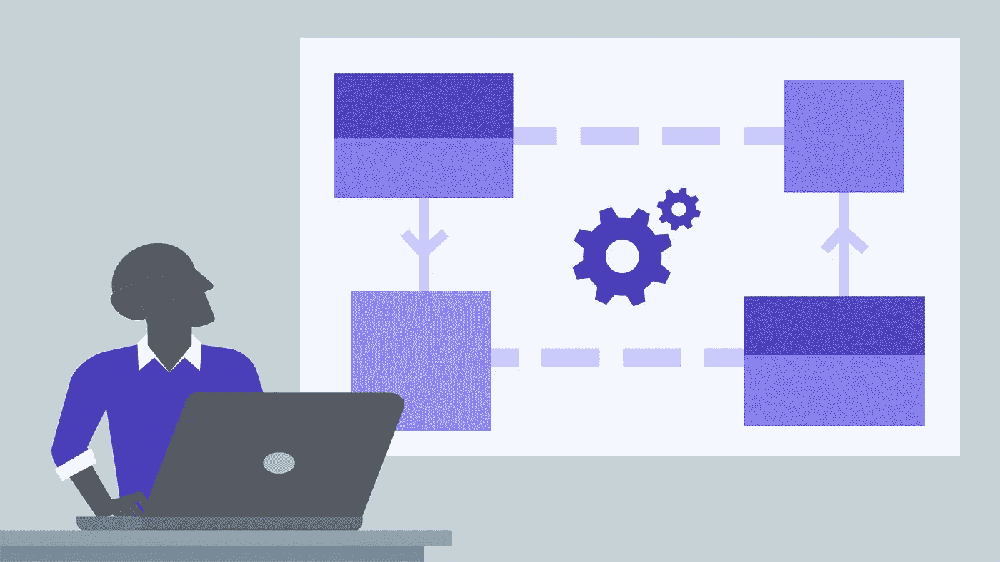
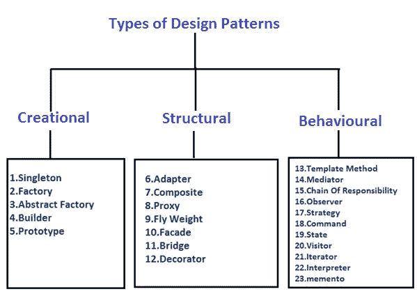
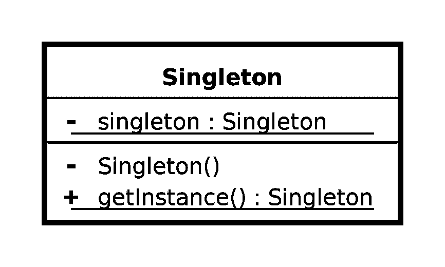
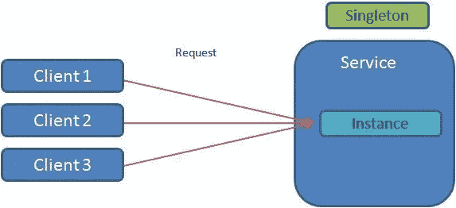
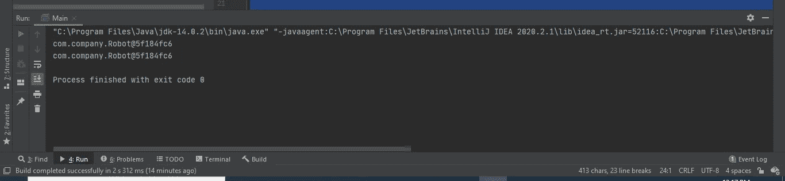

# 设计模式介绍&单一设计模式

> 原文：<https://medium.com/nerd-for-tech/introduction-to-design-patterns-singleton-design-pattern-a36f6b13beab?source=collection_archive---------17----------------------->

你有没有注意到这个世界上的一些事情是以某种方式发生的。当谈到软件工程流时，我们有一些模式。我们称之为设计模式。设计模式代表了有经验的面向对象软件开发人员使用的最佳实践。设计模式是软件工程师在日常生活中开发软件时面临的常见问题的解决方案。设计模式不是可以直接转换成代码的成品设计。它是关于如何解决问题、何时应用解决方案及其后果的描述或模板。Erich Gamma、Richard Helm、Ralph Johnson 和 John Vlissides 在 1994 年出版了一本名为**设计模式-可重用面向对象软件的元素**的书。这些作者统称为**【GOF】**。所以有 23 种设计模式，它们主要分为三种类型。这些是创造性的、行为性的和结构性的。

## 创造型的

这些设计模式提供了一种在隐藏创建逻辑的同时创建对象的方法，而不是使用 new 运算符直接实例化对象。

## 结构的

这些设计模式涉及类和对象的组合。继承的概念用于组合接口和定义组合对象的方式以获得新的功能

## 行为的

行为模式是最特别关注对象间通信的模式。

这将是一系列关于设计模式的文章，我会在最近上传文章。所以我接下来的文章很可能是关于设计模式的。所以在这篇博客中，我将解释一下单体设计模式。所以我们来了解一下。

# 单一设计模式

现在让我们学习一下单体设计模式。singleton 是什么意思？Singleton 是指一个实例？这个例子是什么？机器的一个实例？用户的一个实例？所以 singleton 意味着每个容器一个实例。如果你有 java 程序，这意味着每个 JVM 一个实例。**大多数时候，singleton 用于数据库连接**，但是让我们来理解 singleton 可能使用的另一个场景。假设我们有一家大餐厅。顾客经常来这家餐馆，收入也很高。所以店主决定买一个如下图所示的食物服务机器人，给顾客一些不同的体验。

所以现在当顾客到达时，他/她点了他/她想要的东西。然后，一旦饭菜准备好，顾客将等待几分钟。然后厨师会把饭菜放在机器人的托盘上，机器人就会去为点菜的人服务。这种进步将会继续。但是请记住，机器人在特定的时间只能为一个特定的顾客服务。在为一位顾客服务后，它可以回到厨房为下一位顾客拿饭，并为下一位顾客服务。

现在让我们用 Java 实现这个例子。所以在下面我们有机器人类。

如果你运行上面提到的程序，你得到相同的实例两次，即使你为 2 个不同的变量赋值，并在 2 个不同的时间调用，它给出相同的实例，你可以看到下面的输出。这是因为它是单例的。

然而，这不是一个好的编码实践，也不是一个好主意，因为这将限制我们从这个实例中可以做的事情。比方说，当我们创建实例时，如果我们想做某些事情，那么这些事情将会受到限制。那么让我们用另一种比以前更好的方法来做这件事。

在 robot 类中，我们需要实现一个静态的机器人类型实例，所以在这里我将其命名为 RobotInstance。接下来我们需要实现构造函数，但是记住你需要使它私有。然后我们有一个名为 GetfoodservingRobot 的方法，在这个方法中，我们检查 RobotInstance 是否为空，如果为空，它将进入并创建对象。

main 方法将与前面的相同，在我们运行这个程序后，您将得到与前面相同的输出，但是这个实现有一个问题。所以问题是这个实现不是线程安全的。为什么不是线程安全的？

让我们假设第一个线程到达了上面代码段中的第 12 行。它检查 robotinstance 是否为空。然后，因为它为空，所以它进入并尝试创建一个值并赋给 robotinstance 变量。同时，另一个线程来到第 12 行，检查 robotinstance 是否为空。此时，实例正在创建，但尚未创建。因此，它告诉它是 null。然后第二个线程也会进来。所以，现在你可以看到它不是线程安全的。**解决方案是我们可以使用双重检查单例。**那么什么是双重检查单例。

# 双重检查单例

因此，在双重检查单例锁定时，代码检查 robot 类的现有实例两次，检查是否有锁定，以确保只创建一个 robot 实例。主要方法与前面的相同。我已经上传了完整的例子到 git hub，链接在下面。

 [## dilshanushara/Krish _ LP _ Training

### 在 GitHub 上创建一个帐户，为 Dilshanushara/Krish _ LP _ Training 的发展做出贡献。

github.com](https://github.com/Dilshanushara/Krish_LP_Training/tree/master/Design%20Patterns/Singleton) 

# 独生子女的优势

1.  又快又省时间。
2.  节省内存，因为单个实例可以反复使用。

# 独生子女的缺点

1.  过度使用单例模式可能会产生一些问题。
2.  这使得单元测试非常困难。

我希望现在你了解了什么是设计模式和单体设计模式。我将在下一篇文章中发布另一种设计模式。所以保持联系。

# 参考

 [## 设计模式-概述

### 设计模式代表了有经验的面向对象软件开发人员使用的最佳实践。设计模式…

www.tutorialspoint.com](https://www.tutorialspoint.com/design_pattern/design_pattern_overview.htm)  [## 设计模式和重构

### 在软件工程中，设计模式是对软件中常见问题的通用可重复解决方案

sourcemaking.com](https://sourcemaking.com/design_patterns)